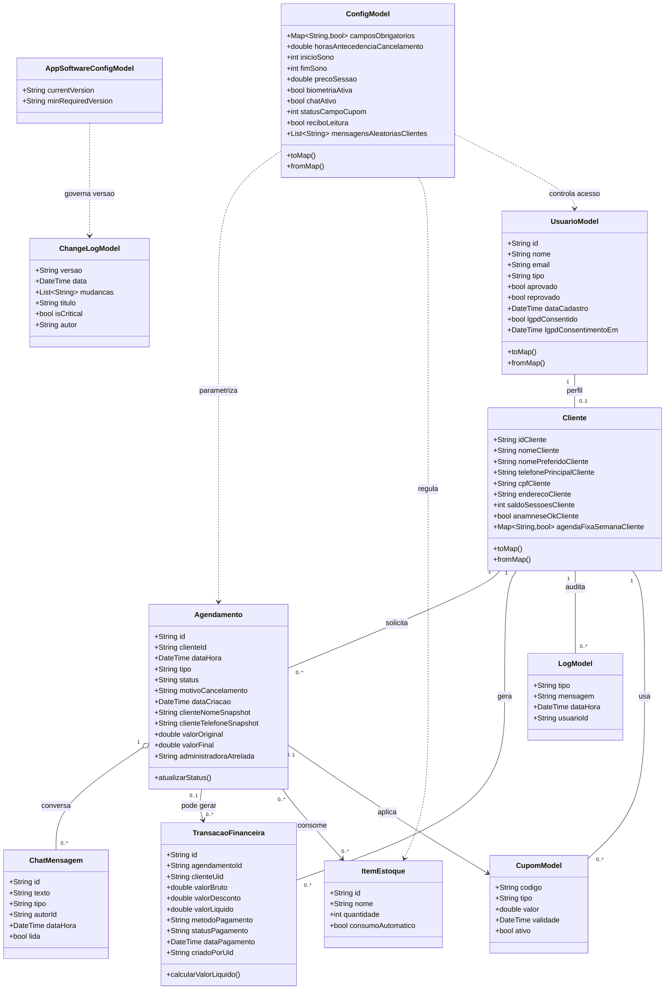
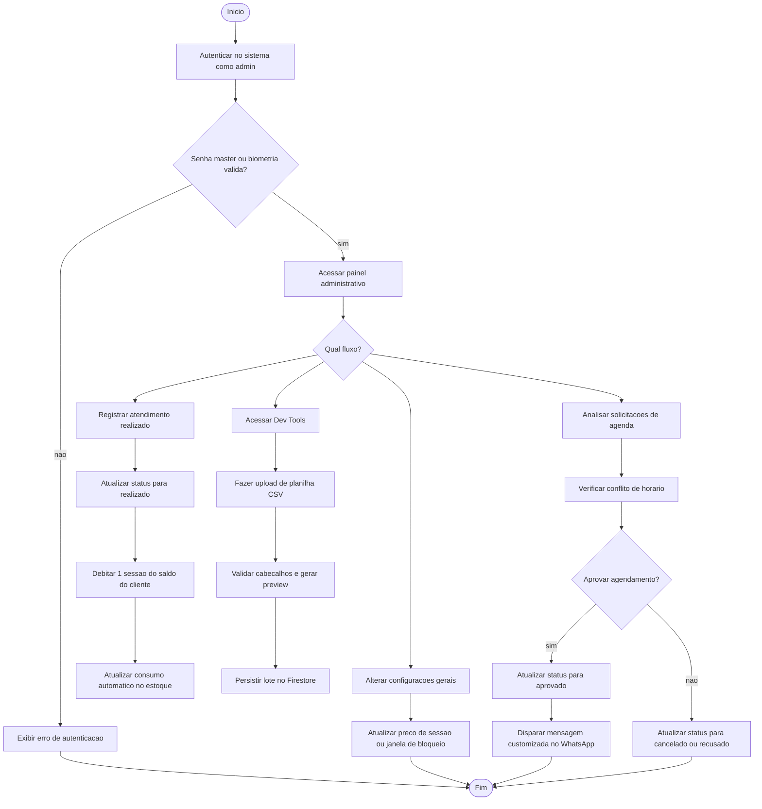
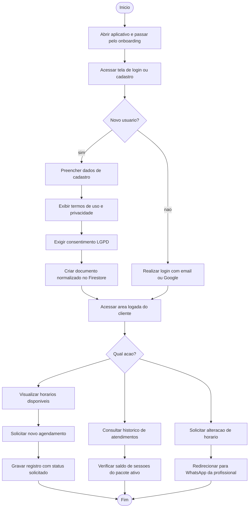
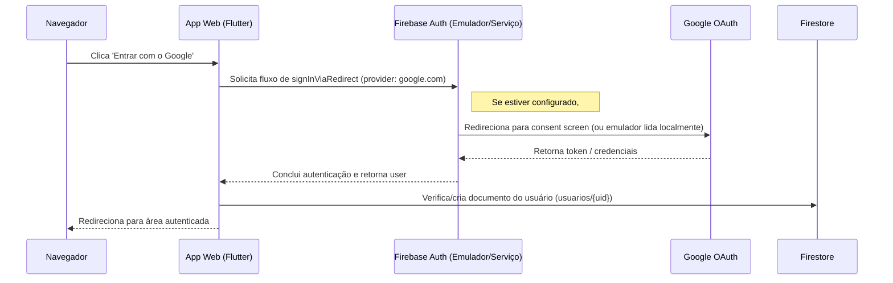

# Diagramas Tecnicos - Agenda Massoterapia

Este arquivo consolida os diagramas principais do projeto em formatos que o GitHub e editores visuais conseguem reutilizar com facilidade.

## 1. Diagrama de Classes UML

Observacao de modelagem: no estado atual do sistema nao existe uma entidade Pacote separada. O controle de sessoes acontece principalmente por `saldo_sessoes` no perfil do cliente e por transacoes financeiras associadas ao atendimento.



## 2. Diagrama de Casos de Uso UML
### 2.1 Visao do Cliente

```javauml
@startuml
left to right direction

actor Cliente
actor "Google Auth" as GoogleAuth
actor "WhatsApp" as WhatsApp

rectangle "Agenda Massoterapia" {
  usecase "Cadastrar / autenticar" as UC1
  usecase "Solicitar agendamento" as UC2
  usecase "Consultar horarios disponiveis" as UC3
  usecase "Consultar historico" as UC4
  usecase "Ver saldo de sessoes" as UC5
  usecase "Solicitar alteracao de horario" as UC6
}

Cliente --> UC1
Cliente --> UC2
Cliente --> UC3
Cliente --> UC4
Cliente --> UC5
Cliente --> UC6

UC1 --> GoogleAuth
UC2 --> WhatsApp
UC6 --> WhatsApp

@enduml
```

### 2.2 Visao da Administradora

```javauml
@startuml
left to right direction

actor Administradora
actor "WhatsApp" as WhatsApp

rectangle "Agenda Massoterapia" {
  usecase "Aprovar ou recusar agendamento" as UC7
  usecase "Registrar atendimento realizado" as UC8
  usecase "Debitar sessao do saldo" as UC9
  usecase "Gerenciar estoque" as UC10
  usecase "Ajustar configuracoes gerais" as UC11
  usecase "Importar planilha CSV" as UC12
  usecase "Auditar solicitacoes LGPD" as UC13
}

Administradora --> UC7
Administradora --> UC8
Administradora --> UC10
Administradora --> UC11
Administradora --> UC12
Administradora --> UC13

UC7 ..> UC9 : <<include>>
UC8 ..> UC9 : <<include>>

@enduml
```

### Intencao de leitura

- O cliente enxerga o fluxo de uso diario do aplicativo.
- A administradora enxerga as funcoes de operacao, configuracao e auditoria.
- O diagrama de classes continua existindo para a estrutura tecnica interna, mas os casos de uso mostram os atores e a separacao funcional.

## 3. Diagrama de Atividades - Visao da Profissional/Admin

### Versao Mermaid



### Versao javaUML

```javauml
@startuml
start
:Autenticar no Sistema (Admin);
if (Senha Master / Biometria Valida?) then (sim)
  :Acessar Painel Administrativo;
  split
    :Visualizar Solicitacoes de Agenda;
    :Analisar Conflito de Horario;
    if (Aprovar Agendamento?) then (Sim)
      :Alterar Estado para "Aprovado";
      :Disparar Link Customizado WhatsApp;
    else (Nao)
      :Alterar Estado para "Cancelado" ou "Recusado";
    endif
  split next
    :Registrar Atendimento Realizado;
    :Alterar Estado para "Realizado";
    :Debitar 1 sessao do saldo do cliente;
    :Atualizar Consumo de Insumos no Estoque;
  split next
    :Acessar Dev Tools;
    :Fazer Upload de Planilha CSV;
    :Validar Cabecalhos e Preview;
    :Persistir Lote de Clientes no Firestore;
  split next
    :Alterar Parametros Dinamicos (Configuracoes);
    :Atualizar Preco de Sessao ou Janela de Bloqueio;
  end split
else (nao)
  :Exibir Erro de Autenticacao;
endif
stop
@enduml
```

## 4. Diagrama de Atividades - Visao do Cliente

### Versao Mermaid



### Versao javaUML

```javauml
@startuml
start
:Abrir Aplicativo (Onboarding);
:Acessar Tela de Login / Cadastro;
if (Novo Usuario?) then (Sim)
  :Preencher Dados de Cadastro;
  :Apresentar Termos de Uso e Privacidade;
  :Exigir Consentimento Explicito (LGPD);
  :Criar Documento Normalizado no Firestore;
else (Nao)
  :Realizar Login (E-mail ou Provedor Google);
endif
:Acessar Area Logada do Cliente;
split
  :Visualizar Horarios Disponiveis;
  :Solicitar Novo Agendamento;
  :Gravar Registro no Estado "Solicitado";
split next
  :Consultar Historico de Atendimentos;
  :Verificar Saldo de Sessoes do Pacote Ativo;
split next
  :Solicitar Alteracao de Horario;
  :Redirecionar para WhatsApp da Profissional;
end split
stop
@enduml
```

## 5. Como exportar para Word ou imagem

Para o GitHub, mantenha este arquivo no repositório. O bloco Mermaid do diagrama de classes e os Mermaid das atividades sao renderizados diretamente na visualizacao do arquivo.

Para o Word, use uma destas abordagens:

1. Use o Mermaid Live Editor para renderizar o bloco Mermaid e baixar a imagem.
2. Em ferramentas visuais como draw.io, Lucidchart ou Astah, use este arquivo como referencia estrutural para recriar o desenho final.

## 6. Modelo Java para Astah

Se a modelagem for feita diretamente no Astah em Java, a estrutura recomendada e esta:

1. Criar um pacote base como `com.agenda.massoterapia`.
2. Criar classes principais para `UsuarioModel`, `Cliente`, `Agendamento`, `TransacaoFinanceira`, `ConfigModel`, `ItemEstoque`, `CupomModel`, `ChatMensagem`, `LogModel`, `AppSoftwareConfigModel` e `ChangeLogModel`.
3. Representar os atributos como campos privados e expor operacoes como metodos publicos, mantendo nomes coerentes com os modelos atuais.
4. Mapear as relacoes de forma equivalente ao diagrama de classes:
    - `UsuarioModel` associado a `Cliente` em relacao 1 para 0..1.
    - `Cliente` associado a `Agendamento`, `TransacaoFinanceira`, `LogModel` e `CupomModel`.
    - `Agendamento` associado a `ChatMensagem`, `TransacaoFinanceira`, `ItemEstoque` e `CupomModel`.
    - `ConfigModel` dependente das regras de `Agendamento`, `ItemEstoque` e `UsuarioModel`.
    - `AppSoftwareConfigModel` ligado a `ChangeLogModel`.
5. Se desejar gerar o modelo a partir do codigo, usar a importacao/reverse engineering do Astah com as classes Dart apenas como referencia conceitual, mantendo o modelo Java separado da implementacao Flutter.

## 7. Fluxo de autenticação — Ao clicar em "Entrar com o Google"

A seguir um diagrama de sequência simplificado descrevendo o comportamento observado ao acionar o botão "Entrar com o Google" na versão web do app.



Observações operacionais:

- Se o emulador de Auth não estiver ativo, a aplicação web tentará acessar 'localhost:9199' e falhará com 'ERR_CONNECTION_REFUSED' comportamento observado durante o teste local.  
- Em ambiente de produção, o fluxo faz redirect ao domínio Google e retorna via OAuth; o app então cria/normaliza o documento do usuário no Firestore.  
- Para testar localmente sem acesso ao Google real, execute os emuladores 'auth', 'firestore' e defina '--dart-define=USE_FIREBASE_EMULATORS=true' ao compilar/rodar a web.

Passos rápidos para reproduzir localmente:

```powershell
# Na raiz do projeto
firebase emulators:start --only auth,firestore --config firebase.json
flutter run -d chrome --dart-define=ENV=dev --dart-define=USE_FIREBASE_EMULATORS=true
```
