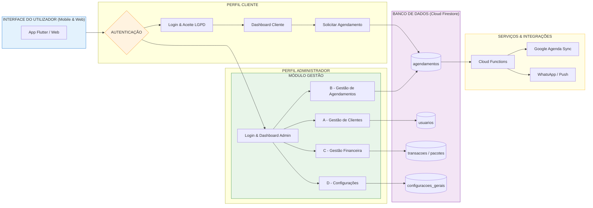

# SAGMA — Sistema de Agendamento e Gestão para Massoterapia

## 📌 Sobre o Projeto

O *SAGMA* é uma aplicação multiplataforma desenvolvida em Flutter com o objetivo de auxiliar profissionais e clínicas de massoterapia no gerenciamento de atendimentos, agendamentos e processos administrativos.

A plataforma oferece recursos para controle de clientes, organização da agenda, acompanhamento financeiro, gestão de estoque e suporte multilíngue, proporcionando maior eficiência operacional e melhor experiência no atendimento terapêutico.

O sistema utiliza Firebase como infraestrutura principal, empregando autenticação segura e banco de dados NoSQL por meio do Firebase Authentication e Cloud Firestore.

---

## 🚀 Primeiros Passos

### Novo no projeto?

Leia o documento abaixo antes de iniciar:

➡️ [BEFORE_STARTING.md](./.github/BEFORE_STARTING.md)

O arquivo contém:

* configuração inicial do ambiente;
* setup obrigatório de GitHub Secrets;
* orientações de execução do projeto.

Tempo estimado: aproximadamente 10 minutos.

---

## ✨ Funcionalidades Principais

* Autenticação segura de usuários;
* Agendamento e gerenciamento de sessões;
* Solicitação de alterações via WhatsApp;
* Dashboard administrativo;
* Controle financeiro e de sessões;
* Controle de estoque de materiais;
* Aplicação multilíngue:

  * Português (PT-BR)
  * Inglês (EN-US)
  * Espanhol (ES)
* Arquitetura preparada para expansão de idiomas;
* Persistência de dados com Firebase Firestore.

---

## 🏗️ Arquitetura do Projeto

Estrutura principal da pasta lib/:

text
lib/
├── core/        → serviços, infraestrutura e recursos compartilhados
├── features/    → módulos organizados por domínio de negócio
├── view/        → telas administrativas e componentes visuais
└── core/models/ → modelos principais do sistema

### Organização por Domínio

* features/auth → autenticação;
* features/agenda → gerenciamento de agenda;
* features/financeiro → controle financeiro;
* features/estoque → gestão de materiais.

---

## 📊 Diagramas Técnicos

Os diagramas oficiais do sistema estão disponíveis em:

➡️ [DIAGRAMAS.md](DIAGRAMAS.md)

O documento contém:

* diagramas em Mermaid compatíveis com GitHub;
* orientações de modelagem;
* estrutura arquitetural do sistema.

### Fluxograma Principal

---

## 🔧 Tecnologias Utilizadas

* Flutter
* Dart
* Firebase Authentication
* Cloud Firestore
* Firebase Core
* WhatsApp Integration
* Internacionalização (i18n)

---

## ⚙️ Configuração do Ambiente

### 1. Configuração do Firebase

1. Crie um projeto no Firebase Console;
2. Ative:

   * Firebase Authentication;
   * Cloud Firestore;
3. Adicione os arquivos:

   * google-services.json
   * GoogleService-Info.plist

nos respectivos diretórios nativos:

text
android/app
ios/Runner

### Dependências principais

yaml
dependencies:
  flutter:
    sdk: flutter
  firebase_core: ^2.10.0
  firebase_auth: ^4.2.0
  cloud_firestore: ^4.5.0
  flutter_localizations:
    sdk: flutter

---

## ▶️ Execução do Projeto

Inicialize o repositório:

bash
git init
git add .
git commit -m "inicial: projeto Flutter de agendamento"

Execute a aplicação:

bash
flutter run

---

## 📁 Modelagem de Dados

Coleções principais do Firestore:

text
usuarios/
agendamentos/
transacoes/
estoque/
configuracoes/
lgpd_logs/
app_software/
app_changelog/

Estrutura de usuário:

text
usuarios/{email_normalizado}/perfil/cliente

---

## 📅 Cronograma de Desenvolvimento

| Período    | Atividade                                 |
| ---------- | ----------------------------------------- |
| Fev        | Setup Flutter/Firebase e modelagem        |
| Mar        | Login, CRUD e agendamento                 |
| Abr        | Financeiro, WhatsApp e estoque            |
| Maio–Julho | Refinamentos, documentação e apresentação |

---

## 🎓 Documentação Acadêmica

O projeto possui documentação acadêmica complementar disponível no repositório:

* anteprojeto_tcc.md
* docs/dossie_entrevistas_elicitacao_requisitos.md

Os documentos incluem:

* introdução e justificativa;
* objetivos gerais e específicos;
* metodologia;
* levantamento de requisitos;
* cronograma;
* fundamentação teórica.

---

## 🔁 Mudanças recentes (20 de maio de 2026)

Pequenas correções e melhorias aplicadas no código-base:

- Inicializado o `Firebase` de forma segura dentro do handler de mensagens em background (`_firebaseMessagingBackgroundHandler`) para evitar falhas em isolates.
- Adicionado `FirestoreService.atualizarPreferenciasUsuario(uid, {theme, locale})` para persistir preferências de `theme` e `locale` no documento do usuário.

Próximos passos sugeridos:

- Testar fluxo de notificações push em Android/iOS/Web para validar handler em background.
- Criar testes unitários/mocks para `FirestoreService` (usar `cloud_firestore_mocks` ou approaches similares).
- Atualizar documentação de variáveis de ambiente com as chaves Firebase e VAPID.

---

## 🔐 Variáveis de Ambiente Obrigatórias / Principais

As variáveis de ambiente podem ser fornecidas via `.env` ou `--dart-define`.

- `DB_ADMIN_PASSWORD` — senha administrativa para scripts de migração.
- `ADMIN_EMAIL` — email do administrador principal.
- `FIREBASE_PROJECT_ID`
- `FIREBASE_MESSAGING_SENDER_ID`
- `FIREBASE_STORAGE_BUCKET`

Chaves específicas por plataforma (adicionais quando aplicáveis):
- `FIREBASE_WEB_API_KEY`, `FIREBASE_WEB_APP_ID`
- `FIREBASE_ANDROID_API_KEY`, `FIREBASE_ANDROID_APP_ID`

Outras variáveis relevantes:
- `VAPID_KEY` — chave pública para Web Push (FCM) no Web
- `FIREBASE_APPCHECK_DEBUG_TOKEN` — token de depuração App Check (web local)
- `RECAPTCHA_SITE_KEY` (ou `RECAPTCHA_SITE_KEY_CLIENT`) — chave pública reCAPTCHA para App Check Web
- `USE_FIREBASE_EMULATORS` — `true` para apontar para emuladores locais
- `ENABLE_APPCHECK_IN_DEBUG`, `ENABLE_APPCHECK_IN_RELEASE` — controlam ativação do App Check
- `ENABLE_WEB_PUSH_IN_DEBUG` — permite web push em modo debug
- `FORCE_CONFIG_CHECK` — força verificação de chaves em startup
- `USE_DEVICE_PREVIEW` — (opcional) se definido como `true` sempre habilita DevicePreview

Coloque essas variáveis em um arquivo `.env` local (não comitar) ou configure via CI/CD/GitHub Secrets.

---

## 📌 Próximas Implementações

* Dashboard administrativo avançado;
* Sistema de notificações;
* Aprovação automática de agendamentos;
* Relatórios financeiros;
* Melhorias de usabilidade;
* Expansão de idiomas.

---

## 📄 Licença

Projeto desenvolvido para fins acadêmicos e educacionais.
