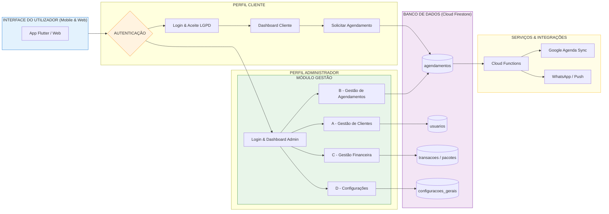

# SAGMA — Sistema de Agendamento e Gestão para Massoterapia


## 📌 Sobre o Projeto

O *SAGMA* é uma aplicação multiplataforma desenvolvida em Flutter com o objetivo de auxiliar profissionais e clínicas de massoterapia no gerenciamento de atendimentos, agendamentos e processos administrativos.

A plataforma oferece recursos para controle de clientes, organização da agenda, acompanhamento financeiro, gestão de estoque e suporte multilíngue, proporcionando maior eficiência operacional e melhor experiência no atendimento terapêutico.

O sistema utiliza Firebase como infraestrutura principal, empregando autenticação segura e banco de dados NoSQL por meio do Firebase Authentication e Cloud Firestore.

---

## 🚀 Primeiros Passos

### Novo no projeto?

Leia o documento abaixo antes de iniciar:

➡️ [BEFORE_STARTING.md](./.github/BEFORE_STARTING.md)

O arquivo contém:

* configuração inicial do ambiente;
* setup obrigatório de GitHub Secrets;
* orientações de execução do projeto.

Tempo estimado: aproximadamente 10 minutos.

---

## ✨ Funcionalidades Principais

* Autenticação segura de usuários;
* Agendamento e gerenciamento de sessões;
* Solicitação de alterações via WhatsApp;
* Dashboard administrativo;
* Controle financeiro e de sessões;
* Controle de estoque de materiais;
* Aplicação multilíngue:

  * Português (PT-BR)
  * Inglês (EN-US)
  * Espanhol (ES)
* Arquitetura preparada para expansão de idiomas;
* Persistência de dados com Firebase Firestore.

---

## 🏗️ Arquitetura do Projeto

Estrutura principal da pasta lib/:

text
lib/
├── core/        → serviços, infraestrutura e recursos compartilhados
├── features/    → módulos organizados por domínio de negócio
├── view/        → telas administrativas e componentes visuais
└── core/models/ → modelos principais do sistema


### Organização por Domínio

* features/auth → autenticação;
* features/agenda → gerenciamento de agenda;
* features/financeiro → controle financeiro;
* features/estoque → gestão de materiais.

---

## 📊 Diagramas Técnicos

Os diagramas oficiais do sistema estão disponíveis em:

➡️ [DIAGRAMAS.md](DIAGRAMAS.md)

O documento contém:

* diagramas em Mermaid compatíveis com GitHub;
* orientações de modelagem;
* estrutura arquitetural do sistema.

### Fluxograma Principal



---

## 🔧 Tecnologias Utilizadas

* Flutter
* Dart
* Firebase Authentication
* Cloud Firestore
* Firebase Core
* WhatsApp Integration
* Internacionalização (i18n)

---

## ⚙️ Configuração do Ambiente

### 1. Configuração do Firebase

1. Crie um projeto no Firebase Console;
2. Ative:

   * Firebase Authentication;
   * Cloud Firestore;
3. Adicione os arquivos:

   * google-services.json
   * GoogleService-Info.plist

nos respectivos diretórios nativos:

text
android/app
ios/Runner


### Dependências principais

yaml
dependencies:
  flutter:
    sdk: flutter
  firebase_core: ^2.10.0
  firebase_auth: ^4.2.0
  cloud_firestore: ^4.5.0
  flutter_localizations:
    sdk: flutter


---

## ▶️ Execução do Projeto

Inicialize o repositório:

bash
git init
git add .
git commit -m "inicial: projeto Flutter de agendamento"


Execute a aplicação:

bash
flutter run


---

## 📁 Modelagem de Dados

Coleções principais do Firestore:

text
usuarios/
agendamentos/
transacoes/
estoque/
configuracoes/
lgpd_logs/
app_software/
app_changelog/


Estrutura de usuário:

text
usuarios/{email_normalizado}/perfil/cliente


---

## 📅 Cronograma de Desenvolvimento

| Período    | Atividade                                 |
| ---------- | ----------------------------------------- |
| Fev        | Setup Flutter/Firebase e modelagem        |
| Mar        | Login, CRUD e agendamento                 |
| Abr        | Financeiro, WhatsApp e estoque            |
| Maio–Julho | Refinamentos, documentação e apresentação |

---

## 🎓 Documentação Acadêmica

O projeto possui documentação acadêmica complementar disponível no repositório:

* anteprojeto_tcc.md
* docs/dossie_entrevistas_elicitacao_requisitos.md

Os documentos incluem:

* introdução e justificativa;
* objetivos gerais e específicos;
* metodologia;
* levantamento de requisitos;
* cronograma;
* fundamentação teórica.

---

## 🚀 Checklist de Deploy para Produção

### Pré-requisitos

- [ ] Conta Google / Firebase criada para o projeto de produção
- [ ] Flutter SDK ≥ 3.19 instalado (`flutter --version`)
- [ ] Firebase CLI instalada (`npm install -g firebase-tools`) e autenticada (`firebase login`)
- [ ] Node.js ≥ 20 para Cloud Functions

### 1. Criar projeto Firebase de produção

```bash
# No console Firebase: https://console.firebase.google.com
# Crie um projeto com ID único, ex: sagma-andreia
# Ative: Authentication (Email/Senha), Firestore, Storage, Hosting, Functions
# Região recomendada: southamerica-east1 (São Paulo)
```

### 2. Configurar o app Flutter

```bash
# Instale o FlutterFire CLI
dart pub global activate flutterfire_cli

# Reconfigure o projeto apontando para o novo Firebase
flutterfire configure --project=SEU_PROJECT_ID
# Isso gera: lib/firebase_options.dart (substitui o anterior)
```

Crie um arquivo `.env` local (não commitar) com:

```
FIREBASE_PROJECT_ID=sagma-andreia
FIREBASE_MESSAGING_SENDER_ID=xxxxxxxxxxxx
FIREBASE_STORAGE_BUCKET=sagma-andreia.appspot.com
FIREBASE_WEB_API_KEY=AIza...
FIREBASE_WEB_APP_ID=1:xxx:web:xxx
FIREBASE_ANDROID_API_KEY=AIza...
FIREBASE_ANDROID_APP_ID=1:xxx:android:xxx
VAPID_KEY=<chave-pública-FCM-web>
ADMIN_EMAIL=andreia@email.com
```

### 3. Deploy das Firestore Security Rules

```bash
firebase deploy --only firestore:rules --project=SEU_PROJECT_ID
```

### 4. Deploy das Cloud Functions

```bash
cd functions
npm install
cd ..
firebase deploy --only functions --project=SEU_PROJECT_ID
```

### 5. Build e deploy do Web (Firebase Hosting)

```bash
flutter build web --release \
  --dart-define=FIREBASE_PROJECT_ID=$FIREBASE_PROJECT_ID \
  --dart-define=FIREBASE_WEB_API_KEY=$FIREBASE_WEB_API_KEY \
  --dart-define=FIREBASE_WEB_APP_ID=$FIREBASE_WEB_APP_ID \
  --dart-define=FIREBASE_MESSAGING_SENDER_ID=$FIREBASE_MESSAGING_SENDER_ID \
  --dart-define=FIREBASE_STORAGE_BUCKET=$FIREBASE_STORAGE_BUCKET \
  --dart-define=VAPID_KEY=$VAPID_KEY

firebase deploy --only hosting --project=SEU_PROJECT_ID
```

### 6. Build Android (APK/AAB)

```bash
flutter build apk --release \
  --dart-define=FIREBASE_PROJECT_ID=$FIREBASE_PROJECT_ID \
  --dart-define=FIREBASE_ANDROID_API_KEY=$FIREBASE_ANDROID_API_KEY \
  --dart-define=FIREBASE_ANDROID_APP_ID=$FIREBASE_ANDROID_APP_ID \
  --dart-define=FIREBASE_MESSAGING_SENDER_ID=$FIREBASE_MESSAGING_SENDER_ID \
  --dart-define=FIREBASE_STORAGE_BUCKET=$FIREBASE_STORAGE_BUCKET
# APK gerado em: build/app/outputs/flutter-apk/app-release.apk
```

### 7. Criar usuário administrador inicial

No Firestore do projeto de produção, crie manualmente o documento:

```
Coleção: usuarios
Documento ID: andreia@email.com  (email em letras minúsculas)

Campos:
  nome: "Andréia"
  email: "andreia@email.com"
  tipo_usuario: "Administrador"
  status_aprovacao: "aprovado"
  data_cadastro: <timestamp atual>
```

Depois faça login no app com esse email — o Firebase Auth criará a conta na primeira autenticação.

### 8. Configurar lembretes automáticos

No Cloud Functions Console, verifique se o job agendado `enviarLembretesDiarios` está ativo (todo dia 08:00 horário de Brasília).

### 9. Pós-deploy — verificações

- [ ] Login e cadastro funcionando
- [ ] Agendamento criado por cliente aparece no painel admin
- [ ] Push notification chega ao admin ao criar agendamento
- [ ] Botão WhatsApp abre mensagem pré-preenchida
- [ ] Relatório PDF exportado com sucesso
- [ ] Regras Firestore: cliente não consegue ler dados de outro cliente

---

## 🔀 Guia de Migração para Nova Conta Firebase (Andréia)

1. Siga os passos do **Checklist de Deploy** acima usando o novo Project ID
2. **Não migre dados** do projeto showcase — comece com Firestore vazio
3. As variáveis sensíveis (chaves API, `google-services.json`, `GoogleService-Info.plist`) do projeto da Andréia **não devem ser commitadas** no repositório público do GitHub
4. Use o repositório público como template: faça fork ou clone e configure os GitHub Secrets do novo repositório (`Settings → Secrets → Actions`) com as variáveis do item 2
5. O arquivo `lib/firebase_options.dart` é gerado por `flutterfire configure` — adicione ao `.gitignore` se o repositório for público

---

## 🔁 Mudanças recentes (10 de junho de 2026)

Correções de bugs e preparação para produção:

**Dart/Flutter**
- Corrigido bug de precedência de operadores em `login_controller.dart` — `kIsWeb && A || B` avaliava `B` sem verificar `kIsWeb`; corrigido para `kIsWeb && (A || B)`.
- Corrigida indentação inconsistente no método `_isFirestorePermissionLikelyAppCheck`.
- Corrigida porta do emulador Firestore em `main.dart`: usava `8080` mas `firebase.json` configura `8081`.
- Corrigida indentação de `ElevatedButton` em `services_view.dart`.

**CI/CD (`flutter_ci.yml`)**
- Corrigida referência a `build_prod.sh` (arquivo inexistente — o projeto usa `.ps1`); substituída por comandos `flutter build apk` diretos.
- Corrigido escopo da variável `$COVERAGE`: não era exportada entre steps via `$GITHUB_ENV`, causando falha silenciosa no badge de cobertura.

**Cloud Functions**
- Corrigido `functions/package.json`: `"main"` apontava para `lib/index.js` (saída TypeScript compilada inexistente); corrigido para `index.js` (JavaScript direto na raiz).
- Corrigidos caminhos nos scripts `serve`/`deploy`/`logs` que referenciavam `../lib/config/firebase.json` incorretamente; corrigido para `../firebase.json`.
- Removido `predeploy: ["npm run build"]` do `firebase.json`: não há fonte TypeScript em `functions/src/`, então `tsc` falhava e impedia o deploy das Cloud Functions.

**Firestore Rules**
- Adicionada permissão de leitura pública para `configuracoes/geral`: a verificação de modo de manutenção ocorre no startup do app (antes do login) e falhava com `permission-denied`; agora permite `get` sem autenticação somente nesse documento.

---

## 🔁 Mudanças recentes (20 de maio de 2026)

Pequenas correções e melhorias aplicadas no código-base:

- Inicializado o `Firebase` de forma segura dentro do handler de mensagens em background (`_firebaseMessagingBackgroundHandler`) para evitar falhas em isolates.
- Adicionado `FirestoreService.atualizarPreferenciasUsuario(uid, {theme, locale})` para persistir preferências de `theme` e `locale` no documento do usuário.

Próximos passos sugeridos:

- Testar fluxo de notificações push em Android/iOS/Web para validar handler em background.
- Criar testes unitários/mocks para `FirestoreService` (usar `cloud_firestore_mocks` ou approaches similares).
- Atualizar documentação de variáveis de ambiente com as chaves Firebase e VAPID.

---

## 🔐 Variáveis de Ambiente Obrigatórias / Principais

As variáveis de ambiente podem ser fornecidas via `.env` ou `--dart-define`.

- `DB_ADMIN_PASSWORD` — senha administrativa para scripts de migração.
- `ADMIN_EMAIL` — email do administrador principal.
- `FIREBASE_PROJECT_ID`
- `FIREBASE_MESSAGING_SENDER_ID`
- `FIREBASE_STORAGE_BUCKET`

Chaves específicas por plataforma (adicionais quando aplicáveis):
- `FIREBASE_WEB_API_KEY`, `FIREBASE_WEB_APP_ID`
- `FIREBASE_ANDROID_API_KEY`, `FIREBASE_ANDROID_APP_ID`

Outras variáveis relevantes:
- `VAPID_KEY` — chave pública para Web Push (FCM) no Web
- `FIREBASE_APPCHECK_DEBUG_TOKEN` — token de depuração App Check (web local)
- `RECAPTCHA_SITE_KEY` (ou `RECAPTCHA_SITE_KEY_CLIENT`) — chave pública reCAPTCHA para App Check Web
- `USE_FIREBASE_EMULATORS` — `true` para apontar para emuladores locais
- `ENABLE_APPCHECK_IN_DEBUG`, `ENABLE_APPCHECK_IN_RELEASE` — controlam ativação do App Check
- `ENABLE_WEB_PUSH_IN_DEBUG` — permite web push em modo debug
- `FORCE_CONFIG_CHECK` — força verificação de chaves em startup
- `USE_DEVICE_PREVIEW` — (opcional) se definido como `true` sempre habilita DevicePreview

Coloque essas variáveis em um arquivo `.env` local (não comitar) ou configure via CI/CD/GitHub Secrets.

---

## ✅ Funcionalidades Implementadas (Junho/2026)

Itens anteriormente listados como "próximas implementações" que já foram entregues:

* **Notificações push** — admin recebe push ao criar agendamento; clientes recebem lembrete 24h antes (Cloud Functions + FCM)
* **Relatório financeiro em PDF** — exportação e compartilhamento direto da tela financeira
* **Botão WhatsApp de aprovação rápida** — admin envia mensagem pré-preenchida ao aprovar um cliente
* **Regras Firestore completas** — todas as coleções cobertas (`transacoes`, `estoque`, `cupons`, `app_software`, `app_changelog`, `lgpd_logs`)
* **Descarte automático LGPD** — Cloud Function `limparLogsLgpdAntigos` apaga logs com mais de 5 anos diariamente

## 📌 Próximas Implementações Sugeridas

* Pagamento online integrado (Mercado Pago / Stripe);
* Sincronização com Google Calendar;
* Relatórios avançados de sazonalidade;
* Expansão de idiomas (japonês, francês).

---

## 📄 Licença

Projeto desenvolvido para fins acadêmicos e educacionais.
