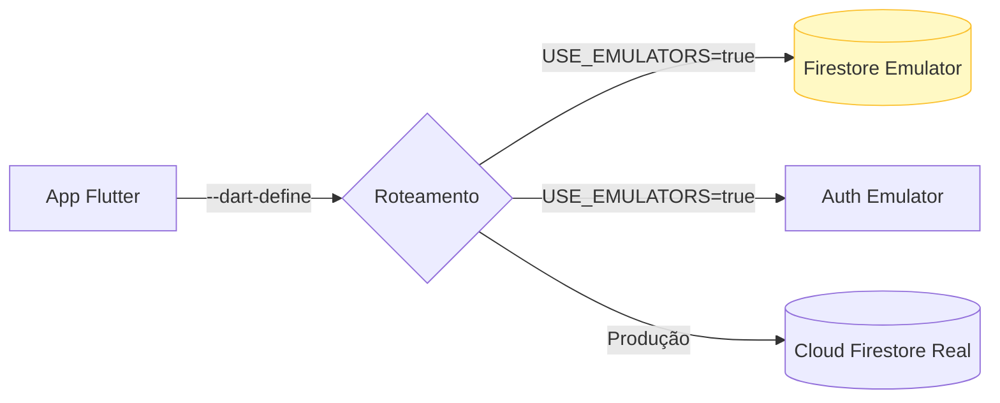

# ⚙️ Ambiente de Diagnóstico, Governança e DevOps

Este documento descreve as diretrizes de governança técnica, simulação de ambiente e painéis operacionais focados no desenvolvedor (DevTools) dentro do ecossistema do SAGMA.

---

## 1. Painel de Desenvolvimento (DevTools)
As funcionalidades de diagnóstico foram totalmente isoladas das áreas de negócio. O acesso ao **DevTools** exige uma Autenticação de 2 Fatores (2FA) indireta:
1. É necessário ter perfil de administrador do sistema.
2. É obrigatório informar senhas de segurança (`DB_ADMIN_PASSWORD`) carregadas a partir das variáveis de ambiente (`.env`).

### 1.1 DB Manager e Operações
Interface embarcada no app para monitoramento do NoSQL (Firestore):
- **Monitoramento de Volumetria:** Quantifica os documentos em tempo real de coleções sensíveis (`usuarios`, `agendamentos`, `estoque`, `configuracoes`, `logs`, etc).
- **Auditoria e Exportação:** Permite exportar a base inteira de uma coleção nos formatos `JSON`, `CSV` e planilhas eletrônicas (`Excel/XLSX`). Integra envios diretamente para APIs web externas via Proxy.
- **População e Truncate:** Rotinas automatizadas de inserção em massa (Data Seeding) e exclusão irreversível (Truncate) com fins de testes em ambiente não produtivo.

### 1.2 Device Preview e Console Logs
- **Logs em Tempo Real:** Captura de fluxo e exceções diretamente na tela do dispositivo, classificados por filtro (`erro`, `aviso`, `info`, `cancelamento`).
- **Device Preview:** Ativa a simulação de múltiplos tamanhos de tela simultaneamente para verificação de responsividade sem necessidade de rebuild.

---

## 2. Padrão OpenAPI 3.0 (Swagger)
Os métodos de interação lógicos do backend, gatilhos acionados via HTTP e integrações externas (barramentos) foram mapeados utilizando a especificação de mercado **OpenAPI 3.0**. 

A documentação técnica Swagger encontra-se hospedada internamente (via renderizador web implementado no pacote) e permite que a equipe de engenharia e auditores revisem as entradas (cargas JSON) e repostas (status HTTP e estruturas de resposta) das automações Cloud Functions.

---

## 3. Governança de Software e Changelog
A transparência das *releases* de software é mantida por meio das coleções `app_software` e `app_changelog`. 
- **Notificação Integrada:** Novas versões maiores disparam "Modais de Novidades" dentro do próprio aplicativo, informando os utilizadores (clientes e admin) das melhorias recentes.
- **Bloqueio Crítico:** A aplicação é capaz de forçar atualizações ou ativar o "Modo Manutenção", impossibilitando novos agendamentos durante janelas de refatoração do banco de dados.

---

## 4. Testes Controlados com Firebase Emulator Suite
Visando proteção contra regressões em produção e garantia de um ambiente local fidedigno, o ciclo de TDD e desenvolvimento funcional adota os emuladores locais do Firebase.



- **Firestore Emulator:** Validação da árvore de documentos e de transações financeiras e baixa de pacotes em um servidor NoSQL restrito a `localhost`.
- **Security Rules (Regras de Segurança):** Avaliação de comportamento defensivo para proteção a ataques. Testes comprovam que apenas o usuário da sessão pode ler sua própria Ficha de Anamnese, e que usuários normais sofrem bloqueio ao tentar realizar um *bypass* nos atributos de status de pagamento de pacote.
- **Auth & Logs:** Criação, simulação de exclusão de usuários e ativação de rotinas em Background, tudo capturado na interface nativa do *Firebase Emulator UI* em tempo real.

### Ativação do Ambiente Isolado:
```bash
# Inicia o Emulator Suite com Auth e Firestore local na porta 4000
firebase emulators:start --only auth,firestore --config firebase.json

# Executa a aplicação Flutter instruída a apontar para o emulador
flutter run -d chrome --dart-define=ENV=dev --dart-define=USE_FIREBASE_EMULATORS=true
```