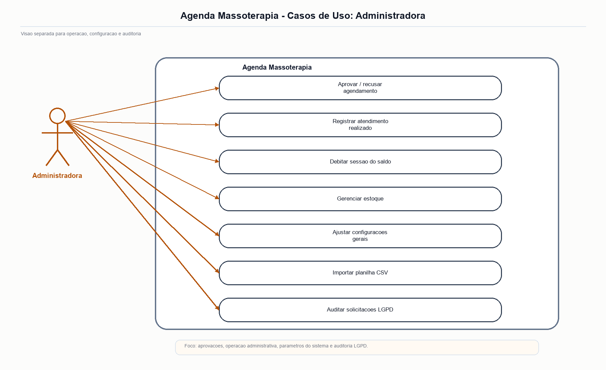
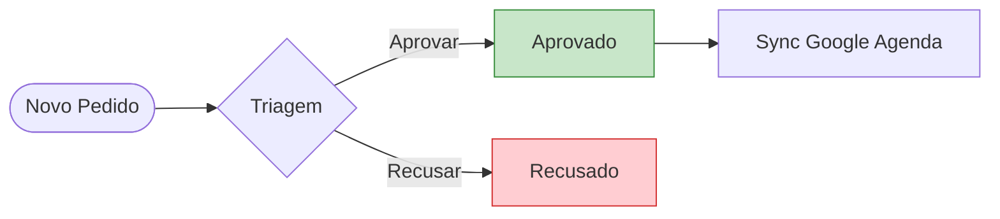

# 🛠️ Manual Operacional da Administradora

## Visão Geral
O painel operativo do **SAGMA (Sistema de Agendamento e Gestão para Massoterapia)** foi projetado para centralizar a governança da clínica. Ele é responsivo, adaptando-se automaticamente a telas mobile e terminais web, e organiza a rotina da administradora em cinco frentes: **Dash, Agenda, Pendentes, Clientes e Configurações**.

**Figura 1. Tela Administração Dash Resumo**
 

 
**Fonte: Autores (2026).**
 
A presente figura apresenta a visão consolidada dos indicadores analíticos da administradora, com métricas de acompanhamento diário, mensal e operacional.

---

## 1. Dashboard e visão executiva
A aba **Dash** atua como o centro de inteligência do negócio. Os dados nela apresentados derivam de *snapshots* registrados reativamente na coleção `metricas_diarias` e ajudam a acompanhar volume, recorrência e saúde operacional.

- **Volumetria Diária/Semanal/Mensal:** Total de agendamentos realizados e pendentes.
- **Estimativa de Faturamento:** Projeção de receita baseada nas sessões confirmadas e realizadas no mês.
- **Taxa de Absenteísmo e Cancelamentos:** Indicadores percentuais de clientes que desmarcaram, categorizados entre "cancelado" (dentro do prazo) e "cancelado_tardio" (com ônus).

**Figura 2. Tela Administração Clientes Detalhes Resumo**
 

 
**Fonte: Autores (2026).**
 
A presente figura evidencia a visão resumida de um cliente, concentrando dados cadastrais, ações de apoio e uma leitura rápida do contexto operacional.

---

## 2. Gestão de agenda, pendências e integrações
A aba **Agenda** exibe a grade cronológica da profissional. A aba **Pendentes** concentra os pedidos aguardando triagem e a decisão administrativa.

**Figura 3. Diagrama Casos Uso Admin Agenda Massoterapia**
 

 
**Fonte: Autores (2026).**
 
A presente figura apresenta o diagrama de casos de uso da administradora, destacando as interações centrais entre triagem, aprovação, recusa e sincronização de agenda.

- **Triagem de Solicitações (Aba Pendentes):** Novos pedidos entram no estado inicial `solicitado`. A administradora possui a alçada para *Aprovar* ou *Recusar*, evitando sobreposições de horários.
- **Google Calendar Sync:** Uma integração unidirecional garante que todas as sessões validadas pelo aplicativo reflitam de forma imediata na grade do Google Agenda pessoal da profissional.
- **Notificações:** Ações tomadas na agenda disparam eventos e podem acionar o WhatsApp para comunicação direta com o cliente.

**Figura 4. Tela Google Agenda Semana Horarios**
 

 
**Fonte: Autores (2026).**
 
A presente figura ilustra a integração visual com a agenda externa, exibindo a organização semanal dos horários da profissional.

**Figura 5. Tela Admin Pendentes Aprovacao Cadastro**
 

 
**Fonte: Autores (2026).**
 
A presente figura evidencia a fila de cadastros aguardando aprovação, etapa importante para a validação de novos clientes.

**Figura 6. Tela Admin Agendamentos Vazios Lista**
 

 
**Fonte: Autores (2026).**
 
A presente figura mostra a tela de agendamentos quando a lista está vazia, evidenciando o estado inicial da gestão da agenda.

---

## 3. Gestão de clientes, pacotes e estoque
O módulo **Clientes** apresenta a base de usuários registrados (coleção `usuarios`) e concentra as informações necessárias para acompanhamento do histórico e dos pacotes ativos.

- **Busca Avançada:** Localização de cadastros via Nome, E-mail ou ID.
- **Fichas Detalhadas:** Informações críticas do paciente (anamnese), saldo atualizado de sessões (pacotes ativos) e histórico financeiro de pagamentos.
- **Controle de Saldo:** Possibilidade de abater sessões consumidas e gerenciar métricas de recorrência (frequência histórica).

**Figura 7. Tela Admin Clientes Detalhes Completos**
 

 
**Fonte: Autores (2026).**
 
A presente figura apresenta a ficha detalhada de um cliente, reunindo informações cadastrais, histórico e controles administrativos.

**Figura 8. Tela Administracao Clientes Tema Escuro**
 

 
**Fonte: Autores (2026).**
 
A presente figura ilustra a listagem de clientes no tema escuro, usada para validar contraste e conforto visual na administração.

**Figura 9. Tela Administração Cadastro Estoque**
 

 
**Fonte: Autores (2026).**
 
A presente figura mostra o formulário de cadastro de itens de estoque, utilizado para registrar e manter os insumos da clínica.

**Figura 10. Tela Administração Controle Estoque**
 

 
**Fonte: Autores (2026).**
 
A presente figura evidencia a lista de itens em estoque, com filtros, ajustes de quantidade e ações de gerenciamento.

---

## 4. Personalização da Experiência (UI/UX)
O sistema permite que o administrador ajuste a interface para seu conforto ergonômico e perfil de atendimento:

- **Temas Dinâmicos:** Acesso a 10 esquemas de cores pré-configurados (incluindo o *Dark Mode* / Tema Escuro), com aplicação e pré-visualização em tempo real.
- **Internacionalização (i18n):** Suporte nativo e troca instantânea entre 5 idiomas:
  - 🇧🇷 Português (Brasileiro)
  - 🇺🇸 Inglês (English)
  - 🇪🇸 Espanhol (Español)
  - 🇫🇷 Francês (Français)
  - 🇯🇵 Japonês (日本語)

---

**Figura 11. Tela Administracao Escolher Tema Dialogo Preview**
 

 
**Fonte: Autores (2026).**
 
A presente figura mostra a pré-visualização do tema antes da aplicação definitiva na interface administrativa.

**Figura 12. Tela Administracao Escolher Tema Lista Opcoes**
 

 
**Fonte: Autores (2026).**
 
A presente figura evidencia a lista de opções disponíveis para personalização do tema da interface.

**Figura 13. Tela Administração Configurações 1**
 

 
**Fonte: Autores (2026).**
 
A presente figura exibe a primeira camada de parametrização administrativa, com ajustes gerais do sistema.

**Figura 14. Tela Administração Configurações 2**
 

 
**Fonte: Autores (2026).**
 
A presente figura complementa a parametrização com opções de integração, políticas e comportamento operacional.

**Figura 15. Tela Administração Configurações 3**
 

 
**Fonte: Autores (2026).**
 
A presente figura reúne controles adicionais de personalização e segurança sob responsabilidade da administração.

**Figura 16. Tela Administração Configurações 4**
 

 
**Fonte: Autores (2026).**
 
A presente figura apresenta a aba final de configurações, com opções de manutenção e versionamento do sistema.

**Figura 17. Tela Administração Auditoria LGPD**
 

 
**Fonte: Autores (2026).**
 
A presente figura documenta a auditoria de LGPD e o fluxo de anonimização de dados após a exclusão de uma conta, reforçando os critérios de privacidade e conformidade legal.

---

## 5. Imagens complementares da administração
Além das telas principais, o repositório contém imagens suplementares na pasta `docs/complementares` que documentam fluxos e estados auxiliares da administração. Elas são úteis para o apêndice ou material de apoio.

**Figura 18. Tela Admin Dashboard Resumo Geral**
 

 
**Fonte: Autores (2026).**
 
Visão alternativa do painel executivo com foco em métricas consolidadas.

**Figura 19. Tela Admin Pendentes Aprovacao Cadastro**
 

 
**Fonte: Autores (2026).**
 
Fila de cadastros aguardando revisão administrativa.

**Figura 20. Tela Admin Clientes Detalhes Completos**
 

 
**Fonte: Autores (2026).**
 
Ficha detalhada do cliente com histórico e controles administrativos.

**Figura 21. Tela Admin Agendamentos Vazios Lista**
 

 
**Fonte: Autores (2026).**
 
Estado da lista de agendamentos quando não há itens a exibir.

**Figura 22. Tela Administração — Configuração Sistema Padrão**
 

 
**Fonte: Autores (2026).**
 
Configurações básicas do sistema acessíveis à administradora.

**Figura 23. Tela Administração — Métricas Diárias / Agendamentos**
 

 
**Fonte: Autores (2026).**
 
Visão detalhada de métricas e séries temporais para acompanhamento operacional.

**Figura 24. Tela Administração — Seleção de Idioma / Cliente**
 

 
**Fonte: Autores (2026).**
 
Opção administrativa para seleção de idioma e filtros de exibição.

**Figura 25. Tela Administração — Template WhatsApp de Aprovação**
 

 
**Fonte: Autores (2026).**
 
Modelo de mensagem usado para comunicação com clientes durante aprovações.

**Figura 26. Tela Administração — Nova Senha Admin (visual)**
 

 
**Fonte: Autores (2026).**
 
Interface de recuperação/definição de senha para usuários administrativos.

**Figura 27. Tela Versão App — Pendentes / Listagem**
 

 
**Fonte: Autores (2026).**
 
Exemplo de listagem de versões e itens pendentes relacionados ao aplicativo.

> *Nota Técnica: Todas as configurações globais descritas (incluindo chaves de personalização e regras de cancelamento) são persistidas diretamente no Cloud Firestore (coleções `configuracoes/geral` e `configuracoes_gerais`), propagando as regras de negócio de maneira instantânea sem necessidade de atualizações nas lojas de aplicativos.*

---

## Links Relacionados

- Manual Administrativo: [MANUAL_ADMINISTRATIVO.md](MANUAL_ADMINISTRATIVO.md) (você está aqui!)
- Manual do Cliente: [MANUAL_CLIENTE.md](MANUAL_CLIENTE.md) (veja também)
- DevOps e Emuladores: [DEVOPS_AND_EMULATORS.md](DEVOPS_AND_EMULATORS.md) (veja também)
