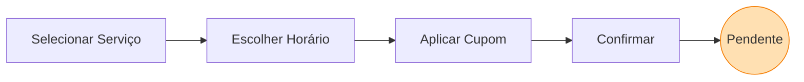

# 📱 Manual do Cliente - Fluxo de Agendamento

## Visão Geral
A interface do cliente no **SAGMA** foi concebida para oferecer fricção mínima ("frictionless experience"). Desde o *onboarding* e o aceite da LGPD, até o acompanhamento do saldo de sessões, a navegação é guiada e intuitiva.

---

## 1. Tela Inicial e Histórico
Ao autenticar-se, o cliente é direcionado ao seu **Dashboard Pessoal**.

- **Linha do Tempo (Histórico):** Lista cronológica contendo sessões passadas (Realizadas), agendamentos futuros (Aprovados) e requisições aguardando retorno (Pendentes).
- **Ação Principal:** Um gatilho flutuante (FAB - *Floating Action Button*) permanente no canto da tela induz a ação primária: **"Novo Agendamento"**.

---

## 2. Fluxo Interativo de Agendamento
A solicitação de um horário é dividida em estágios consecutivos e claros:

1. **Seleção de Procedimento:** O cliente escolhe o tipo de massagem desejada (Relaxante, Desportiva, Drenagem, etc.). 
   - *Recurso de Favoritos:* Serviços recorrentes podem ser marcados com uma "Estrela Dourada", mantendo-os no topo da lista para agendamentos futuros rápidos.
2. **Grade de Horários:** O sistema realiza uma checagem defensiva de concorrência com o Firebase. Apenas horários estritamente livres (respeitando a janela de descanso e horários ocupados) são exibidos para escolha do cliente.
3. **Aplicação de Cupons:** Antes da revisão final, é possível inserir códigos promocionais ativos geridos pela administradora.
4. **Confirmação:** Um resumo (Data, Hora, Tipo e Desconto) é apresentado para anuência final.

---

## 3. Pós-Agendamento e Trilha de Status

- Ao confirmar, o agendamento é persistido no Firestore com a flag de estado `solicitado` (pendente).
- **Integração Externa:** O sistema disponibiliza atalhos para o WhatsApp, permitindo que o cliente notifique rapidamente a terapeuta ou negocie exceções caso seja necessário.
- **Status Visuais:** Os *badges* (chips) na tela principal mudam de cor conforme a resposta da administração:
  - 🟠 **Pendente** (Em análise)
  - 🟢 **Aprovado** (Confirmado na agenda)
  - 🔴 **Recusado** (Horário indisponível)

---

## 4. Gestão de Perfil e LGPD
Acessando as configurações do perfil, o cliente pode atualizar sua ficha de Anamnese e gerir seus contatos de indicação. 
Caso deseje, o cliente tem acesso ao fluxo de **Direito ao Esquecimento**, que aciona a *anonimização* irreversível de seus dados na base da clínica (obedecendo os critérios legais da LGPD).