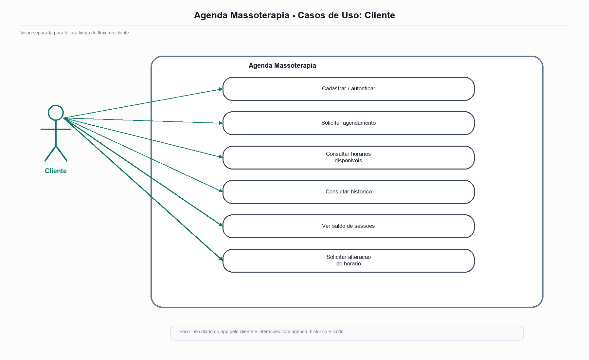
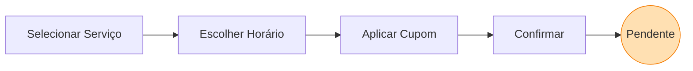
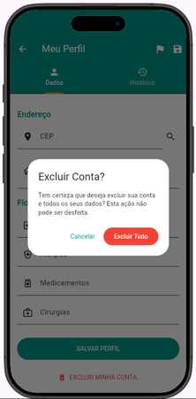

# 📱 Manual do Cliente - Fluxo de Agendamento

## Visão Geral
A interface do cliente no **SAGMA** foi concebida para oferecer fricção mínima ("frictionless experience"). Desde o *onboarding* e o aceite da LGPD, até o acompanhamento do saldo de sessões, a navegação é guiada e intuitiva.

### Diagrama de Casos de Uso do Cliente

**Fonte: Autores (2026).**

O diagrama sintetiza as principais interações do cliente com o sistema, incluindo autenticação, agendamento, acompanhamento de status e gestão do perfil.

**Figura 1. Tela Onboarding Bem Vindo Principal**
 

 
**Fonte: Autores (2026).**
 
A presente figura evidencia a tela inicial de boas-vindas, que introduz o cliente ao aplicativo e orienta a primeira interação com o sistema.

---

## 1. Tela Inicial e Histórico
Ao autenticar-se, o cliente é direcionado ao seu **Dashboard Pessoal**.

- **Linha do Tempo (Histórico):** Lista cronológica contendo sessões passadas (Realizadas), agendamentos futuros (Aprovados) e requisições aguardando retorno (Pendentes).
- **Ação Principal:** Um gatilho flutuante (FAB - *Floating Action Button*) permanente no canto da tela induz a ação primária: **"Novo Agendamento"**.

**Figura 2. Tela Login Cliente Completo Principal**
 

 
**Fonte: Autores (2026).**
 
A presente figura apresenta a interface de autenticação do cliente, utilizada para acesso ao dashboard e às demais funcionalidades do aplicativo.

**Figura 3. Tela Dashboard Cliente Resumo Sessoes Pacotes**
 

 
**Fonte: Autores (2026).**
 
A presente figura exibe o resumo de sessões e pacotes disponíveis, servindo como visão geral do estado atual da conta do cliente.

---

## 2. Fluxo Interativo de Agendamento
A solicitação de um horário é dividida em estágios consecutivos e claros:

1. **Seleção de Procedimento:** O cliente escolhe o tipo de massagem desejada (Relaxante, Desportiva, Drenagem, etc.). 
   - *Recurso de Favoritos:* Serviços recorrentes podem ser marcados com uma "Estrela Dourada", mantendo-os no topo da lista para agendamentos futuros rápidos.
2. **Grade de Horários:** O sistema realiza uma checagem defensiva de concorrência com o Firebase. Apenas horários estritamente livres (respeitando a janela de descanso e horários ocupados) são exibidos para escolha do cliente.
3. **Aplicação de Cupons:** Antes da revisão final, é possível inserir códigos promocionais ativos geridos pela administradora.
4. **Confirmação:** Um resumo (Data, Hora, Tipo e Desconto) é apresentado para anuência final.

**Figura 4. Tela Agendamento Novo Formulario**
 

 
**Fonte: Autores (2026).**
 
A presente figura mostra o formulário de novo agendamento, reunindo os campos utilizados pelo cliente para solicitar um horário.

**Figura 5. Tela Agendamento Confirmacao Final Completa**
 

 
**Fonte: Autores (2026).**
 
A presente figura evidencia a etapa final de conferência dos dados antes da confirmação da solicitação.

---

## 3. Pós-Agendamento e Trilha de Status

- Ao confirmar, o agendamento é persistido no Firestore com a flag de estado `solicitado` (pendente).
- **Integração Externa:** O sistema disponibiliza atalhos para o WhatsApp, permitindo que o cliente notifique rapidamente a terapeuta ou negocie exceções caso seja necessário.
- **Status Visuais:** Os *badges* (chips) na tela principal mudam de cor conforme a resposta da administração:
  - 🟠 **Pendente** (Em análise)
  - 🟢 **Aprovado** (Confirmado na agenda)
  - 🔴 **Recusado** (Horário indisponível)

**Figura 6. Tela Dashboard Cliente Agendamentos Ativos Detalhes**
 

 
**Fonte: Autores (2026).**
 
A presente figura ilustra a área de agendamentos ativos, onde o cliente acompanha o status das solicitações já registradas.

---

## 4. Gestão de Perfil e LGPD
Acessando as configurações do perfil, o cliente pode atualizar sua ficha de Anamnese e gerir seus contatos de indicação. 
Caso deseje, o cliente tem acesso ao fluxo de **Direito ao Esquecimento**, que aciona a *anonimização* irreversível de seus dados na base da clínica (obedecendo os critérios legais da LGPD).

**Figura 7. Tela Perfil Cliente Consentimento LGPD Visual**
 

 
**Fonte: Autores (2026).**
 
A presente figura apresenta a visualização do consentimento LGPD, reforçando a transparência no tratamento das informações do cliente.

**Figura 8. Tela Perfil Cliente Dados Pessoais Formulario**
 

 
**Fonte: Autores (2026).**
 
A presente figura mostra o formulário de dados pessoais utilizado para atualização das informações cadastrais do cliente.

**Figura 9. Tela Perfil Cliente Excluir Conta Confirmacao**
 

 
**Fonte: Autores (2026).**
 
A presente figura registra o modal de confirmação para exclusão da conta do cliente, em conformidade com a [Lei nº 13.709, de 14 de agosto de 2018](https://www.planalto.gov.br/ccivil_03/_ato2015-2018/2018/lei/l13709.htm) (LGPD). Os dados que precisarem permanecer na base por prazo legal são anonimizados; o restante é excluído.

---

## Links Relacionados

- Manual Administrativo: [MANUAL_ADMINISTRATIVO.md](MANUAL_ADMINISTRATIVO.md) (veja também)
- Manual do Cliente: [MANUAL_CLIENTE.md](MANUAL_CLIENTE.md) (você está aqui!)
- DevOps e Emuladores: [DEVOPS_AND_EMULATORS.md](DEVOPS_AND_EMULATORS.md) (veja também)
