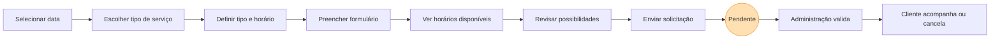
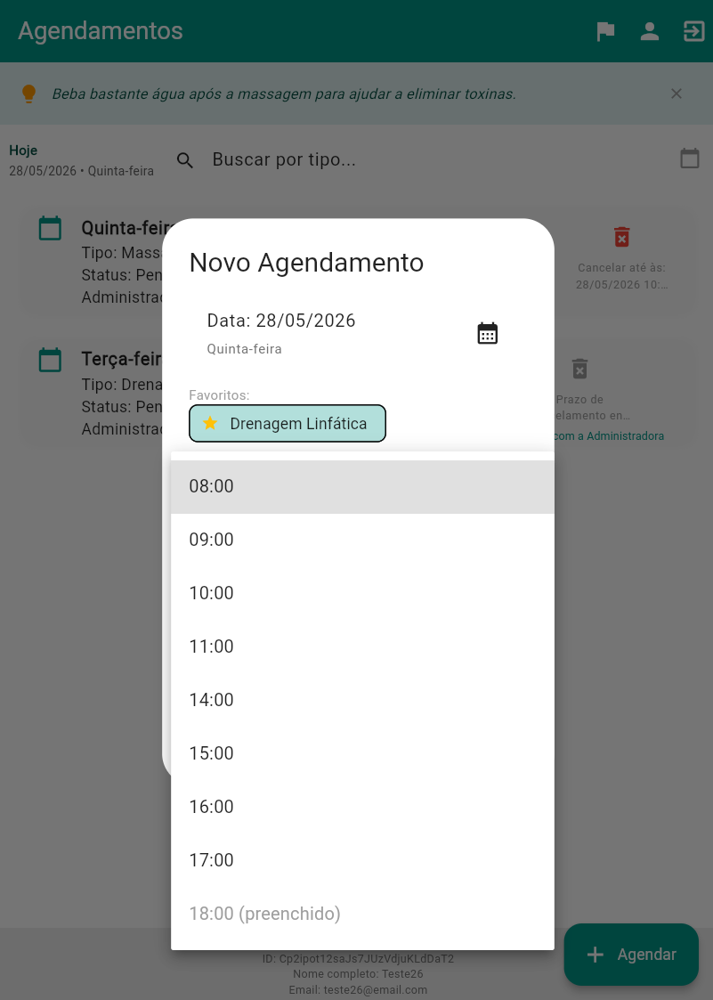
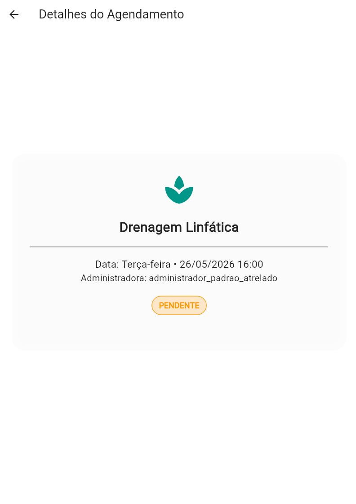
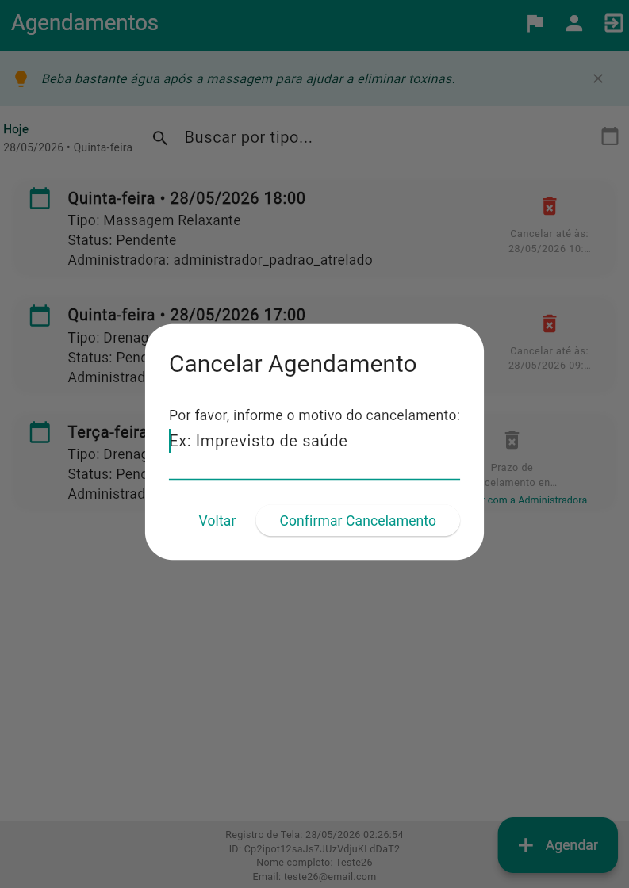
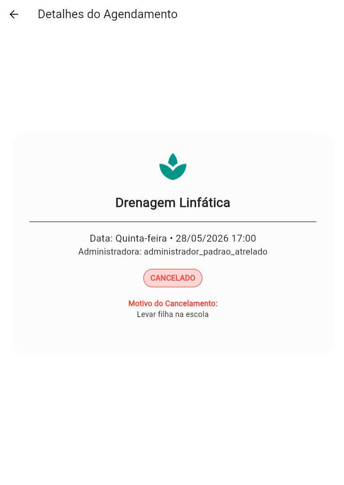
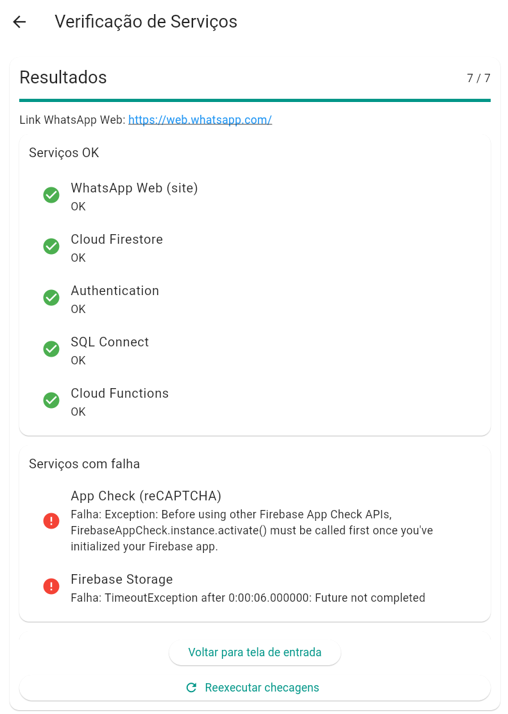

# 📱 Manual do Cliente - Fluxo de Agendamento

## Visão Geral
A interface do cliente no **SAGMA** foi concebida para oferecer fricção mínima ("frictionless experience"). Desde o *onboarding* e o aceite da LGPD, até o acompanhamento do saldo de sessões, a navegação é guiada e intuitiva.

### Diagrama de Casos de Uso do Cliente

**Fonte: Autores.**

O diagrama sintetiza as principais interações do cliente com o sistema, incluindo autenticação, agendamento, acompanhamento de status e gestão do perfil.

## 1. Entrada, acesso e cadastro
O fluxo do cliente começa pelo onboarding, segue para autenticação e, quando necessário, passa pelo cadastro e pela aprovação inicial da conta.

**Figura 1. Tela Onboarding Bem Vindo Principal**
---
**Figura 26. Tela Health Check Serviços Nuvem App**
 

 
**Fonte: Autores.**
 
A presente figura exibe o health check dos serviços na nuvem, utilizado para monitoramento e manutenção do aplicativo.

**Figura 3. Tela Onboarding Notificações Automáticas**
 

 
**Fonte: Autores.**
 
A presente figura apresenta a comunicação de notificações automáticas, reforçando a experiência guiada e a lembrança de compromissos.

---

## 2. Personalização da Experiência (UI/UX)
O sistema permite que o cliente ajuste a interface para seu conforto ergonômico e perfil de atendimento:
- **Internacionalização (i18n):** Suporte nativo e troca instantânea entre 5 idiomas:
  - 🇧🇷 Português (Brasileiro)
  - 🇺🇸 Inglês (English)
  - 🇪🇸 Espanhol (Español)
  - 🇫🇷 Francês (Français)
  - 🇯🇵 Japonês (日本語)
 

**Figura 4. Tela Login Cliente Completo Principal**
 

 
**Fonte: Autores.**
 
A presente figura mostra a interface de autenticação utilizada para acesso ao painel do cliente.

**Figura 5. Tela Cadastro Cliente Novo Completo**
 

 
**Fonte: Autores.**
 
A presente figura expõe o formulário de criação de conta, no qual o cliente informa os dados necessários para iniciar o uso do sistema.

**Figura 6. Tela Cadastro Aguardando Aprovacao Admin**
 

 
**Fonte: Autores.**
 
A presente figura mostra o estado de espera após o cadastro, indicando que a conta foi enviada para análise administrativa.

**Figura 7. Tela Cadastro Em Analise**
 

 
**Fonte: Autores.**
 
A presente figura detalha a tela de acompanhamento da análise do cadastro até a liberação definitiva da conta.

---

## 2. Fluxo interativo de agendamento
A solicitação de horário foi organizada em uma sequência única, do preparo da agenda até a confirmação e o acompanhamento do estado do pedido.

### 2.1 Seleção inicial
**Figura 8. Tela Agendamento Data Selecao Calendario**
 

 
**Fonte: Autores.**
 
A presente figura mostra a etapa inicial de escolha da data no calendário, que define o ponto de partida do pedido.

**Figura 9. Tela Agendamento Favoritos Tipo Servico**
 

 
**Fonte: Autores.**
 
A presente figura destaca a seleção de serviços favoritos, agilizando agendamentos recorrentes e reduzindo o tempo de navegação.

**Figura 10. Tela Agendamento Novo Tipo Horario**
 

 
**Fonte: Autores.**
 
A presente figura evidencia a escolha do tipo de horário, que ajusta a agenda conforme a disponibilidade e a duração do atendimento.

### 2.2 Preenchimento e conferência
**Figura 11. Tela Agendamento Novo Formulario**
 

 
**Fonte: Autores.**
 
A presente figura apresenta o formulário de solicitação, reunindo os dados necessários para registrar o novo agendamento.

**Figura 12. Tela Agendamento Horarios Disponiveis Lista**
 

 
**Fonte: Autores.**
 
A presente figura mostra a lista de horários disponíveis, filtrada conforme a data e as restrições já aplicadas ao fluxo.

**Figura 13. Tela Agendamento Confirmacao Final Completa**
 

 
**Fonte: Autores.**
 
A presente figura evidencia a etapa final de conferência dos dados antes do envio da solicitação ao sistema.

**Figura 14. Tela Agendamentos Cliente Possibilidades de Horario**
 

 
**Fonte: Autores.**
 
A presente figura exibe as possibilidades de horário derivadas da verificação de conflito, oferecendo ao cliente alternativas viáveis para concluir o pedido.

### 2.3 Estado do pedido e acompanhamento
**Figura 15. Tela Agendamentos Cliente Pendente à Confirmar**
 

 
**Fonte: Autores.**
 
A presente figura mostra o agendamento já enviado e aguardando resposta, consolidando a etapa de pendência no painel do cliente.

**Figura 16. Tela Agendamentos Cliente Cancelamento Horario**
 

 
**Fonte: Autores.**
 
A presente figura detalha o fluxo de cancelamento de um horário previamente solicitado, incluindo a ação de desistência pelo cliente.

**Figura 17. Tela Agendamentos Cliente Cancelamento Prévio com Motivo2**
 

 
**Fonte: Autores.**
 
A presente figura apresenta o registro do cancelamento prévio com justificativa, reforçando a rastreabilidade da operação.

**Figura 18. Tela Agendamentos Administracao Selecionar Data**
 

 
**Fonte: Autores.**
 
A presente figura representa a etapa administrativa de conferência da data, usada para validação e apoio à gestão dos agendamentos.

---

## 3. Pós-agendamento e status

- Ao confirmar, o agendamento é persistido no Firestore com a flag de estado `solicitado` (pendente).
- **Integração externa:** o sistema disponibiliza atalhos para o WhatsApp, permitindo que o cliente notifique rapidamente a terapeuta ou negocie exceções, quando necessário.
- **Status visuais:** os *badges* (chips) na tela principal mudam de cor conforme a resposta da administração:
  - 🟠 **Pendente**: em análise.
  - 🟢 **Aprovado**: confirmado na agenda.
  - 🔴 **Recusado**: horário indisponível.

---

## 4. Gestão de perfil e LGPD
Acessando as configurações do perfil, o cliente pode atualizar sua ficha de anamnese, ajustar seus dados pessoais e gerir os efeitos do consentimento LGPD. Caso deseje, também pode acionar o fluxo de **Direito ao Esquecimento**, que executa a anonimização irreversível dos dados conforme a legislação.

**Figura 19. Tela Perfil Cliente Consentimento LGPD Visual**
 

 
**Fonte: Autores.**
 
A presente figura apresenta a visualização do consentimento LGPD, reforçando a transparência no tratamento das informações do cliente.

**Figura 20. Tela Perfil Cliente Dados Pessoais Formulario**
 

 
**Fonte: Autores.**
 
A presente figura mostra o formulário de dados pessoais utilizado para atualização das informações cadastrais do cliente.

**Figura 21. Tela Perfil Cliente Excluir Conta Confirmacao**
 

 
**Fonte: Autores.**
 
A presente figura registra o modal de confirmação para exclusão da conta do cliente, em conformidade com a Lei nº 13.709, de 14 de agosto de 2018 (LGPD). Os dados que precisarem permanecer na base por prazo legal são anonimizados; o restante é excluído.

**Figura 22. Tela Esqueci Senha Cliente**
 

 
**Fonte: Autores.**
 
A presente figura exibe a tela de recuperação de senha, permitindo que o cliente solicite um link de redefinição para seu e-mail cadastrado.

---

## 5. Versão do aplicativo e atualizações
O cliente tem acesso à informação da versão do aplicativo, que é exibida na tela de configurações. Essa funcionalidade é importante para garantir que o cliente esteja ciente da versão que está utilizando, facilitando a comunicação em caso de suporte técnico ou dúvidas relacionadas a funcionalidades específicas.

**Figura 23. Tela Versão App Pendente Listagem**
 

 
**Fonte: Autores.**
 
A presente figura mostra a listagem das versões pendentes da aplicação, utilizada para gerenciamento de atualizações e manutenção.

**Figura 25. Tela Sistema Detalhes Health App Check**
 
 
**Fonte: Autores.**
 
A presente figura exibe os detalhes do health check do sistema, complementando o monitoramento e a manutenção do aplicativo.

---

## 6. Monitoramento e manutenção
O sistema inclui ferramentas de monitoramento e manutenção para garantir a estabilidade e a performance do aplicativo. O health check dos serviços na nuvem é uma dessas ferramentas, permitindo que a equipe de suporte identifique e resolva problemas rapidamente.

**Figura 26. Tela Health Check Serviços Nuvem App**
 
 **Fonte: Autores.**
 A presente figura exibe o health check dos serviços na nuvem, utilizado para monitoramento e manutenção do aplicativo.

---

## 5. Visão administrativa e suporte ao fluxo do cliente
A área administrativa complementa o fluxo do cliente com controle operacional, parametrização do sistema e auditoria de privacidade. Essas telas não fazem parte da navegação do cliente final, mas sustentam o atendimento, o gerenciamento e a governança da agenda.

**Figura 22. Tela Administração Dash Resumo**
 

 
**Fonte: Autores.**
 
A presente figura apresenta o painel executivo da administração, com indicadores resumidos para acompanhamento rápido da operação.

**Figura 23. Tela Administracao Clientes Detalhes Resumo**
 

 
**Fonte: Autores.**
 
A presente figura mostra a visão consolidada de um cliente, reunindo dados cadastrais, contexto operacional e ações de apoio ao atendimento.

**Figura 24. Tela Administração Configurações 1**
 

 
**Fonte: Autores.**
 
A presente figura exibe a primeira camada de parametrização administrativa, com ajustes gerais do sistema.

**Figura 25. Tela Administração Configurações 2**
 

 
**Fonte: Autores.**
 
A presente figura complementa a parametrização com opções de integração, políticas e comportamento operacional.

**Figura 26. Tela Administração Configurações 3**
 

 
**Fonte: Autores.**
 
A presente figura reúne controles adicionais de personalização e segurança sob responsabilidade da administração.

**Figura 27. Tela Administração Configurações 4**
 

 
**Fonte: Autores.**
 
A presente figura apresenta a aba final de configurações, com opções de manutenção e versionamento do sistema.

**Figura 28. Tela Administração Auditoria LGPD**
 

 
**Fonte: Autores.**
 
A presente figura documenta a auditoria de LGPD e o fluxo de anonimização de dados após a exclusão de uma conta, reforçando os critérios de privacidade e conformidade legal.
Link para o documento completo: [LGPD_PRIVACIDADE.md](../lib/documents/LGPD_PRIVACIDADE.md). Contém detalhes técnicos sobre o processo de anonimização e retenção de dados conforme a legislação vigente.

Partes dessas telas sao compartilhadas com o cliente para fins de documentação de tranquilização e transparência, mas a maioria dos controles e informações são exclusivos da administração, garantindo a segurança e a integridade do sistema cumprindo as exigências legais da LGPD.

---

## Links Relacionados

- Manual Administrativo: [MANUAL_ADMINISTRATIVO.md](MANUAL_ADMINISTRATIVO.md) (veja também)
- Manual do Cliente: [MANUAL_CLIENTE.md](MANUAL_CLIENTE.md) (você está aqui!)
- DevOps e Emuladores: [DEVOPS_AND_EMULATORS.md](DEVOPS_AND_EMULATORS.md) (veja também)
