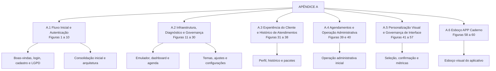
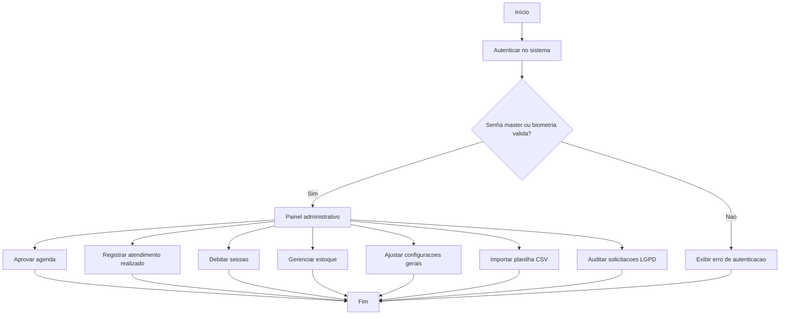
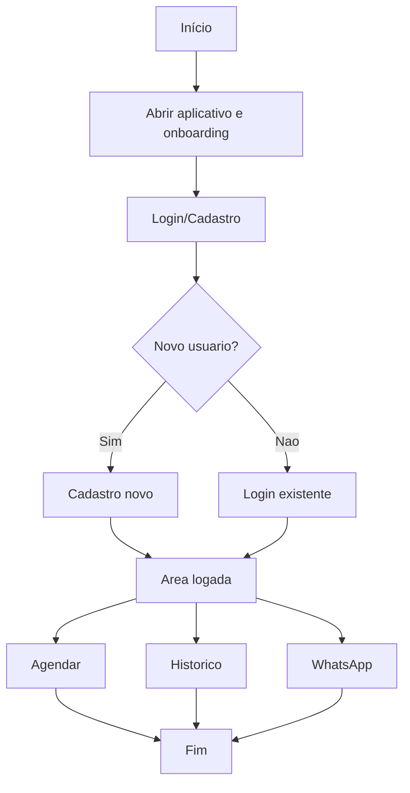
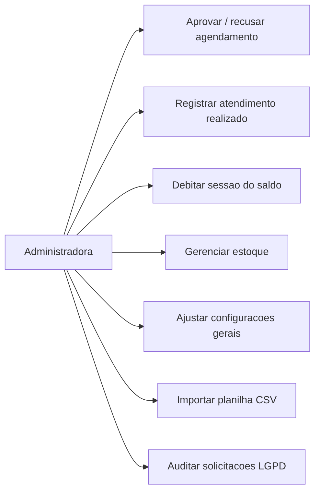
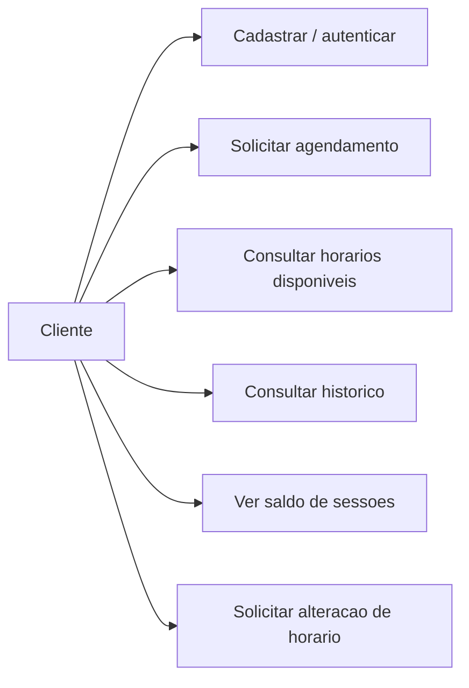
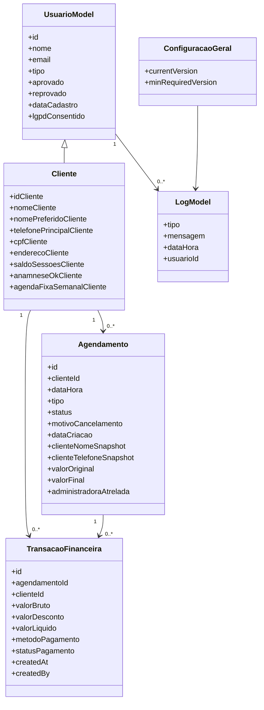

# APÊNDICE A - Imagens Complementares SAGMA

Este documento reúne, de forma sistematizada, as capturas de tela, mockups e demais evidências visuais relacionadas ao aplicativo SAGMA, apresentando os arquivos já renomeados de maneira descritiva para facilitar sua referência ao longo do texto acadêmico.

## Galeria de imagens

As imagens abaixo permanecem como registros visuais do apêndice; o diagrama a seguir organiza, em um único mapa, toda a sequência temática do material.

## Diagramas do Sistema

Os diagramas a seguir complementam as imagens do apêndice e resumem, em linguagem de modelagem, o comportamento principal do sistema.

### Diagrama de Atividades do Admin

### Diagrama de Atividades do Cliente

### Diagrama de Casos de Uso da Administradora

### Diagrama de Casos de Uso do Cliente

### Diagrama de Classes

## A.1 Fluxo Inicial e Autenticação

As figuras desta seção reúnem a sequência inicial de interação com o sistema, abrangendo elementos de apresentação, autenticação, cadastro e consentimento.

**Figura 1. Tela Firestore Perfil Cliente Dados**

**Fonte: Autores (2026).**
A presente figura evidencia a estrutura de dados vinculada ao perfil do cliente, na qual se observa a organização dos campos destinados ao cadastro, ao acompanhamento e ao histórico das informações registradas.

**Figura 2. Tela Onboarding Bem Vindo Principal**

**Fonte: Autores (2026).**
A presente captura ilustra a primeira interação do usuário com o aplicativo, destacando a mensagem inicial de acolhimento e orientação ao acesso ao sistema.

**Figura 3. Tela Onboarding Notificacoes Automaticas**

**Fonte: Autores (2026).**
A presente figura evidencia a apresentação de recursos de notificações automáticas ao usuário, evidenciando a preocupação do sistema com a comunicação proativa já na etapa inicial de navegação.

**Figura 4. Tela Onboarding Historico Completo**

**Fonte: Autores (2026).**
A referida etapa de onboarding demonstra a contextualização do histórico de uso e da continuidade da interação do usuário com a plataforma.

**Figura 5. Tela Login Cliente Completo Principal**

**Fonte: Autores (2026).**
A presente captura apresenta a interface de autenticação do cliente, configurada como porta de entrada para o acesso ao sistema e às funcionalidades disponibilizadas.

**Figura 6. Tela Cadastro Cliente Novo Completo**

**Fonte: Autores (2026).**
A presente figura ilustra o formulário destinado ao cadastro de um novo cliente, contemplando os campos essenciais para sua identificação e posterior vinculação ao ambiente da aplicação.

**Figura 7. Tela Termos Uso Privacidade Cliente**

**Fonte: Autores (2026).**
A presente figura apresenta a etapa de aceite dos termos de uso e privacidade, requisito indispensável para o atendimento às exigências de conformidade e tratamento adequado dos dados.

**Figura 8. Tela Cadastro Aguardando Aprovacao Admin**

**Fonte: Autores (2026).**
A captura evidencia o estado intermediário do cadastro, o qual permanece pendente até a validação e aprovação pela instância administrativa competente.

**Figura 9. Diagrama Arquitetura Total SAGMA Completo**

**Fonte: Autores (2026).**
O diagrama sintetiza a arquitetura do sistema, articulando a interface, o banco de dados e os serviços de integração externa de forma integrada e coerente.

**Figura 10. Tela Compartilhar WhatsApp Aprovacao**

**Fonte: Autores (2026).**
A presente figura demonstra a integração com o WhatsApp, utilizada como mecanismo de comunicação para o compartilhamento de confirmações e orientações ao cliente.

## A.2 Infraestrutura, Diagnóstico e Governança

As figuras a seguir documentam o ambiente técnico de apoio, contemplando emulação, governança de versão e recursos de diagnóstico utilizados durante o desenvolvimento.

**Figura 11. Tela Firebase Emulator Firestore Data**

**Fonte: Autores (2026).**
A presente figura apresenta uma evidência do ambiente de emulação do Firebase, utilizado na fase de testes e validação.

**Figura 12. Tela Admin Dashboard Resumo Geral**

**Fonte: Autores (2026).**
A presente figura evidencia o painel administrativo com A presente figura indicadores resumidos de acompanhamento do sistema.

**Figura 13. Tela Admin Agendamentos Vazios Lista**

**Fonte: Autores (2026).**
A presente figura exibe a visão administrativa quando ainda não há agendamentos carregados na listagem.

**Figura 14. Tela Admin Clientes Detalhes Completos**

**Fonte: Autores (2026).**
A presente figura apresenta a área administrativa com informações detalhadas de um cliente selecionado.

**Figura 15. Tela Admin Pendentes Aprovacao Cadastro**

**Fonte: Autores (2026).**
A presente figura indica a fila de cadastros pendentes aguardando aprovação da profissional ou administradora.

**Figura 16. Tela Google Agenda Semana Horarios**

**Fonte: Autores (2026).**
A presente figura registra a integração visual com a agenda externa, exibindo a organização semanal dos horários.

**Figura 17. Tela Agendamentos Visao Cliente Vazia**

**Fonte: Autores (2026).**
A presente figura evidencia a visão do cliente quando não há agendamentos cadastrados ou ativos.

**Figura 18. Tela Agendamento Novo Tipo Horario**

**Fonte: Autores (2026).**
A presente figura apresenta a seleção inicial do tipo de atendimento e do horário desejado pelo cliente.

**Figura 19. Tela Agendamento Data Selecao Calendario**

**Fonte: Autores (2026).**
A presente figura exibe o calendário de seleção de data, etapa essencial para definir o agendamento.

**Figura 20. Tela Agendamento Favoritos Tipo Servico**

**Fonte: Autores (2026).**
A presente figura evidencia a seleção de tipos de serviço favoritados para agilizar o fluxo de agendamento.

**Figura 21. Tela Agendamento Horarios Disponiveis Lista**

**Fonte: Autores (2026).**
A presente figura apresenta a relação de horários disponíveis após a verificação de conflito na agenda.

**Figura 22. Tela Agendamento Confirmacao Final Completa**

**Fonte: Autores (2026).**
A presente figura registra a etapa final de confirmação do agendamento antes do envio ou persistência da solicitação.

**Figura 23. Tela Administracao Tema Teste Listagem**

**Fonte: Autores (2026).**
A presente figura evidencia a aplicação de tema em modo de teste na listagem administrativa.

**Figura 24. Tela Administracao Escolher Tema Personalizado**

**Fonte: Autores (2026).**
A presente figura apresenta a tela de seleção de tema personalizado para a interface administrativa.

**Figura 25. Tela Administracao Clientes Pesquisa Detalhes**

**Fonte: Autores (2026).**
A presente figura ilustra a busca de clientes com exibição de detalhes complementares para consulta administrativa.

**Figura 26. Tela Administracao Clientes Tema Escuro**

**Fonte: Autores (2026).**
A presente figura evidencia a listagem de clientes em tema escuro, útil para validação de contraste e leitura.

**Figura 27. Tela Administracao Agendamentos Detalhe Cliente**

**Fonte: Autores (2026).**
A presente figura apresenta os detalhes do cliente associados a um agendamento específico.

**Figura 28. Tela Administracao Agendamentos Detalhe Status**

**Fonte: Autores (2026).**
A presente figura evidencia o painel administrativo com foco na atualização e acompanhamento do status do agendamento.

**Figura 29. Tela Administracao Config Sistema Padrao**

**Fonte: Autores (2026).**
A presente figura exibe a configuração geral padrão utilizada pelo sistema.

**Figura 30. Tela Administracao WhatsApp Aprovacao Template**

**Fonte: Autores (2026).**
A presente figura evidencia o modelo de mensagem usado para aprovação por meio do WhatsApp.

## A.3 Experiência do Cliente e Histórico de Atendimentos

As imagens reunidas a seguir documentam o percurso visual do cliente, abrangendo cadastro, consentimento, perfil, histórico e informações financeiras associadas ao acompanhamento dos atendimentos.

**Figura 31. Tela Perfil Cliente Dados Pessoais Formulario**

**Fonte: Autores (2026).**
A presente figura apresenta o formulário de dados pessoais do cliente para edição e acompanhamento.

**Figura 32. Tela Perfil Cliente Endereco Anamnese Formulario**

**Fonte: Autores (2026).**
A presente figura evidencia os campos de endereço e anamnese vinculados ao perfil do cliente.

**Figura 33. Tela Perfil Cliente Historico Atendimentos Detalhes**

**Fonte: Autores (2026).**
A presente figura registra o histórico de atendimentos com detalhes do cliente e dos procedimentos realizados.

**Figura 34. Tela Perfil Cliente Financeiro Pacotes Detalhes**

**Fonte: Autores (2026).**
A presente figura apresenta os pacotes financeiros vinculados ao cliente e seus respectivos detalhes.

**Figura 35. Tela Perfil Cliente Consentimento LGPD Visual**

**Fonte: Autores (2026).**
A presente figura exibe a etapa de consentimento LGPD com foco na conformidade e transparência dos dados.

**Figura 36. Tela Perfil Cliente Atividades Historico Completo**

**Fonte: Autores (2026).**
A presente figura evidencia o histórico completo de atividades executadas no perfil do cliente.

**Figura 37. Tela Dashboard Cliente Meu Perfil Visao**

**Fonte: Autores (2026).**
A presente figura apresenta a visão geral do perfil do cliente dentro do dashboard.

**Figura 38. Tela Dashboard Cliente Resumo Sessoes Pacotes**

**Fonte: Autores (2026).**
A presente figura exibe o resumo de sessões e pacotes disponíveis para o cliente.

## A.4 Agendamentos e Operação Administrativa

Esta seção concentra as evidências visuais da operação administrativa, incluindo panorama geral, gestão de clientes, pendências, calendário e parametrizações internas.

**Figura 39. Tela Dashboard Cliente Agendamentos Ativos Detalhes**

**Fonte: Autores (2026).**
Detalha os agendamentos ativos disponíveis no painel do cliente.

**Figura 40. Tela Agendamentos Administracao Mensal Calendario**

**Fonte: Autores (2026).**
A presente figura evidencia o calendário mensal usado na administração dos agendamentos.

## A.5 Personalização Visual e Governança de Interface

As últimas figuras concentram a camada de personalização estética do sistema, incluindo temas, pré-visualização e aplicação final das configurações visuais.

**Figura 41. Tela Agendamentos Administracao Pendente Listagem**

**Fonte: Autores (2026).**
A presente figura apresenta a listagem de agendamentos pendentes aguardando análise.

**Figura 42. Tela Agendamentos Administracao Selecionar Tipo**

**Fonte: Autores (2026).**
A presente figura evidencia a etapa administrativa de seleção do tipo de atendimento.

**Figura 43. Tela Agendamentos Administracao Selecionar Data**

**Fonte: Autores (2026).**
A presente figura exibe a seleção de data para criação ou ajuste do agendamento.

**Figura 44. Tela Agendamentos Administracao Selecionar Horario**

**Fonte: Autores (2026).**
A presente figura apresenta a seleção de horário dentro do fluxo administrativo de agendamentos.

**Figura 45. Tela Agendamentos Administracao Cupom Desconto**

**Fonte: Autores (2026).**
A presente figura registra a aplicação de cupom de desconto no agendamento administrativo.

**Figura 46. Tela Agendamentos Administracao Favoritos Tipo**

**Fonte: Autores (2026).**
A presente figura evidencia os tipos de atendimento salvos como favoritos para agilizar a operação.

**Figura 47. Tela Agendamentos Administracao Remover Favorito**

**Fonte: Autores (2026).**
A presente figura apresenta a ação administrativa para remover um item da lista de favoritos.

**Figura 48. Tela Agendamentos Administracao Total Previsto**

**Fonte: Autores (2026).**
A presente figura exibe o total previsto para o atendimento ou conjunto de agendamentos analisados.

**Figura 49. Tela Agendamentos Administracao Confirmar Reserva**

**Fonte: Autores (2026).**
A presente figura evidencia a confirmação final da reserva dentro do fluxo administrativo.

**Figura 50. Tela Agendamentos Administracao Aviso Dica**

**Fonte: Autores (2026).**
A presente figura registra um aviso ou dica operacional exibido na interface administrativa.

**Figura 51. Tela Administracao Painel Resumo Metrico**

**Fonte: Autores (2026).**
A presente figura apresenta um painel com métricas resumidas para suporte à tomada de decisão.

**Figura 52. Tela Administracao Agendamentos Calendario Semanal**

**Fonte: Autores (2026).**
A presente figura evidencia a visualização semanal dos agendamentos em ambiente administrativo.

**Figura 53. Tela Administracao Clientes Listagem Teste**

**Fonte: Autores (2026).**
A presente figura registra a listagem de clientes em contexto de teste ou validação do sistema.

**Figura 54. Tela Administracao Tema Lista Personalizada**

**Fonte: Autores (2026).**
A presente figura evidencia uma lista personalizada de temas disponíveis para aplicação no sistema.

**Figura 55. Tela Administracao Tema PreVisualizacao Personalizada**

**Fonte: Autores (2026).**
A presente figura exibe a pré-visualização do tema selecionado antes da aplicação definitiva.

**Figura 56. Tela Administracao Tema Aplicacao Confirmacao**

**Fonte: Autores (2026).**
A presente figura evidencia a confirmação de aplicação do tema personalizado na interface administrativa.

**Figura 57. Tela Diagrama Fluxo Total Sistema**

**Fonte: Autores (2026).**
A presente figura apresenta o diagrama consolidado do fluxo total do sistema, reunindo os principais caminhos de interação.

## A.6 Esboço APP Caderno

O material de esboço do aplicativo encontra-se disponível no arquivo [Esboço APP caderno.pdf](Esboço%20APP%20caderno.pdf). As páginas seguintes reproduzem visualmente esse conteúdo para registro no apêndice.

**Figura 58. Esboço APP Caderno Pagina 1**

**Fonte: Autores (2026).**
Esta imagem registra a primeira página do esboço do aplicativo, preservando a proposta visual inicial do projeto.

**Figura 59. Esboço APP Caderno Pagina 2**

**Fonte: Autores (2026).**
Esta imagem apresenta a segunda página do esboço, com a continuidade das anotações e estudos de interface.

**Figura 60. Esboço APP Caderno Pagina 3**

**Fonte: Autores (2026).**
Esta imagem registra a terceira página do esboço, consolidando as referências visuais preparatórias do aplicativo.
