# APÊNDICE A - Imagens Complementares SAGMA

Este documento reúne, de forma sistematizada, as capturas de tela, mockups e demais evidências visuais relacionadas ao aplicativo SAGMA, apresentando os arquivos já renomeados de maneira descritiva para facilitar sua referência ao longo do texto acadêmico.

## Galeria de imagens

## A.1 Fluxo Inicial e Autenticação

As figuras desta seção reúnem a sequência inicial de interação com o sistema, abrangendo elementos de apresentação, autenticação, cadastro e consentimento.

Figura 1. Tela Firestore Perfil Cliente Dados

Fonte: Autores (2026).

A presente figura evidencia a estrutura de dados vinculada ao perfil do cliente, na qual se observa a organização dos campos destinados ao cadastro, ao acompanhamento e ao histórico das informações registradas.

Figura 2. Tela Onboarding Bem Vindo Principal

Fonte: Autores (2026).

A presente captura ilustra a primeira interação do usuário com o aplicativo, destacando a mensagem inicial de acolhimento e orientação ao acesso ao sistema.

Figura 3. Tela Onboarding Notificacoes Automaticas

Fonte: Autores (2026).

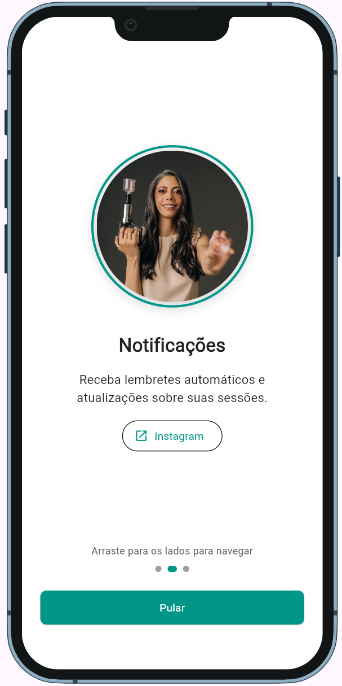

A presente figura evidencia a apresentação de recursos de notificações automáticas ao usuário, evidenciando a preocupação do sistema com a comunicação proativa já na etapa inicial de navegação.

Figura 4. Tela Onboarding Historico Completo

Fonte: Autores (2026).

A referida etapa de onboarding demonstra a contextualização do histórico de uso e da continuidade da interação do usuário com a plataforma.

Figura 5. Tela Login Cliente Completo Principal

Fonte: Autores (2026).

A presente captura apresenta a interface de autenticação do cliente, configurada como porta de entrada para o acesso ao sistema e às funcionalidades disponibilizadas.

Figura 6. Tela Cadastro Cliente Novo Completo

Fonte: Autores (2026).

A presente figura ilustra o formulário destinado ao cadastro de um novo cliente, contemplando os campos essenciais para sua identificação e posterior vinculação ao ambiente da aplicação.

Figura 7. Tela Termos Uso Privacidade Cliente

Fonte: Autores (2026).

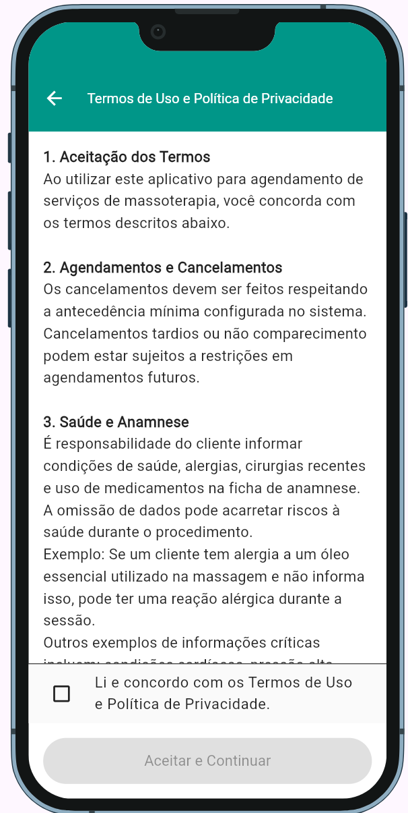

A presente figura apresenta a etapa de aceite dos termos de uso e privacidade, requisito indispensável para o atendimento às exigências de conformidade e tratamento adequado dos dados.

Figura 8. Tela Cadastro Aguardando Aprovacao Admin

Fonte: Autores (2026).

A captura evidencia o estado intermediário do cadastro, o qual permanece pendente até a validação e aprovação pela instância administrativa competente.

Figura 9. Diagrama Arquitetura Total SAGMA Completo

Fonte: Autores (2026).

O diagrama sintetiza a arquitetura do sistema, articulando a interface, o banco de dados e os serviços de integração externa de forma integrada e coerente.

Figura 10. Tela Compartilhar WhatsApp Aprovacao

Fonte: Autores (2026).

A presente figura demonstra a integração com o WhatsApp, utilizada como mecanismo de comunicação para o compartilhamento de confirmações e orientações ao cliente.

## A.2 Infraestrutura, Diagnóstico e Governança

As figuras a seguir documentam o ambiente técnico de apoio, contemplando emulação, governança de versão e recursos de diagnóstico utilizados durante o desenvolvimento.

Figura 11. Tela Firebase Emulator Firestore Data

Fonte: Autores (2026).

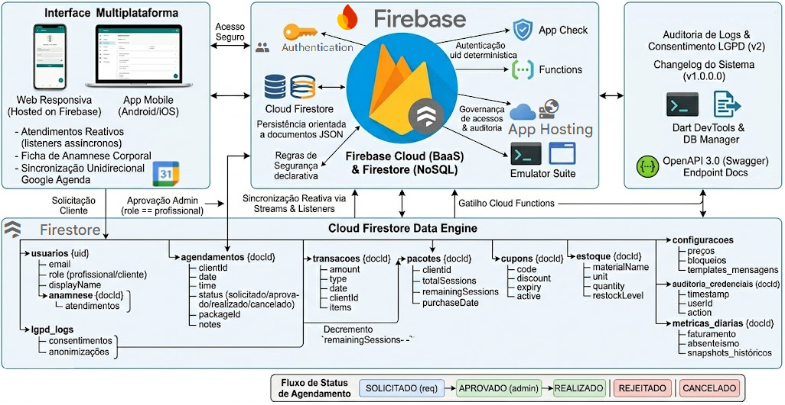

A presente figura apresenta uma evidência do ambiente de emulação do Firebase, utilizado na fase de testes e validação.

Figura 12. Tela Admin Dashboard Resumo Geral

Fonte: Autores (2026).

A presente figura evidencia o painel administrativo com A presente figura indicadores resumidos de acompanhamento do sistema.

Figura 13. Tela Admin Agendamentos Vazios Lista

Fonte: Autores (2026).

A presente figura exibe a visão administrativa quando ainda não há agendamentos carregados na listagem.

Figura 14. Tela Admin Clientes Detalhes Completos

Fonte: Autores (2026).

A presente figura apresenta a área administrativa com informações detalhadas de um cliente selecionado.

Figura 15. Tela Admin Pendentes Aprovacao Cadastro

Fonte: Autores (2026).

A presente figura indica a fila de cadastros pendentes aguardando aprovação da profissional ou administradora.

Figura 16. Tela Google Agenda Semana Horarios

Fonte: Autores (2026).

A presente figura registra a integração visual com a agenda externa, exibindo a organização semanal dos horários.

Figura 17. Tela Agendamentos Visao Cliente Vazia

Fonte: Autores (2026).

A presente figura evidencia a visão do cliente quando não há agendamentos cadastrados ou ativos.

Figura 18. Tela Agendamento Novo Tipo Horario

Fonte: Autores (2026).

A presente figura apresenta a seleção inicial do tipo de atendimento e do horário desejado pelo cliente.

Figura 19. Tela Agendamento Data Selecao Calendario

Fonte: Autores (2026).

A presente figura exibe o calendário de seleção de data, etapa essencial para definir o agendamento.

Figura 20. Tela Agendamento Favoritos Tipo Servico

Fonte: Autores (2026).

A presente figura evidencia a seleção de tipos de serviço favoritados para agilizar o fluxo de agendamento.

Figura 21. Tela Agendamento Horarios Disponiveis Lista

Fonte: Autores (2026).

A presente figura apresenta a relação de horários disponíveis após a verificação de conflito na agenda.

Figura 22. Tela Agendamento Confirmacao Final Completa

Fonte: Autores (2026).

A presente figura registra a etapa final de confirmação do agendamento antes do envio ou persistência da solicitação.

Figura 23. Tela Administracao Tema Teste Listagem

Fonte: Autores (2026).

A presente figura evidencia a aplicação de tema em modo de teste na listagem administrativa.

Figura 24. Tela Administracao Escolher Tema Personalizado

Fonte: Autores (2026).

A presente figura apresenta a tela de seleção de tema personalizado para a interface administrativa.

Figura 25. Tela Administracao Clientes Pesquisa Detalhes

Fonte: Autores (2026).

A presente figura ilustra a busca de clientes com exibição de detalhes complementares para consulta administrativa.

Figura 26. Tela Administracao Clientes Tema Escuro

Fonte: Autores (2026).

A presente figura evidencia a listagem de clientes em tema escuro, útil para validação de contraste e leitura.

Figura 27. Tela Administracao Agendamentos Detalhe Cliente

Fonte: Autores (2026).

A presente figura apresenta os detalhes do cliente associados a um agendamento específico.

Figura 28. Tela Administracao Agendamentos Detalhe Status

Fonte: Autores (2026).

A presente figura evidencia o painel administrativo com foco na atualização e acompanhamento do status do agendamento.

Figura 29. Tela Administracao Config Sistema Padrao

Fonte: Autores (2026).

A presente figura exibe a configuração geral padrão utilizada pelo sistema.

Figura 30. Tela Administracao WhatsApp Aprovacao Template

Fonte: Autores (2026).

A presente figura evidencia o modelo de mensagem usado para aprovação por meio do WhatsApp.

## A.3 Experiência do Cliente e Histórico de Atendimentos

As imagens reunidas a seguir documentam o percurso visual do cliente, abrangendo cadastro, consentimento, perfil, histórico e informações financeiras associadas ao acompanhamento dos atendimentos.

Figura 31. Tela Perfil Cliente Dados Pessoais Formulario

Fonte: Autores (2026).

A presente figura apresenta o formulário de dados pessoais do cliente para edição e acompanhamento.

Figura 32. Tela Perfil Cliente Endereco Anamnese Formulario

Fonte: Autores (2026).

A presente figura evidencia os campos de endereço e anamnese vinculados ao perfil do cliente.

Figura 33. Tela Perfil Cliente Historico Atendimentos Detalhes

Fonte: Autores (2026).

A presente figura registra o histórico de atendimentos com detalhes do cliente e dos procedimentos realizados.

Figura 34. Tela Perfil Cliente Financeiro Pacotes Detalhes

Fonte: Autores (2026).

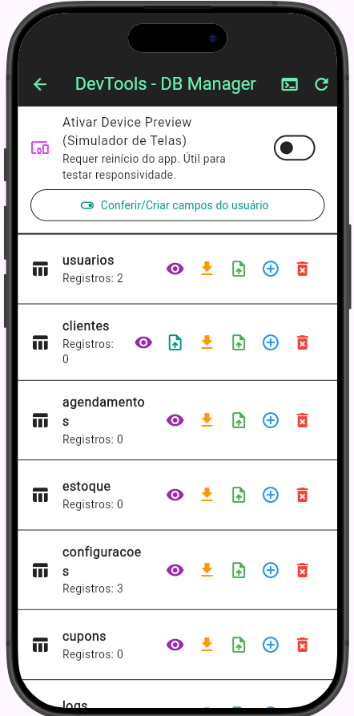

A presente figura apresenta os pacotes financeiros vinculados ao cliente e seus respectivos detalhes.

Figura 35. Tela Perfil Cliente Consentimento LGPD Visual

Fonte: Autores (2026).

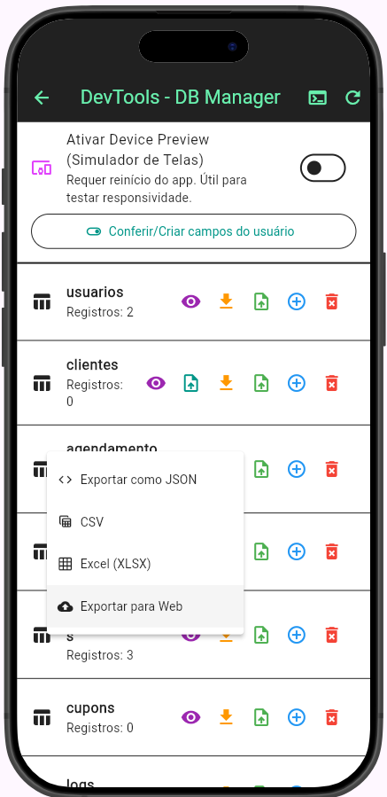

A presente figura exibe a etapa de consentimento LGPD com foco na conformidade e transparência dos dados.

Figura 36. Tela Perfil Cliente Atividades Historico Completo

Fonte: Autores (2026).

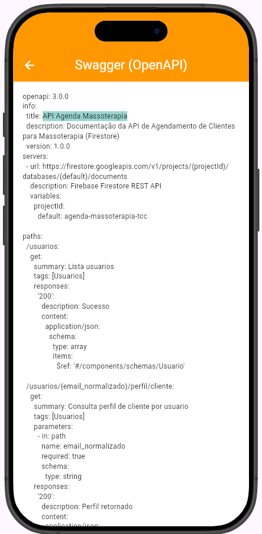

A presente figura evidencia o histórico completo de atividades executadas no perfil do cliente.

Figura 37. Tela Dashboard Cliente Meu Perfil Visao

Fonte: Autores (2026).

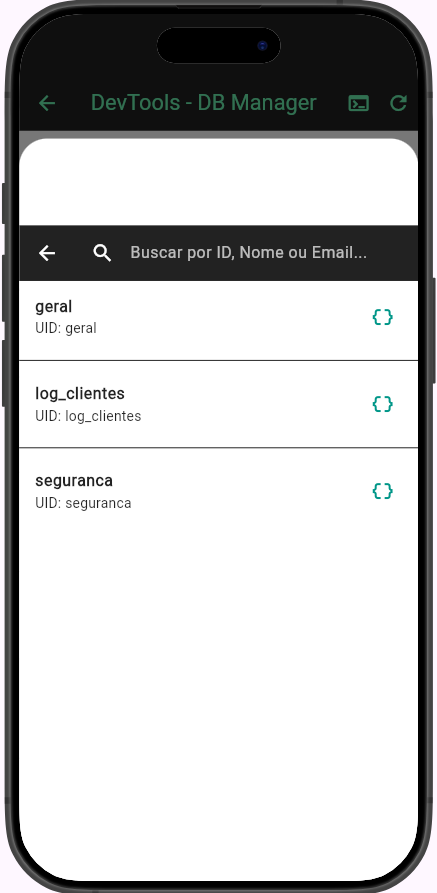

A presente figura apresenta a visão geral do perfil do cliente dentro do dashboard.

Figura 38. Tela Dashboard Cliente Resumo Sessoes Pacotes

Fonte: Autores (2026).

A presente figura exibe o resumo de sessões e pacotes disponíveis para o cliente.

## A.4 Agendamentos e Operação Administrativa

Esta seção concentra as evidências visuais da operação administrativa, incluindo panorama geral, gestão de clientes, pendências, calendário e parametrizações internas.

Figura 39. Tela Dashboard Cliente Agendamentos Ativos Detalhes

Fonte: Autores (2026).

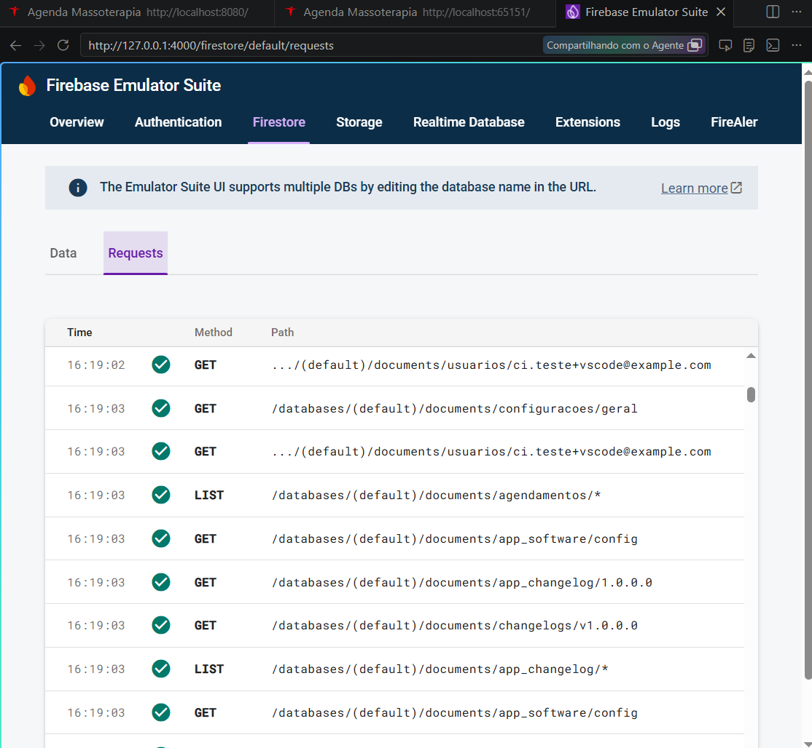

Detalha os agendamentos ativos disponíveis no painel do cliente.

Figura 40. Tela Agendamentos Administracao Mensal Calendario

Fonte: Autores (2026).

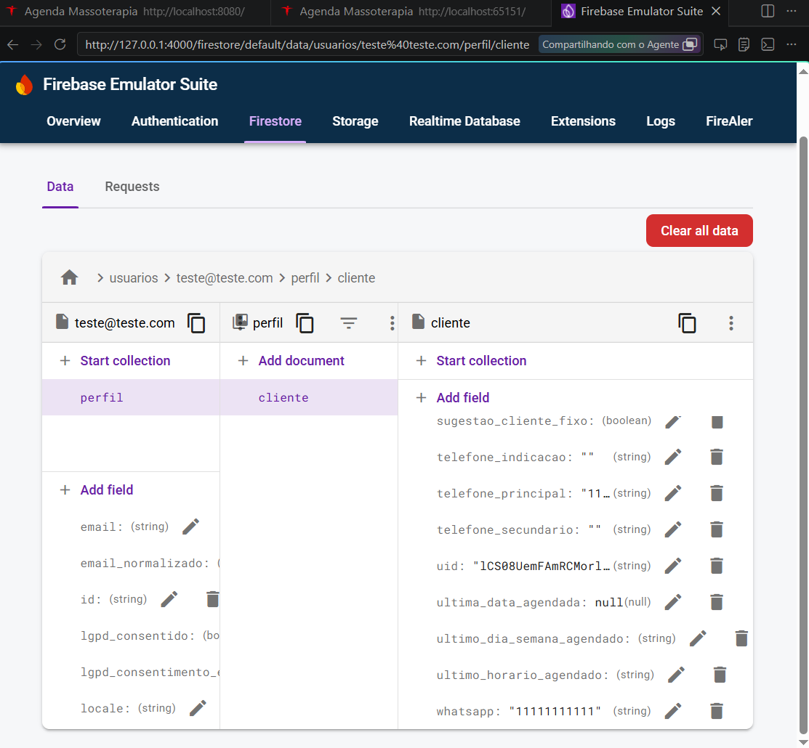

A presente figura evidencia o calendário mensal usado na administração dos agendamentos.

## A.5 Personalização Visual e Governança de Interface

As últimas figuras concentram a camada de personalização estética do sistema, incluindo temas, pré-visualização e aplicação final das configurações visuais.

Figura 41. Tela Agendamentos Administracao Pendente Listagem

Fonte: Autores (2026).

A presente figura apresenta a listagem de agendamentos pendentes aguardando análise.

Figura 42. Tela Agendamentos Administracao Selecionar Tipo

Fonte: Autores (2026).

A presente figura evidencia a etapa administrativa de seleção do tipo de atendimento.

Figura 43. Tela Agendamentos Administracao Selecionar Data

Fonte: Autores (2026).

A presente figura exibe a seleção de data para criação ou ajuste do agendamento.

Figura 44. Tela Agendamentos Administracao Selecionar Horario

Fonte: Autores (2026).

A presente figura apresenta a seleção de horário dentro do fluxo administrativo de agendamentos.

Figura 45. Tela Agendamentos Administracao Cupom Desconto

Fonte: Autores (2026).

A presente figura registra a aplicação de cupom de desconto no agendamento administrativo.

Figura 46. Tela Agendamentos Administracao Favoritos Tipo

Fonte: Autores (2026).

A presente figura evidencia os tipos de atendimento salvos como favoritos para agilizar a operação.

Figura 47. Tela Agendamentos Administracao Remover Favorito

Fonte: Autores (2026).

A presente figura apresenta a ação administrativa para remover um item da lista de favoritos.

Figura 48. Tela Agendamentos Administracao Total Previsto

Fonte: Autores (2026).

A presente figura exibe o total previsto para o atendimento ou conjunto de agendamentos analisados.

Figura 49. Tela Agendamentos Administracao Confirmar Reserva

Fonte: Autores (2026).

A presente figura evidencia a confirmação final da reserva dentro do fluxo administrativo.

Figura 50. Tela Agendamentos Administracao Aviso Dica

Fonte: Autores (2026).

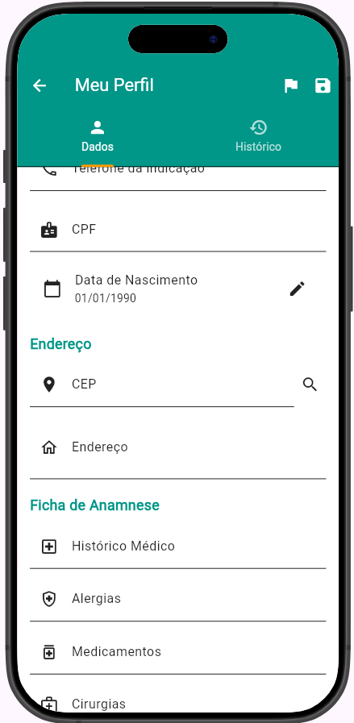

A presente figura registra um aviso ou dica operacional exibido na interface administrativa.

Figura 51. Tela Administracao Painel Resumo Metrico

Fonte: Autores (2026).

A presente figura apresenta um painel com métricas resumidas para suporte à tomada de decisão.

Figura 52. Tela Administracao Agendamentos Calendario Semanal

Fonte: Autores (2026).

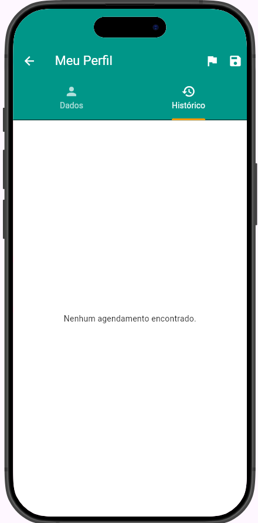

A presente figura evidencia a visualização semanal dos agendamentos em ambiente administrativo.

Figura 53. Tela Administracao Clientes Listagem Teste

Fonte: Autores (2026).

A presente figura registra a listagem de clientes em contexto de teste ou validação do sistema.

Figura 54. Tela Administracao Tema Lista Personalizada

Fonte: Autores (2026).

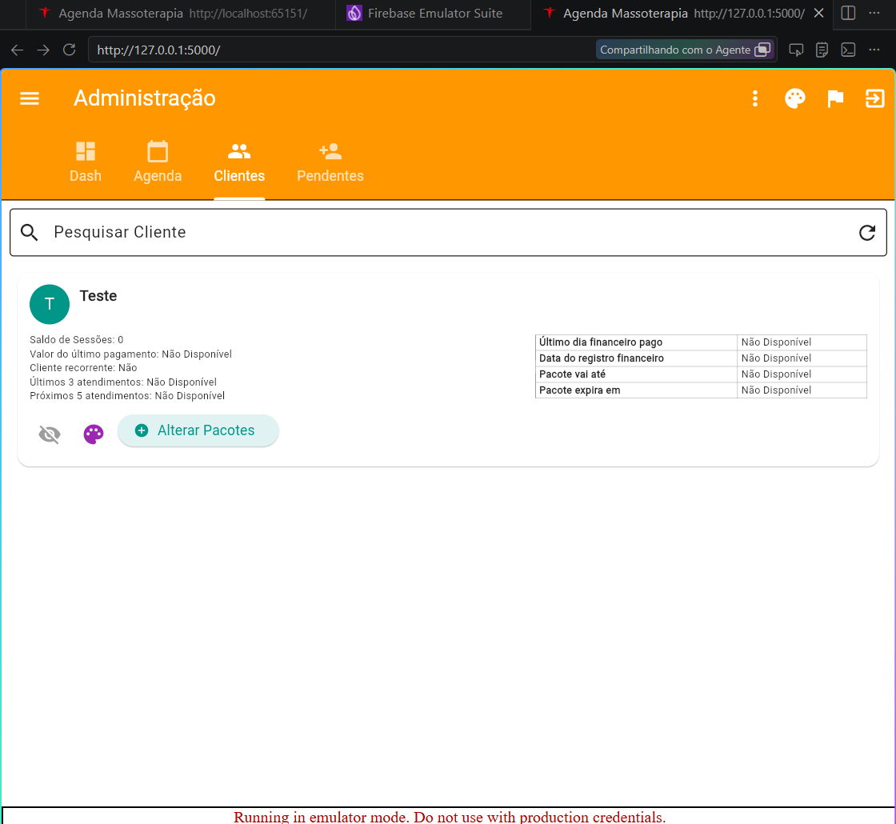

A presente figura evidencia uma lista personalizada de temas disponíveis para aplicação no sistema.

Figura 55. Tela Administracao Tema PreVisualizacao Personalizada

Fonte: Autores (2026).

A presente figura exibe a pré-visualização do tema selecionado antes da aplicação definitiva.

Figura 56. Tela Administracao Tema Aplicacao Confirmacao

Fonte: Autores (2026).

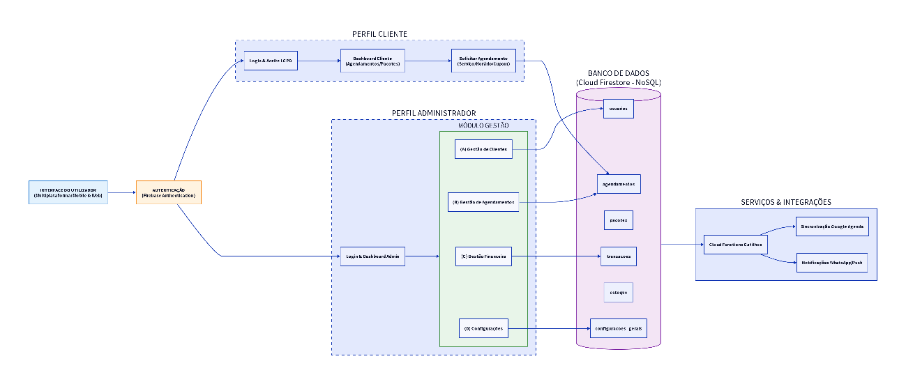

A presente figura evidencia a confirmação de aplicação do tema personalizado na interface administrativa.

Figura 57. Tela Diagrama Fluxo Total Sistema

Fonte: Autores (2026).

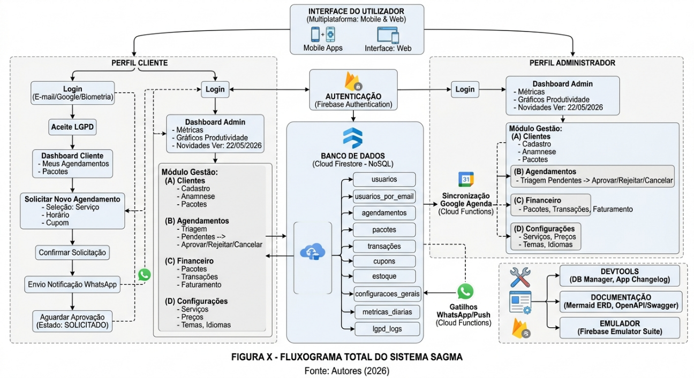

A presente figura apresenta o diagrama consolidado do fluxo total do sistema, reunindo os principais caminhos de interação.

## A.6 Esboço APP Caderno

O material de esboço do aplicativo encontra-se disponível no arquivo [Esboço APP caderno.pdf](Esboço%20APP%20caderno.pdf). As páginas seguintes reproduzem visualmente esse conteúdo para registro no apêndice.

Figura 58. Esboço APP Caderno Pagina 1

Fonte: Autores (2026).

Esta imagem registra a primeira página do esboço do aplicativo, preservando a proposta visual inicial do projeto.

Figura 59. Esboço APP Caderno Pagina 2

Fonte: Autores (2026).

Esta imagem apresenta a segunda página do esboço, com a continuidade das anotações e estudos de interface.

Figura 60. Esboço APP Caderno Pagina 3

Fonte: Autores (2026).

Esta imagem registra a terceira página do esboço, consolidando as referências visuais preparatórias do aplicativo.

