# APÊNDICE A - Imagens Complementares SAGMA

Este documento reúne, de forma sistematizada, as capturas de tela, mockups e demais evidências visuais relacionadas ao aplicativo SAGMA, apresentando os arquivos já renomeados de maneira descritiva para facilitar sua referência ao longo do texto acadêmico.

## Galeria de imagens

As imagens abaixo permanecem como registros visuais do apêndice; o diagrama a seguir organiza, em um único mapa, toda a sequência temática do material.

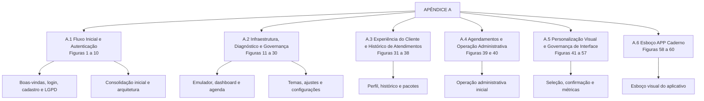
```mermaid
flowchart TD
    A[APÊNDICE A] --> B1[A.1 Fluxo Inicial e Autenticação\nFiguras 1 a 10]
    A --> B2[A.2 Infraestrutura, Diagnóstico e Governança\nFiguras 11 a 30]
    A --> B3[A.3 Experiência do Cliente e Histórico de Atendimentos\nFiguras 31 a 38]
    A --> B4[A.4 Agendamentos e Operação Administrativa\nFiguras 39 e 40]
    A --> B5[A.5 Personalização Visual e Governança de Interface\nFiguras 41 a 57]
    A --> B6[A.6 Esboço APP Caderno\nFiguras 58 a 60]

    B1 --> C1[Boas-vindas, login, cadastro e LGPD]
    B1 --> C2[Consolidação inicial e arquitetura]
    B2 --> C3[Emulador, dashboard e agenda]
    B2 --> C4[Temas, ajustes e configurações]
    B3 --> C5[Perfil, histórico e pacotes]
    B4 --> C6[Operação administrativa inicial]
    B5 --> C7[Seleção, confirmação e métricas]
    B6 --> C8[Esboço visual do aplicativo]
```

## Diagramas do Sistema

### Diagrama de Atividades do Admin

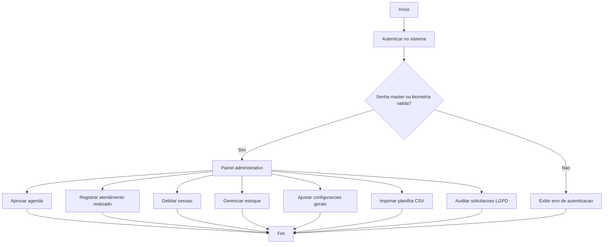
```mermaid
flowchart TD
    A[Início] --> B[Autenticar no sistema]
    B --> C{Senha master ou biometria valida?}
    C -- Sim --> D[Painel administrativo]
    C -- Nao --> E[Exibir erro de autenticacao]
    D --> F[Aprovar agenda]
    D --> G[Registrar atendimento realizado]
    D --> H[Debitar sessao]
    D --> I[Gerenciar estoque]
    D --> J[Ajustar configuracoes gerais]
    D --> K[Importar planilha CSV]
    D --> L[Auditar solicitacoes LGPD]
    F --> M[Fim]
    G --> M
    H --> M
    I --> M
    J --> M
    K --> M
    L --> M
    E --> M
```

### Diagrama de Atividades do Cliente

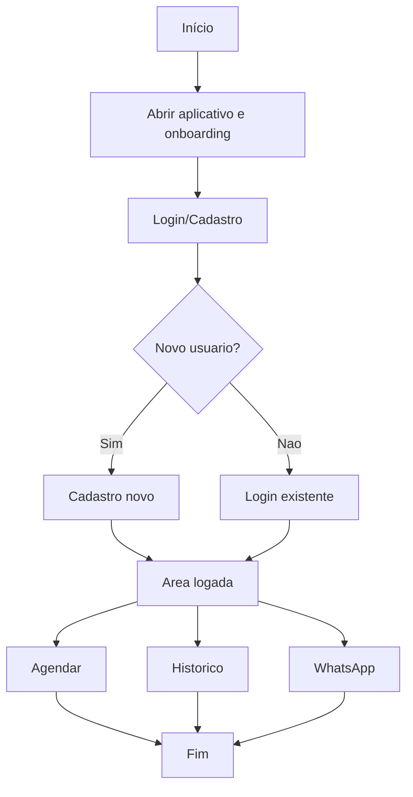
```mermaid
flowchart TD
    A[Início] --> B[Abrir aplicativo e onboarding]
    B --> C[Login/Cadastro]
    C --> D{Novo usuario?}
    D -- Sim --> E[Cadastro novo]
    D -- Nao --> F[Login existente]
    E --> G[Area logada]
    F --> G
    G --> H[Agendar]
    G --> I[Historico]
    G --> J[WhatsApp]
    H --> K[Fim]
    I --> K
    J --> K
```

### Diagrama de Casos de Uso da Administradora

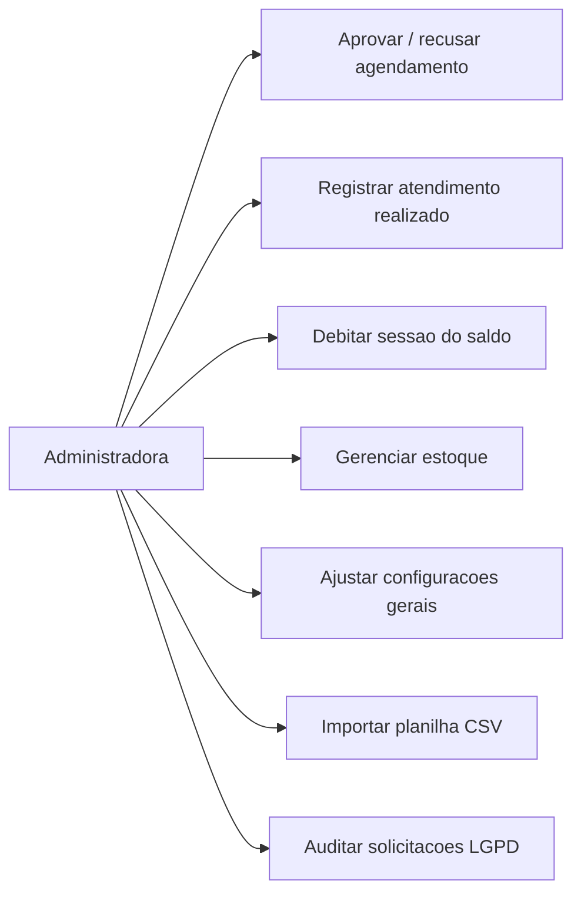
```mermaid
flowchart LR
    A[Administradora] --> U1[Aprovar / recusar agendamento]
    A --> U2[Registrar atendimento realizado]
    A --> U3[Debitar sessao do saldo]
    A --> U4[Gerenciar estoque]
    A --> U5[Ajustar configuracoes gerais]
    A --> U6[Importar planilha CSV]
    A --> U7[Auditar solicitacoes LGPD]
```

### Diagrama de Casos de Uso do Cliente

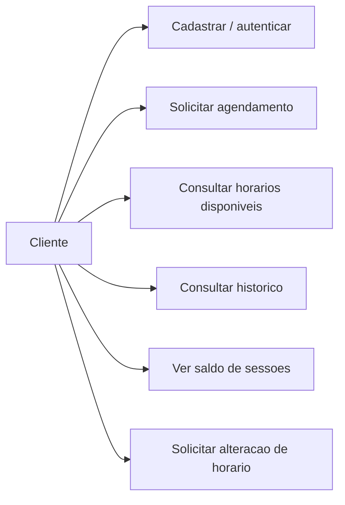
```mermaid
flowchart LR
    A[Cliente] --> U1[Cadastrar / autenticar]
    A --> U2[Solicitar agendamento]
    A --> U3[Consultar horarios disponiveis]
    A --> U4[Consultar historico]
    A --> U5[Ver saldo de sessoes]
    A --> U6[Solicitar alteracao de horario]
```

### Diagrama de Classes

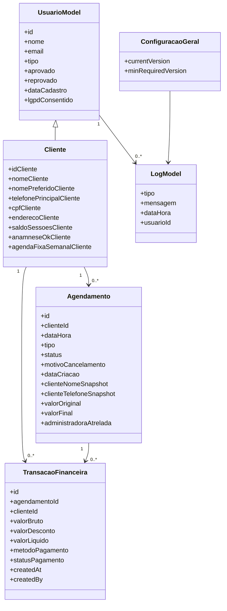
```mermaid
classDiagram
    class UsuarioModel {
        +id
        +nome
        +email
        +tipo
        +aprovado
        +reprovado
        +dataCadastro
        +lgpdConsentido
    }

    class Cliente {
        +idCliente
        +nomeCliente
        +nomePreferidoCliente
        +telefonePrincipalCliente
        +cpfCliente
        +enderecoCliente
        +saldoSessoesCliente
        +anamneseOkCliente
        +agendaFixaSemanalCliente
    }

    class Agendamento {
        +id
        +clienteId
        +dataHora
        +tipo
        +status
        +motivoCancelamento
        +dataCriacao
        +clienteNomeSnapshot
        +clienteTelefoneSnapshot
        +valorOriginal
        +valorFinal
        +administradoraAtrelada
    }

    class TransacaoFinanceira {
        +id
        +agendamentoId
        +clienteId
        +valorBruto
        +valorDesconto
        +valorLiquido
        +metodoPagamento
        +statusPagamento
        +createdAt
        +createdBy
    }

    class LogModel {
        +tipo
        +mensagem
        +dataHora
        +usuarioId
    }

    class ConfiguracaoGeral {
        +currentVersion
        +minRequiredVersion
    }

    UsuarioModel <|-- Cliente
    Cliente "1" --> "0..*" Agendamento
    Cliente "1" --> "0..*" TransacaoFinanceira
    Agendamento "1" --> "0..*" TransacaoFinanceira
    UsuarioModel "1" --> "0..*" LogModel
    ConfiguracaoGeral --> LogModel
```
## A.1 Fluxo Inicial e Autenticação

Fluxograma do fluxo do cliente: [Fluxo do Cliente (SVG)](../diagramas/generated_svgs/Tela_Fluxo_Cliente.svg)

As figuras desta seção reúnem a sequência inicial de interação com o sistema, abrangendo elementos de apresentação, autenticação, cadastro e consentimento.

**Figura 1. Tela Cadastro Aguardando Aprovacao Admin**
 
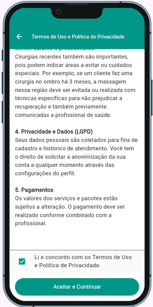
 
**Fonte: Autores (2026).**
 
A presente figura A captura evidencia o estado intermediário do cadastro, o qual permanece pendente até a validação e aprovação pela instância administrativa competente.

**Figura 2. Tela Cadastro Cliente Novo Completo**
 
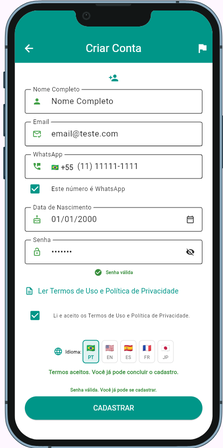
 
**Fonte: Autores (2026).**
 
A presente figura Ilustra o formulário destinado ao cadastro de um novo cliente, contemplando os campos essenciais para sua identificação e posterior vinculação ao ambiente da aplicação.

**Figura 3. Diagrama Arquitetura Total SAGMA Completo**
 

 
**Fonte: Autores (2026).**
 
A presente figura O diagrama sintetiza a arquitetura do sistema, articulando a interface, o banco de dados e os serviços de integração externa de forma integrada e coerente.

**Figura 4. Tela Compartilhar WhatsApp Aprovacao**
 
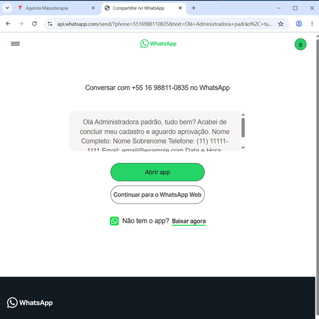
 
**Fonte: Autores (2026).**
 
A presente figura Demonstra a integração com o WhatsApp, utilizada como mecanismo de comunicação para o compartilhamento de confirmações e orientações ao cliente.

**Figura 5. Tela Firestore Perfil Cliente Dados**
 
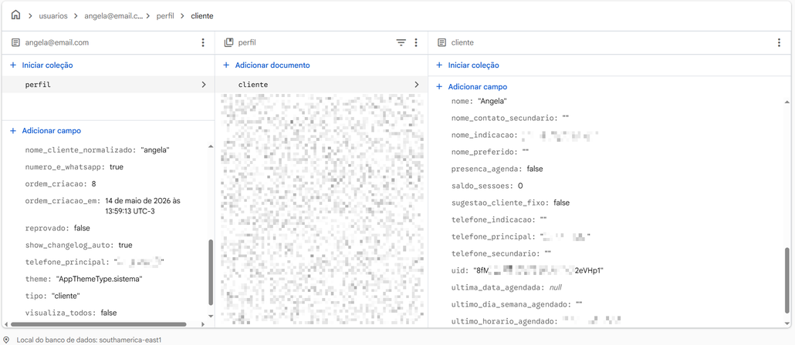
 
**Fonte: Autores (2026).**
 
A presente figura Evidencia a estrutura de dados vinculada ao perfil do cliente, na qual se observa a organização dos campos destinados ao cadastro, ao acompanhamento e ao histórico das informações registradas.

**Figura 6. Tela Login Cliente Completo Principal**
 
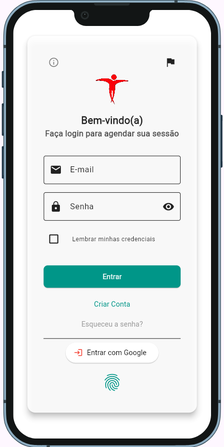
 
**Fonte: Autores (2026).**
 
A presente figura A presente captura apresenta a interface de autenticação do cliente, configurada como porta de entrada para o acesso ao sistema e às funcionalidades disponibilizadas.

**Figura 7. Tela Onboarding Bem Vindo Principal**
 
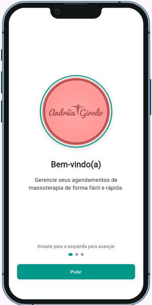
 
**Fonte: Autores (2026).**
 
A presente figura A presente captura ilustra a primeira interação do usuário com o aplicativo, destacando a mensagem inicial de acolhimento e orientação ao acesso ao sistema.

**Figura 8. Tela Onboarding Historico Completo**
 
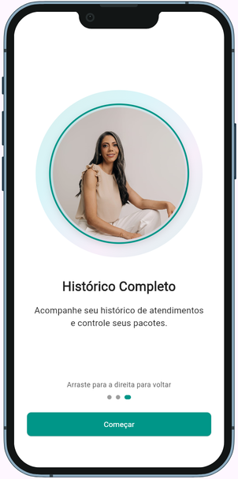
 
**Fonte: Autores (2026).**
 
A presente figura A referida etapa de onboarding demonstra a contextualização do histórico de uso e da continuidade da interação do usuário com a plataforma.

**Figura 9. Tela Onboarding Notificacoes Automaticas**
 
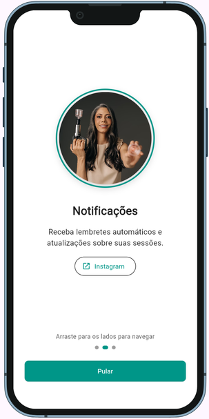
 
**Fonte: Autores (2026).**
 
A presente figura Evidencia a apresentação de recursos de notificações automáticas ao usuário, evidenciando a preocupação do sistema com a comunicação proativa já na etapa inicial de navegação.

**Imagem adicional. Tela Device Preview**
 
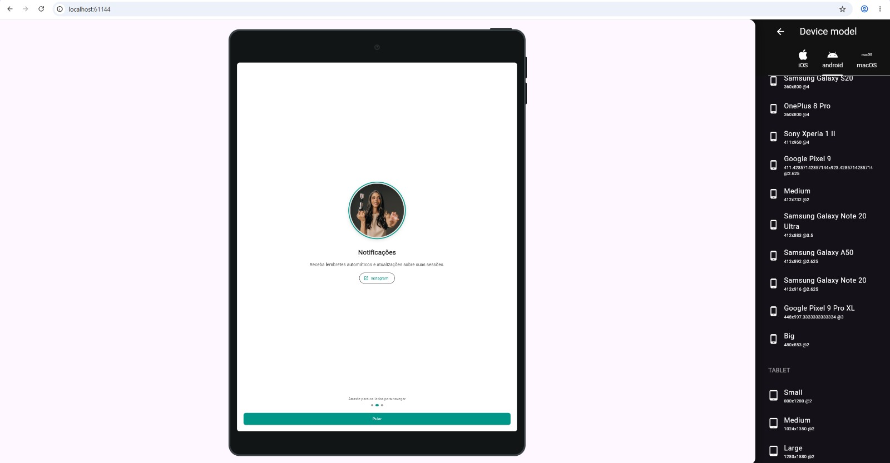
 
**Fonte: Autores (2026).**
 
Imagem capturada do Device Preview exibindo a pré-visualização responsiva (tablet) da etapa de notificações do onboarding.

**Figura 10. Tela Termos Uso Privacidade Cliente**
 

 
**Fonte: Autores (2026).**
 
A presente figura Apresenta a etapa de aceite dos termos de uso e privacidade, requisito indispensável para o atendimento às exigências de conformidade e tratamento adequado dos dados.

Consulte também: - [LGPD — Privacidade e Tratamento de Dados](../../lib/documents/LGPD_PRIVACIDADE.md)

## A.2 Infraestrutura, Diagnóstico e Governança

As figuras a seguir documentam o ambiente técnico de apoio, contemplando emulação, governança de versão e recursos de diagnóstico utilizados durante o desenvolvimento.

Documentos relacionados:
- [api_commands.md](../../lib/documents/api_commands.md)
- [IMPORT_DATA_GUIDE.md](../../IMPORT_DATA_GUIDE.md)
- [IMPORT_FINAL_SUMMARY.md](../../IMPORT_FINAL_SUMMARY.md)
- [IMPORT_FIXES_APPLIED.md](../../IMPORT_FIXES_APPLIED.md)
- [IMPLEMENTATION_GUIDE.md](../../IMPLEMENTATION_GUIDE.md)
- [Relatório de Correções e Melhorias - Projeto Agenda.md](../../lib/documents/Relatório%20de%20Correções%20e%20Melhorias%20-%20Projeto%20Agenda.md)

**Figura 11. Tela Admin Agendamentos Vazios Lista**
 
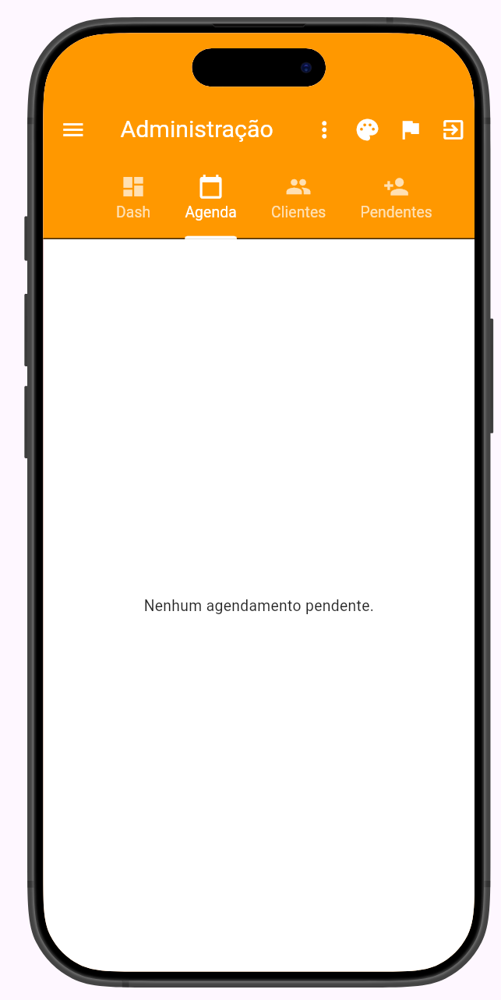
 
**Fonte: Autores (2026).**
 
A presente figura Exibe a visão administrativa quando ainda não há agendamentos carregados na listagem.

**Figura 12. Tela Admin Clientes Detalhes Completos**
 
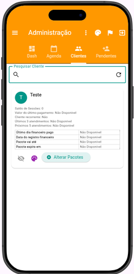
 
**Fonte: Autores (2026).**
 
A presente figura Apresenta a área administrativa com informações detalhadas de um cliente selecionado.

**Figura 13. Tela Admin Dashboard Resumo Geral**
 
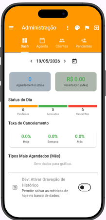
 
**Fonte: Autores (2026).**
 
A presente figura Evidencia o painel administrativo com indicadores resumidos de acompanhamento do sistema.

**Figura 14. Tela Admin Pendentes Aprovacao Cadastro**
 
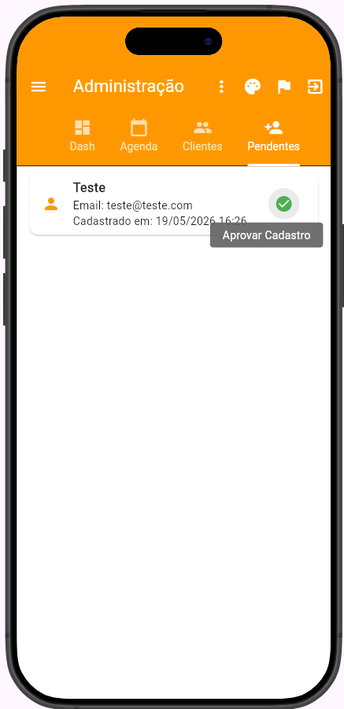
 
**Fonte: Autores (2026).**
 
A presente figura Indica a fila de cadastros pendentes aguardando aprovação da profissional ou administradora.

**Figura 15. Tela Administracao Clientes Tema Escuro**
 
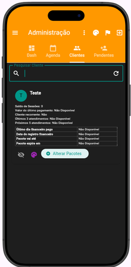
 
**Fonte: Autores (2026).**
 
A presente figura Evidencia a listagem de clientes em tema escuro, útil para validação de contraste e leitura.

**Figura 16. Tela Administracao Config Sistema Padrao**
 
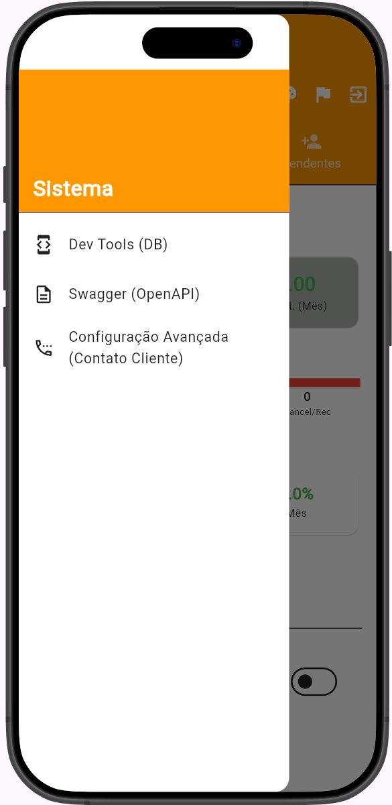
 
**Fonte: Autores (2026).**
 
A presente figura Exibe a configuração geral padrão utilizada pelo sistema.

**Figura 17. Tela Administracao Escolher Tema Dialogo Preview**
 

 
**Fonte: Autores (2026).**
 
A presente figura Apresenta a pré-visualização do tema selecionado antes da aplicação definitiva na interface administrativa.

**Figura 18. Tela Administracao Agendamentos Detalhe Status**
 
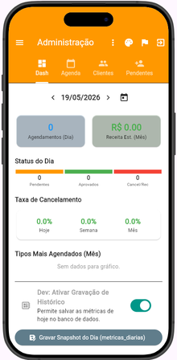
 
**Fonte: Autores (2026).**
 
A presente figura Evidencia o painel administrativo com foco na atualização e acompanhamento do status do agendamento.

**Figura 19. Tela Administracao Agendamentos Detalhe Cliente**
 
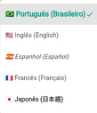
 
**Fonte: Autores (2026).**
 
A presente figura Apresenta os detalhes do cliente associados a um agendamento específico.

**Figura 20. Tela Administracao WhatsApp Aprovacao Template**
 
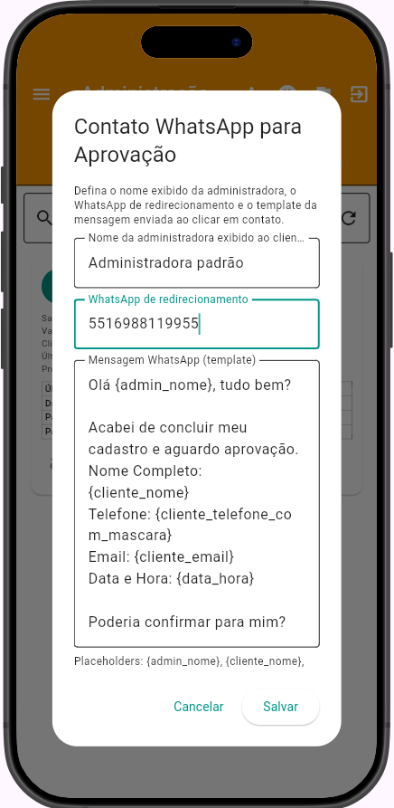
 
**Fonte: Autores (2026).**
 
A presente figura Evidencia o modelo de mensagem usado para aprovação por meio do WhatsApp.

**Figura 21. Tela Agendamento Confirmacao Final Completa**
 
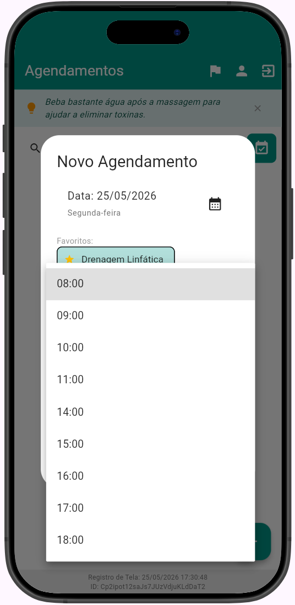
 
**Fonte: Autores (2026).**
 
A presente figura Registra a etapa final de confirmação do agendamento antes do envio ou persistência da solicitação.

**Figura 22. Tela Agendamento Data Selecao Calendario**
 
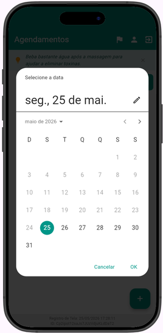
 
**Fonte: Autores (2026).**
 
A presente figura Exibe o calendário de seleção de data, etapa essencial para definir o agendamento.

**Figura 23. Tela Agendamento Favoritos Tipo Servico**
 
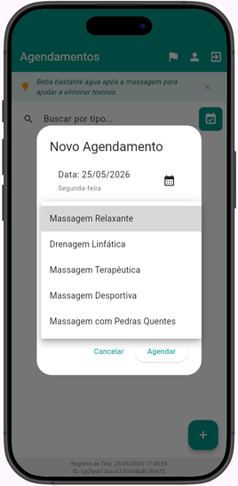
 
**Fonte: Autores (2026).**
 
A presente figura Evidencia a seleção de tipos de serviço favoritados para agilizar o fluxo de agendamento.

**Figura 24. Tela Agendamento Horarios Disponiveis Lista**
 
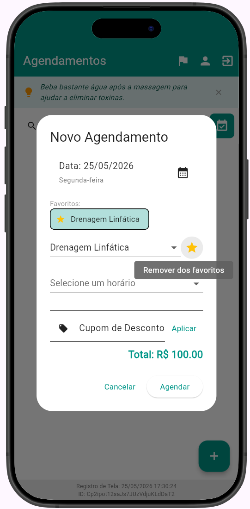
 
**Fonte: Autores (2026).**
 
A presente figura Apresenta a relação de horários disponíveis após a verificação de conflito na agenda.

**Figura 25. Tela Agendamento Novo Formulario**
 
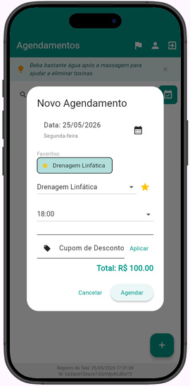
 
**Fonte: Autores (2026).**
 
A presente figura Evidencia o formulário modal de novo agendamento, com seleção de data, horário, tipo de serviço, cupom e confirmação final.

**Figura 26. Tela Agendamento Novo Tipo Horario**
 
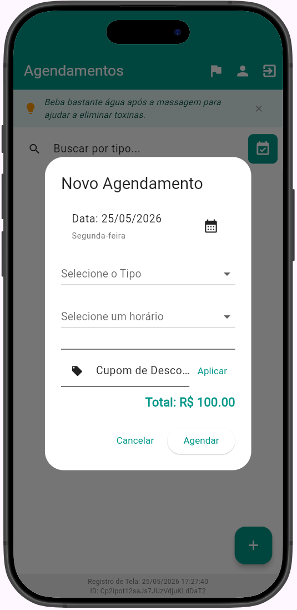
 
**Fonte: Autores (2026).**
 
A presente figura Apresenta a seleção inicial do tipo de atendimento e do horário desejado pelo cliente.

**Figura 27. Tela Agendamentos Visao Cliente Vazia**
 
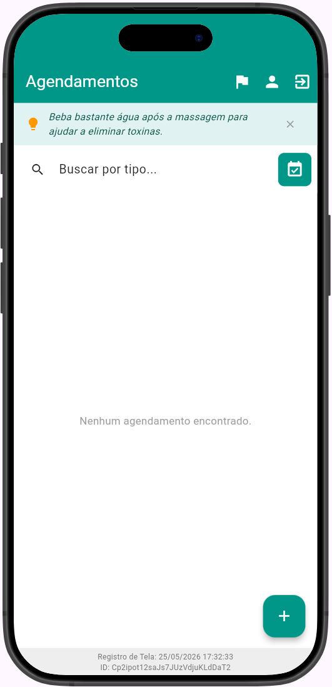
 
**Fonte: Autores (2026).**
 
A presente figura Evidencia a visão do cliente quando não há agendamentos cadastrados ou ativos.

**Figura 28. Tela Firebase Emulator Firestore Data**
 
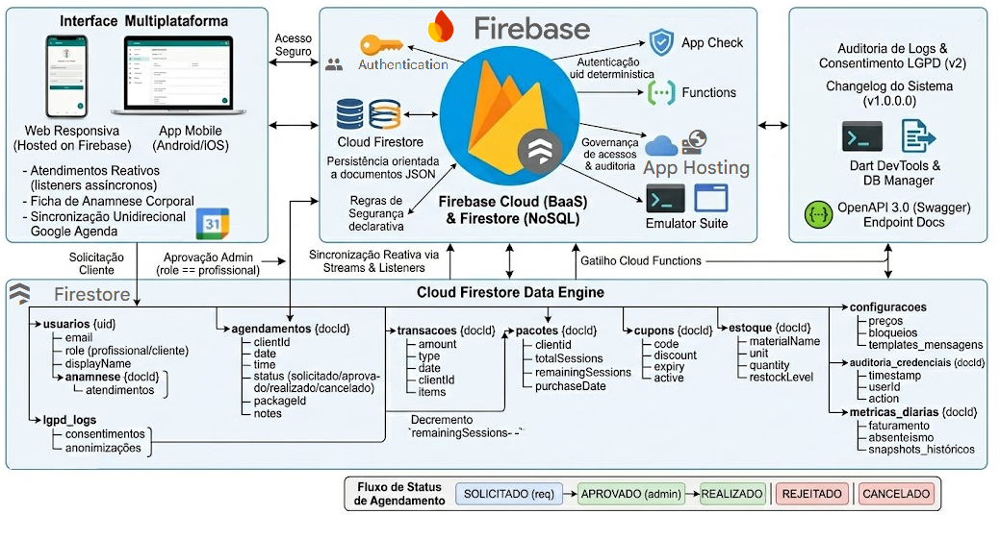
 
**Fonte: Autores (2026).**
 
A presente figura Apresenta uma evidência do ambiente de emulação do Firebase, utilizado na fase de testes e validação.

**Figura 29. Tela Google Agenda Semana Horarios**
 
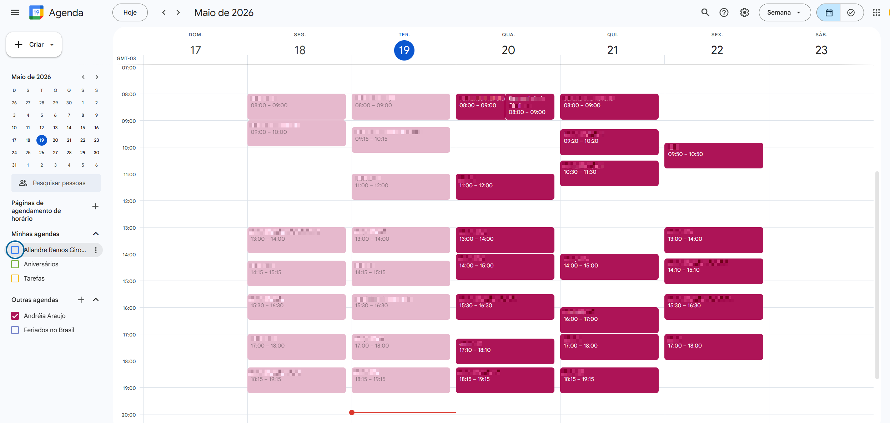
 
**Fonte: Autores (2026).**
 
A presente figura Registra a integração visual com a agenda externa, exibindo a organização semanal dos horários.

**Figura 30. Tela Instagram Popup Cadastro Entrar**
 
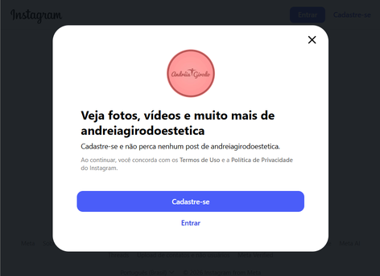
 
**Fonte: Autores (2026).**
 
A presente figura Ilustra o pop-up de cadastro e entrada exibido sobre a tela inicial do Instagram.

## A.3 Experiência do Cliente e Histórico de Atendimentos

As imagens reunidas a seguir documentam o percurso visual do cliente, abrangendo cadastro, consentimento, perfil, histórico e informações financeiras associadas ao acompanhamento dos atendimentos.

Documento relacionado:
- [LGPD_PRIVACIDADE.md](../../lib/documents/LGPD_PRIVACIDADE.md)

**Figura 31. Tela Perfil Cliente Dados Pessoais Formulario**
 
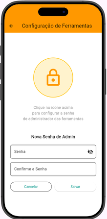
 
**Fonte: Autores (2026).**
 
A presente figura Apresenta o formulário de dados pessoais do cliente para edição e acompanhamento.

**Figura 32. Tela Dev Acesso Banco Dados Senha Admin**
 
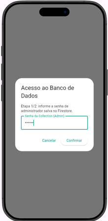
 
**Fonte: Autores (2026).**
 
A presente figura evidencia a proteção do acesso ao banco de dados em ambiente DEV, com senha administrativa definida conforme o padrão descrito em [.env.example](../../.env.example), habilitando as rotinas de diagnóstico.

**Figura 33. Tela Dev Confirmacao Senha Admin Env Etapa 2**
 
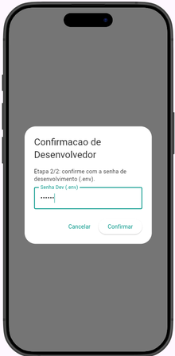
 
**Fonte: Autores (2026).**
 
A presente figura registra a etapa 2 de confirmação da senha administrativa em ambiente DEV, usando a configuração definida no arquivo [.env.example](../../.env.example).

**Figura 34. Tela DevTools DB Manager Device Preview Csv Configuracao**
 
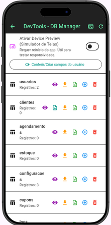
 
**Fonte: Autores (2026).**
 
A presente figura apresenta o DevTools DB Manager com Device Preview ativado e apoio à exportação de CSV e configuração de ambiente DEV.

**Figura 35. Tela Dashboard Cliente Meu Perfil Visao**
 
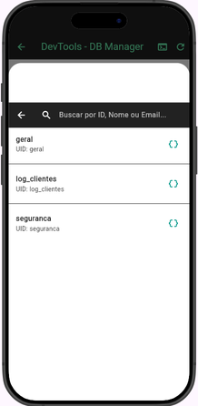
 
**Fonte: Autores (2026).**
 
A presente figura Apresenta a visão geral do perfil do cliente dentro do dashboard.

**Figura 36. Tela Dashboard Cliente Resumo Sessoes Pacotes**
 
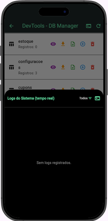
 
**Fonte: Autores (2026).**
 
A presente figura Exibe o resumo de sessões e pacotes disponíveis para o cliente.

**Figura 37. Tela Perfil Cliente Consentimento LGPD Visual**
 
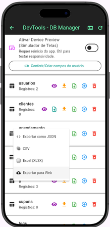
 
**Fonte: Autores (2026).**
 
A presente figura Exibe a etapa de consentimento LGPD com foco na conformidade e transparência dos dados.

Ver documentação de privacidade e consentimento: - [LGPD — Privacidade e Tratamento de Dados](../../lib/documents/LGPD_PRIVACIDADE.md)

**Figura 38. Tela Perfil Cliente Atividades Historico Completo**
 
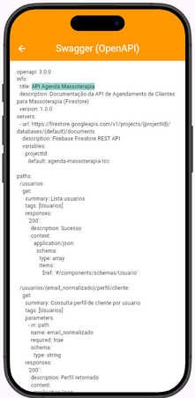
 
**Fonte: Autores (2026).**
 
A presente figura Evidencia o histórico completo de atividades executadas no perfil do cliente.

Documentos relacionados: - [Especificação OpenAPI (swagger.yaml)](../../lib/documents/swagger.yaml)  - [Comandos de API (api_commands.md)](../../lib/documents/api_commands.md)

## A.4 Agendamentos e Operação Administrativa

Esta seção concentra as evidências visuais da operação administrativa, incluindo panorama geral, gestão de clientes, pendências, calendário e parametrizações internas.

Documento relacionado:
- [MELHORIAS_INTERFACE_ADMIN_DEV.md](../../MELHORIAS_INTERFACE_ADMIN_DEV.md)

**Figura 39. Tela Firebase Emulator Firestore Perfil Cliente Dados**
 

 
**Fonte: Autores (2026).**
 
A presente figura Apresenta a coleção de perfil do cliente no Firebase Emulator Suite, com os campos de dados persistidos no Firestore.

**Figura 40. Tela Dashboard Cliente Agendamentos Ativos Detalhes**
 
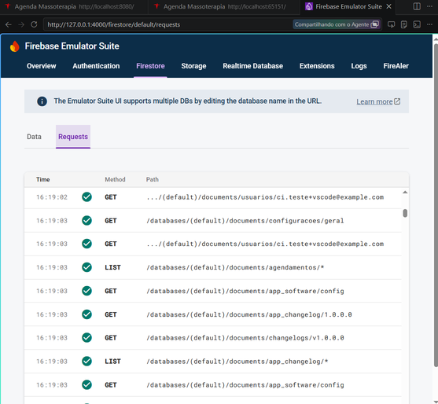
 
**Fonte: Autores (2026).**
 
A presente figura Detalha os agendamentos ativos disponíveis no painel do cliente.

## A.5 Personalização Visual e Governança de Interface

As últimas figuras concentram a camada de personalização estética do sistema, incluindo temas, pré-visualização e aplicação final das configurações visuais.

Documento relacionado:
- [IMPLEMENTATION_GUIDE.md](../../IMPLEMENTATION_GUIDE.md)

**Figura 41. Diagrama Arquitetura Geral SAGMA**
 

 
**Fonte: Autores (2026).**
 
A presente figura Apresenta a arquitetura geral do sistema SAGMA, com a relação entre perfil do cliente, perfil do administrador, banco de dados e integrações.

**Figura 42. Tela Administracao Clientes Detalhes Resumo**
 

 
**Fonte: Autores (2026).**
 
A presente figura Evidencia o resumo administrativo de um cliente com seus principais indicadores e ações rápidas.

**Figura 43. Tela Administracao Escolher Tema Lista Opcoes**
 
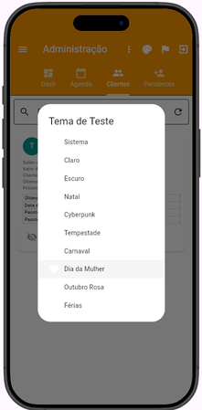
 
**Fonte: Autores (2026).**
 
A presente figura Evidencia a lista de opções disponíveis para personalização do tema, organizada em um seletor suspenso.

**Figura 44. Tela Agendamentos Administracao Selecionar Data**
 
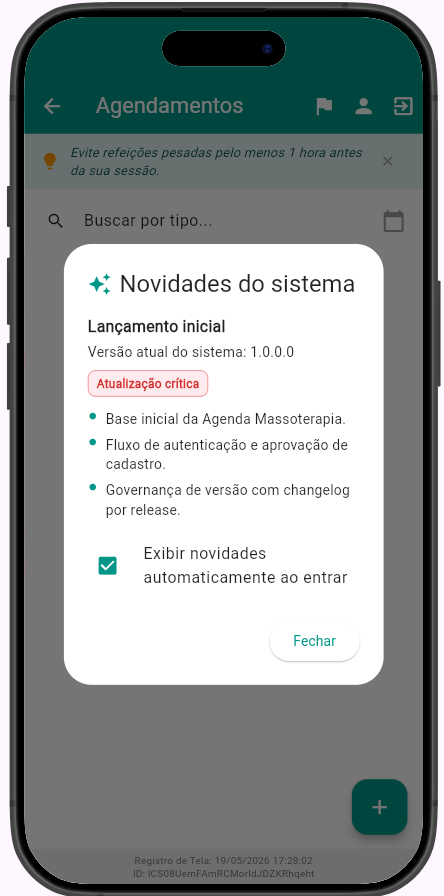
 
**Fonte: Autores (2026).**
 
A presente figura Exibe a seleção de data para criação ou ajuste do agendamento.

**Figura 45. Tela Agendamentos Administracao Selecionar Horario**
 
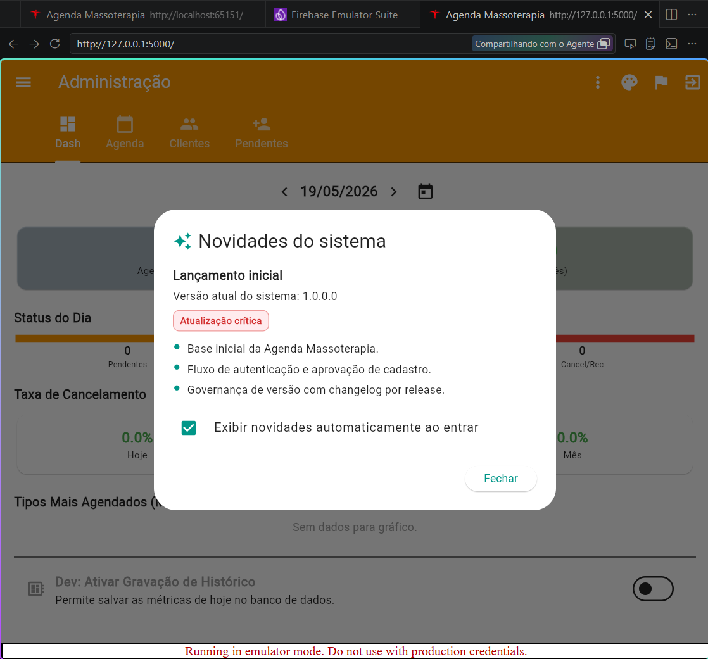
 
**Fonte: Autores (2026).**
 
A presente figura Apresenta a seleção de horário dentro do fluxo administrativo de agendamentos.

**Figura 46. Tela Agendamentos Administracao Selecionar Tipo**
 
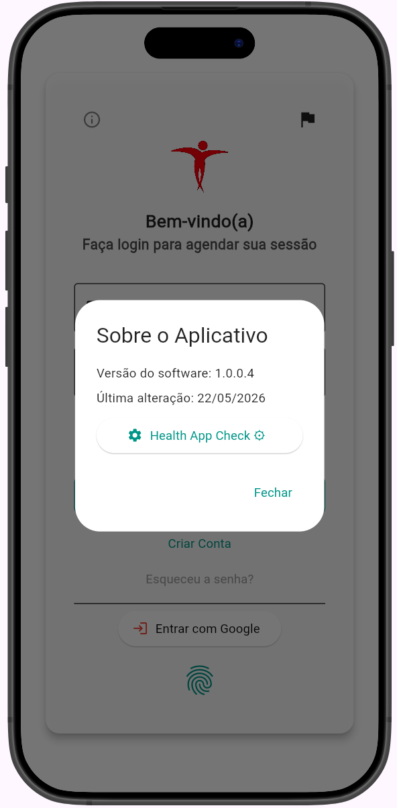
 
**Fonte: Autores (2026).**
 
A presente figura Evidencia a etapa administrativa de seleção do tipo de atendimento.

**Figura 47. Tela Agendamentos Administracao Total Previsto**
 
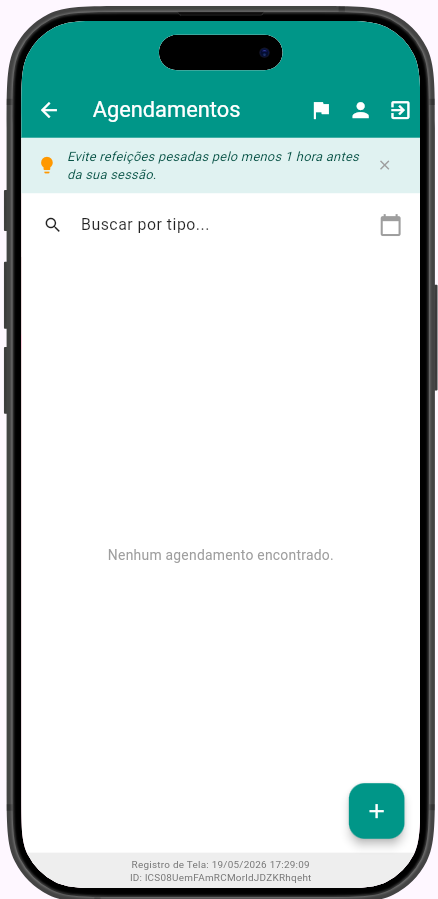
 
**Fonte: Autores (2026).**
 
A presente figura Exibe o total previsto para o atendimento ou conjunto de agendamentos analisados.

**Figura 48. Tela Agendamentos Administracao Aviso Dica**
 
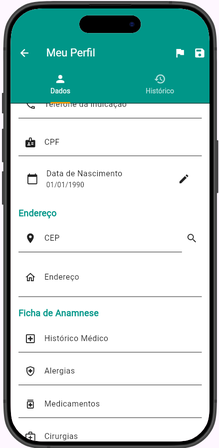
 
**Fonte: Autores (2026).**
 
A presente figura Registra um aviso ou dica operacional exibido na interface administrativa.

**Figura 49. Tela Dev Acesso Banco Dados Senha Admin**
 

 
**Fonte: Autores (2026).**
 
A presente figura evidencia a proteção do acesso ao banco de dados em ambiente DEV, com senha administrativa definida conforme o padrão descrito em [.env.example](../../.env.example), habilitando as rotinas de diagnóstico.

**Figura 50. Tela Diagrama Fluxo Total Sistema**
 

 
**Fonte: Autores (2026).**
 
A presente figura Apresenta o diagrama consolidado do fluxo total do sistema, reunindo os principais caminhos de interação.

**Figura 51. Tela Agendamentos Administracao Favoritos Tipo**
 

 
**Fonte: Autores (2026).**
 
A presente figura Evidencia os tipos de atendimento salvos como favoritos para agilizar a operação.

**Figura 52. Tela Agendamentos Administracao Remover Favorito**
 

 
**Fonte: Autores (2026).**
 
A presente figura Apresenta a ação administrativa para remover um item da lista de favoritos.

**Figura 53. Tela Agendamentos Administracao Cupom Desconto**
 
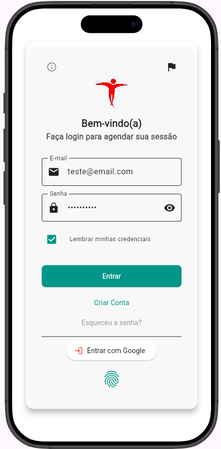
 
**Fonte: Autores (2026).**
 
A presente figura Registra a aplicação de cupom de desconto no agendamento administrativo.

**Figura 54. Tela Agendamentos Administracao Confirmar Reserva**
 
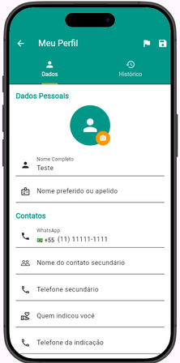
 
**Fonte: Autores (2026).**
 
A presente figura Evidencia a confirmação final da reserva dentro do fluxo administrativo.

**Figura 55. Tela Perfil Cliente Excluir Conta Confirmacao**
 

 
**Fonte: Autores (2026).**
 
A presente figura registra o modal de confirmação para exclusão da conta do cliente, em conformidade com a [Lei nº 13.709, de 14 de agosto de 2018](https://www.planalto.gov.br/ccivil_03/_ato2015-2018/2018/lei/l13709.htm) (LGPD). Os dados que precisarem permanecer na base por prazo legal são anonimizados; o restante é excluído.

**Figura 56. Tela Perfil Cliente Salvar Perfil Disparo WhatsApp Admin**
 

 
**Fonte: Autores (2026).**
 
A presente figura apresenta o botão de salvar perfil que dispara comunicação ao WhatsApp do administrador para acompanhamento do atendimento.

**Figura 57. Tela Agendamentos Administracao Pendente Listagem**
 
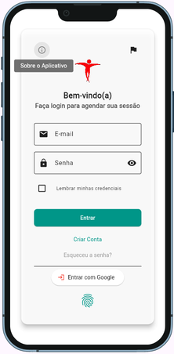
 
**Fonte: Autores (2026).**
 
A presente figura Apresenta a listagem de agendamentos pendentes aguardando análise.

## A.6 Esboço APP Caderno

O material de esboço do aplicativo encontra-se disponível no arquivo [Esboço APP caderno.pdf](Esboço%20APP%20caderno.pdf). As páginas seguintes reproduzem visualmente esse conteúdo para registro no apêndice.

**Figura 58. Esboço APP Caderno Pagina 3**
 
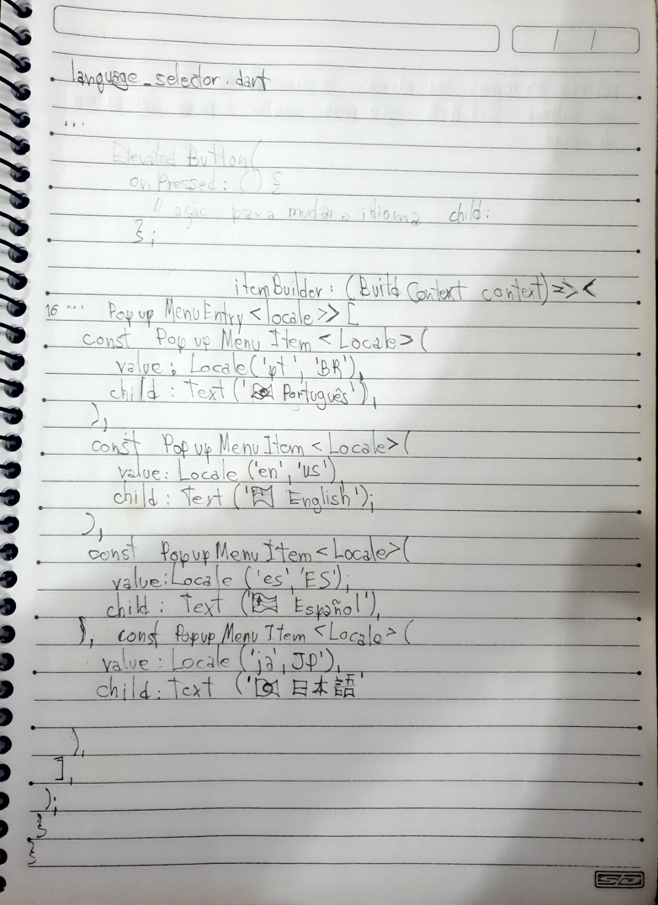
 
**Fonte: Autores (2026).**
 
A presente figura Registra a terceira página do esboço, consolidando as referências visuais preparatórias do aplicativo.

**Figura 59. Esboço APP Caderno Pagina 1**
 
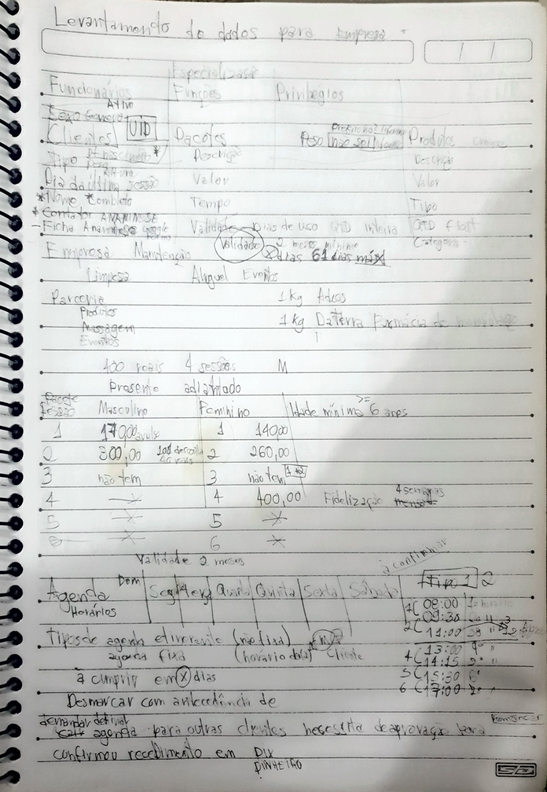
 
**Fonte: Autores (2026).**
 
A presente figura Registra a primeira página do esboço do aplicativo, preservando a proposta visual inicial do projeto.

**Figura 60. Esboço APP Caderno Pagina 2**
 
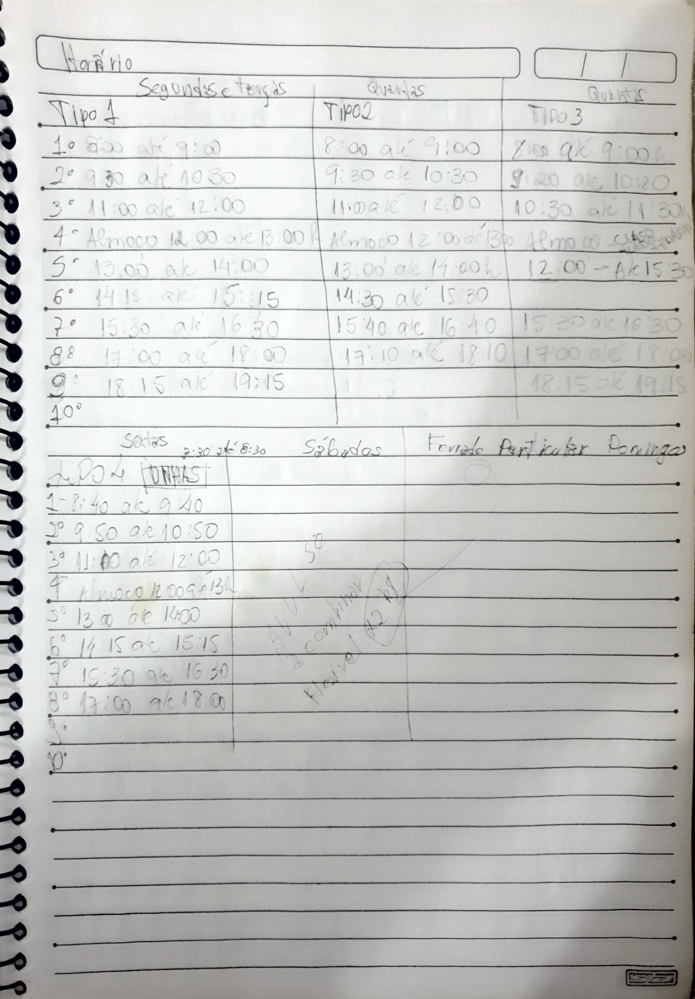
 
**Fonte: Autores (2026).**
 
A presente figura Apresenta a segunda página do esboço, com a continuidade das anotações e estudos de interface.

## A.7 Telas Administrativas — Complementares

As imagens a seguir complementam a seção administrativa com telas de auditoria, controle de estoque e configuração do sistema.

**Figura 61. Tela Administração — Cadastro de Estoque**
 
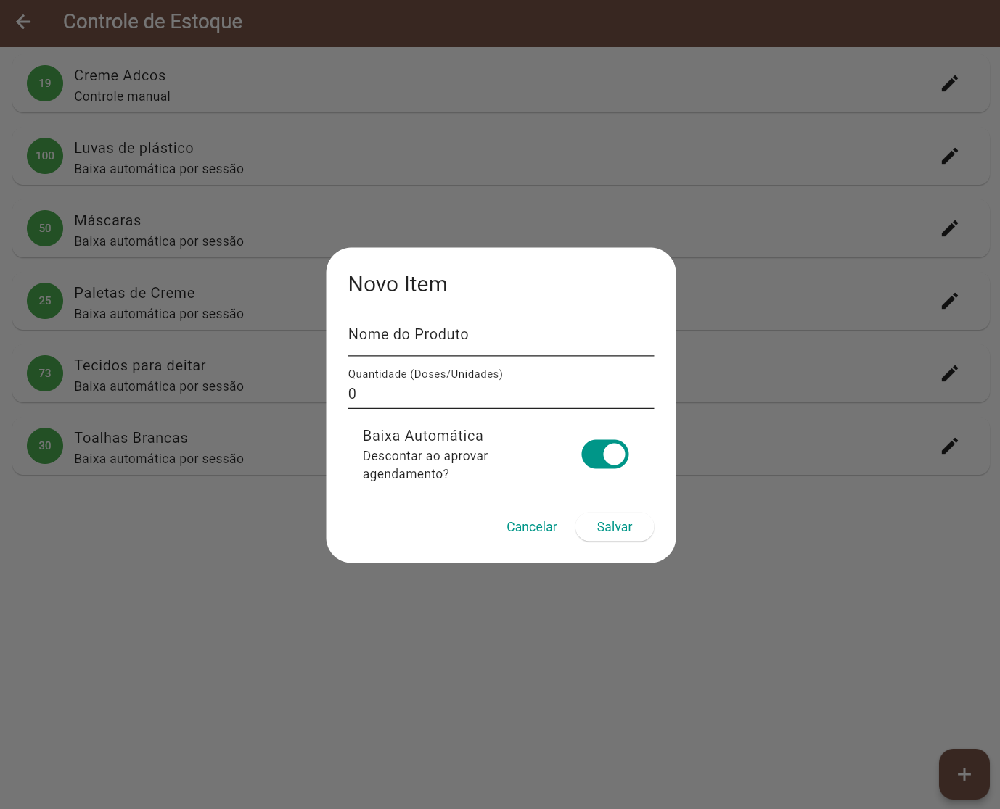
 
**Fonte: Autores (2026).**
 
A presente figura Mostra o formulário e validações relacionadas ao cadastro e atualização de itens de estoque no sistema administrativo.

**Figura 62. Tela Administração — Auditoria LGPD (Anonimização de Conta)**
 
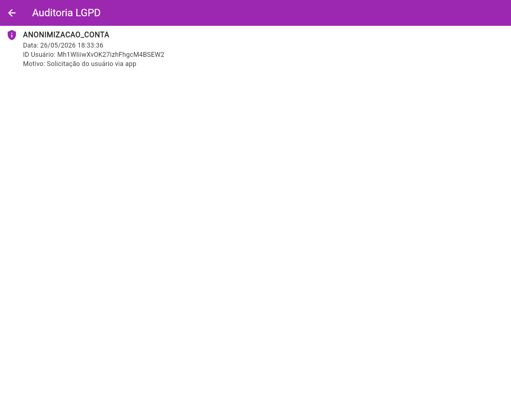
 
**Fonte: Autores (2026).**
 
A presente figura Documenta o processo de auditoria e opções de anonimização de dados pessoais após exclusão de conta, conforme requisitos de privacidade.

**Figura 63. Tela Administração — Configurações (1)**
 
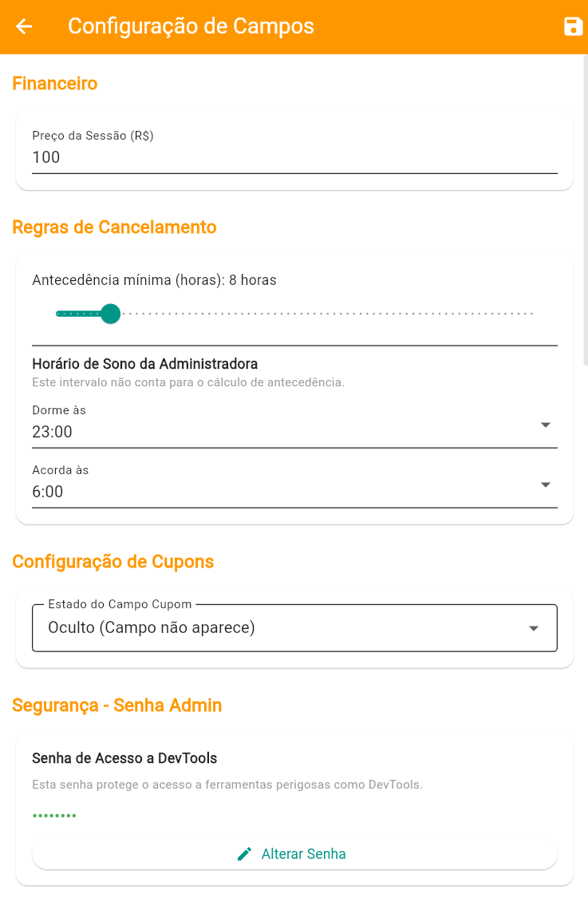
 
**Fonte: Autores (2026).**
 
A presente figura Exibe opções de configuração do sistema na primeira aba de parametrização.

**Figura 64. Tela Administração — Configurações (2)**
 
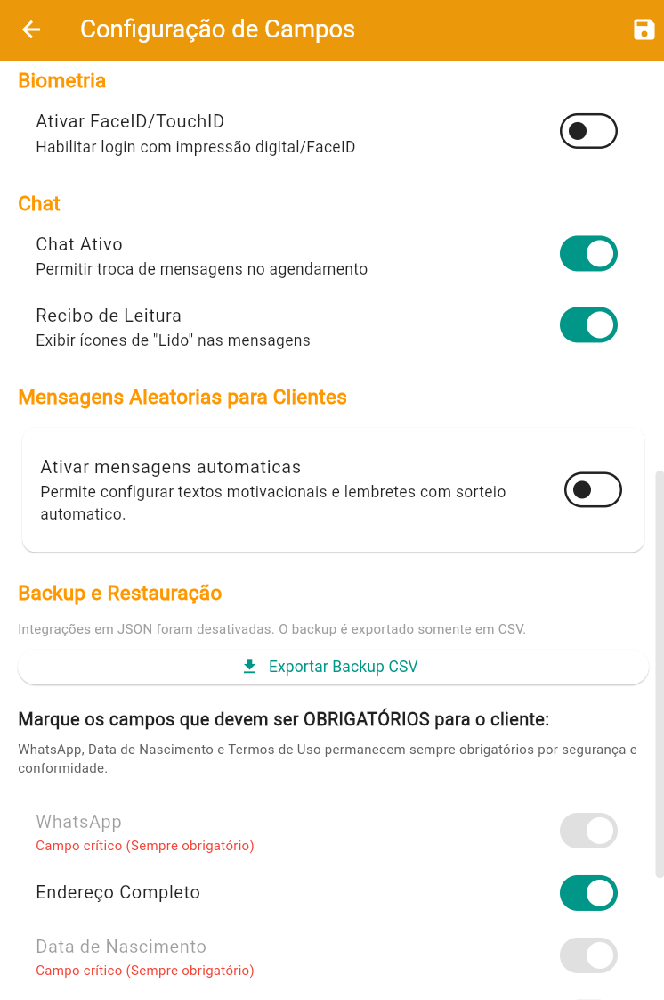
 
**Fonte: Autores (2026).**
 
A presente figura Complementa a visão de parametrização com ajustes avançados de integração e políticas.

**Figura 65. Tela Administração — Configurações (3)**
 
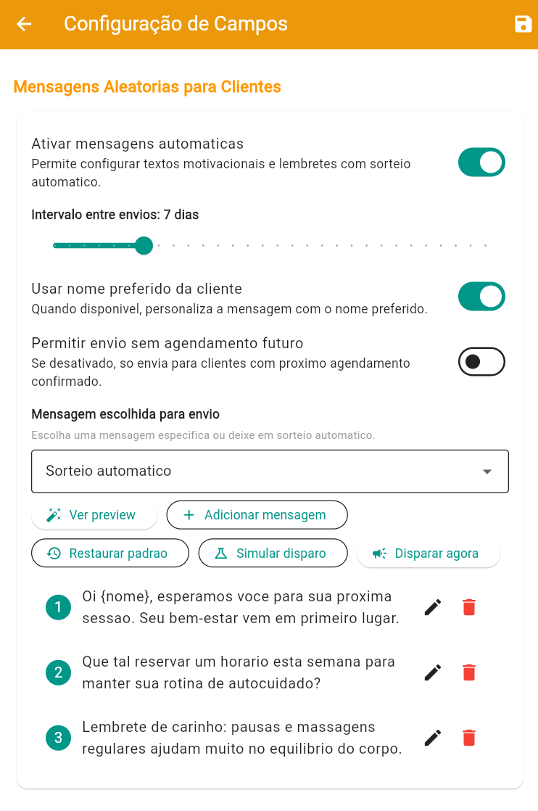
 
**Fonte: Autores (2026).**
 
A presente figura Mostra controles adicionais de personalização e segurança aplicáveis à administradora.

**Figura 66. Tela Administração — Configurações (4)**
 
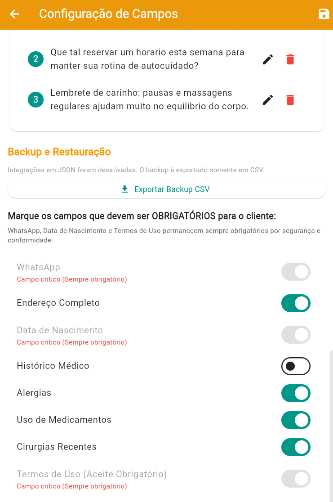
 
**Fonte: Autores (2026).**
 
A presente figura Apresenta a aba final de configurações com opções de versão e manutenção do sistema.

**Figura 67. Tela Administração — Controle de Estoque**
 
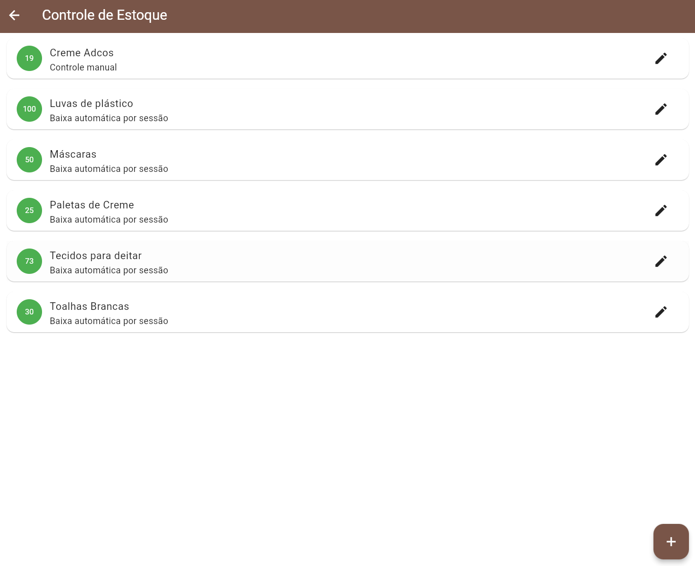
 
**Fonte: Autores (2026).**
 
A presente figura Evidencia a lista de itens em estoque, com filtros, ajustes de quantidade e exportação.

**Figura 68. Tela Administração — Relatório / Dash Resumo**
 
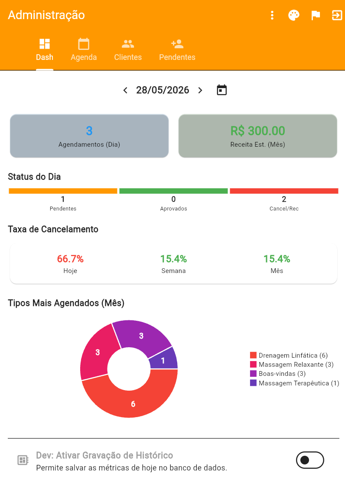
 
**Fonte: Autores (2026).**
 
A presente figura Exibe um resumo gerencial com indicadores financeiros e operacionais relevantes para a administradora.

**Figura 69. Vídeo: Visão Cliente / Administradora (demonstração)**
 
[VisãoCliente — Administradora (vídeo demonstrativo)](media/VisaoCliente_Administradora_Video_1.mp4)
 
**Fonte: Autores (2026).**
 
Vídeo demonstrativo que apresenta a interação entre a visão do cliente e a visão administrativa durante um fluxo de aprovação e confirmação de agendamento.

## Direcionamento ao Dossiê

Para continuidade e consulta das evidências qualitativas, consulte o dossiê: - [Dossiê de entrevistas e elicitação de requisitos](../dossie_entrevistas_elicitacao_requisitos.md)

## Direcionamento ao Fluxograma

Para visualizar o fluxograma principal do sistema e outros diagramas de fluxo, consulte: - [Fluxogramas do Sistema](../diagramas/fluxograma.md)

## REFERÊNCIAS

Para a lista completa de referências utilizadas neste apêndice, consulte: [REFERÊNCIAS](REFERENCIAS.md)

