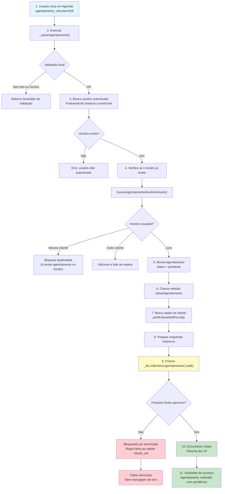

# Falha Silenciosa no Processo de Agendamento

## Fluxograma do Processo



## Descrição do Problema
Durante o fluxo de salvamento de um agendamento na camada de view (`agendamento_view.dart:828` -> `_salvarAgendamento()`), é feita uma chamada ao `FirestoreService` para persistir o novo registro na coleção `agendamentos`. 

O fluxo mapeado (diagrama "Processo de Agendamento") descreve o seguinte comportamento:
1. O objeto de Agendamento é montado com status `pendente`.
2. O sistema busca os dados do cliente e os prepara usando snapshots.
3. A chamada para salvar no banco é feita via `_db.collection('agendamentos').add(...)`.
4. **O problema:** Quando as regras de segurança (Firestore Rules) avaliam a operação e negam o acesso (por exemplo, porque o `cliente_uid` esperado pela regra não existe no documento ou está inconsistente com a autenticação), a promessa do `add()` é rejeitada lançando uma exceção de permissão negada.
5. Como não há um tratamento de erro apropriado (bloco `catch` em torno da chamada assíncrona ou tratamento de exceções específicas do Firestore na interface), a exceção não é capturada na view. O resultado é uma "falha silenciosa": a operação falha, o documento não é criado, mas a interface não exibe nenhuma mensagem de erro (SnackBar) avisando o usuário sobre o bloqueio.

## Como as Firestore Rules Validam `cliente_uid`
Geralmente, as regras de segurança (Firestore Rules) exigem que o UID do usuário tentando criar o agendamento (`request.auth.uid`) corresponda ao `cliente_uid` ou `cliente_id` armazenado no próprio documento a ser criado. 
Exemplo de Regra:
```javascript
match /agendamentos/{agendamentoId} {
  allow create: if request.auth != null && request.resource.data.cliente_id == request.auth.uid;
}
```
Se a aplicação não enviar corretamente essa variável (ou enviar com outro nome), a regra falha, bloqueando silenciosamente a criação caso o aplicativo não trate o erro no Flutter.

## Solução Recomendada
Para corrigir este comportamento:
1. **Adicionar tratamento de exceção no Flutter**: Envolver a chamada de criação de agendamento num bloco `try-catch` capturando `FirebaseException`, exibindo um `SnackBar` com erro amigável na interface.
2. **Corrigir os dados na origem**: Garantir que o objeto passado para o Firestore contenha o campo exato exigido pela regra (como `cliente_id` ou `cliente_uid`).

## Resolução Aplicada
A falha foi mitigada implementando a primeira parte da solução recomendada no arquivo `agendamento_view.dart` (dentro do método `_salvarAgendamento()`). 

A chamada assíncrona ao serviço de persistência foi envolvida num bloco `try-catch` com captura específica da `FirebaseException` (exceção lançada quando a operação é negada pelas Firestore Rules). Também foi adicionado suporte de internacionalização usando a classe `AppStrings` e feedbacks visuais coloridos para guiar o usuário.

**Trecho com o tratamento implementado:**
```dart
try {
  await _firestoreService.salvarAgendamento(novoAgendamento);

  if (mounted) {
    messenger.showSnackBar(
      SnackBar(
        content: Text(appointmentSuccessMessage),
        backgroundColor: Colors.green,
      ),
    );
  }
} on FirebaseException catch (e) {
  // 🔴 Captura específica da falha imposta por Firestore Rules / Auth
  if (mounted) {
    messenger.showSnackBar(
      SnackBar(
        content: Text(AppStrings.erroOperacaoBloqueada(e.message)),
        backgroundColor: Colors.red,
        duration: const Duration(seconds: 5),
      ),
    );
  }
} catch (e) {
  if (mounted) {
    messenger.showSnackBar(
      SnackBar(
        content: Text(AppStrings.erroGenerico(e.toString())),
        backgroundColor: Colors.red,
      ),
    );
  }
}
```
