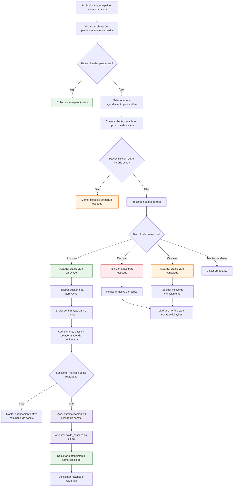

# Fluxo detalhado do procedimento de agendamento

Este documento descreve, em ordem cronológica, o fluxo completo de criação e tratamento de um agendamento no sistema. A versão abaixo segue a opção 3: separa o fluxo do cliente e o fluxo da profissional, deixando explícitas as validações, a prevenção de conflito de horário, a persistência no Firestore, a lista de espera, as regras de segurança e a baixa de pacote ao concluir a sessão.

## 1. Fluxo do cliente

```mermaid
flowchart TD
    A[Cliente acessa a tela de agendamento] --> B[Seleciona data, horário e tipo de massagem]
    B --> C{Campos obrigatórios preenchidos?}

    C -->|Não| C1[Exibir feedback de validação\nSolicitar preenchimento dos campos]
    C -->|Sim| D{Usuário autenticado?}

    D -->|Não| D1[Bloquear a operação\nRedirecionar para autenticação]
    D -->|Sim| E{Perfil com permissão para criar solicitação?}

    E -->|Cliente| F[Montar solicitação de agendamento]
    E -->|Sem permissão| E1[Negar ação\nExibir mensagem de acesso restrito]

    F --> G[Normalizar data e hora\nGerar status inicial: pendente/solicitado]
    G --> H[Buscar agendamento ativo no mesmo horário]
    H --> I{Existe agendamento no horário?}

    I -->|Não| J[Montar objeto Agendamento\ncliente_uid, data_hora, tipo, status, snapshots]
    I -->|Sim| K{O agendamento ocupado pertence ao mesmo cliente?}

    K -->|Sim| K1[Bloquear duplicidade\nInformar que já existe agendamento no horário]
    K -->|Não| L[Oferecer lista de espera\nou nova tentativa em horário livre]

    L --> L1{Cliente aceita entrar na lista de espera?}
    L1 -->|Não| L2[Cancelar a tentativa\nRetornar à escolha de horários]
    L1 -->|Sim| L3{Cliente já atingiu limite de solicitações ativas?}
    L3 -->|Sim| L4[Recusar entrada na lista de espera\nExibir limite máximo permitido]
    L3 -->|Não| L5[Registrar nome do cliente na fila\nAtualizar lista_espera e lista_espera_detalhes]
    L5 --> M[Salvar solicitação vinculada ao horário ocupado]

    J --> N[Chamar FirestoreService.salvarAgendamento()]
    M --> N

    N --> O[Buscar perfil do cliente\nCriar snapshots históricos de nome e telefone]
    O --> P[Preencher administradora_atrelada\ne demais campos derivados]
    P --> Q[Garantir compatibilidade\nGravar cliente_uid no documento]
    Q --> R[Executar add() na coleção agendamentos]

    R --> S{Firestore Security Rules aprovam a gravação?}
    S -->|Não| S1[Erro permission-denied\nExibir SnackBar de falha para o usuário]
    S -->|Sim| T[Documento criado com sucesso]

    T --> U[Exibir confirmação visual\nAgendamento realizado com sucesso]
    T --> V[Disponibilizar o agendamento para a área administrativa]

    style A fill:#e3f2fd,stroke:#1976d2
    style C1 fill:#fff3e0,stroke:#f57c00
    style E1 fill:#ffebee,stroke:#c62828
    style K1 fill:#ffebee,stroke:#c62828
    style L2 fill:#fff3e0,stroke:#ef6c00
    style L4 fill:#ffebee,stroke:#c62828
    style S1 fill:#ffebee,stroke:#c62828
    style T fill:#e8f5e9,stroke:#2e7d32
    style U fill:#e8f5e9,stroke:#2e7d32
```

## 2. Fluxo da profissional



## 3. Pontos críticos do fluxo

- O sistema não permite criar dois agendamentos ativos no mesmo horário quando o horário já está ocupado por outro cliente.
- Se o cliente tentar repetir o mesmo horário, a operação é bloqueada para evitar duplicidade.
- Quando o horário estiver ocupado por outra pessoa, o sistema pode encaminhar o cliente para a lista de espera, respeitando o limite de solicitações ativas.
- A gravação exige o campo `cliente_uid`, pois ele é o vínculo usado pelas regras de segurança do Firestore.
- A profissional é quem aprova, recusa, cancela e conclui a sessão.
- A baixa de pacote não ocorre na criação do agendamento; ela acontece somente quando a sessão é registrada como realizada.
- O histórico deve preservar nome, telefone, data, tipo e status para auditoria e relatórios.

## 4. Transições de status mais comuns

- pendente -> aprovado
- pendente -> recusado
- pendente -> cancelado
- aprovado -> realizado
- aprovado -> cancelado
- cancelado -> encerrado sem baixa de pacote

## 5. Relação com o código-fonte

- A criação do documento e o snapshot de dados do cliente são tratados em [lib/core/services/firestore_service.dart](lib/core/services/firestore_service.dart).
- A estrutura dos campos do agendamento está em [lib/core/models/agendamento_model.dart](lib/core/models/agendamento_model.dart).
- As regras de acesso estão em [lib/config/firestore.rules](lib/config/firestore.rules).
