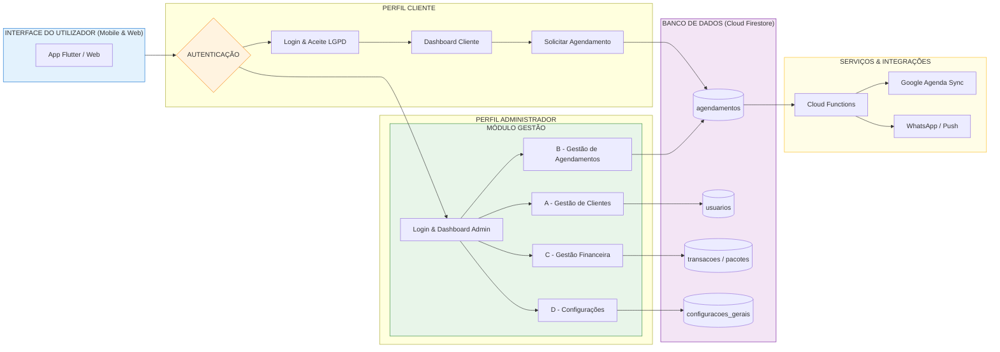

```mermaid
graph LR
    subgraph UI ["INTERFACE DO UTILIZADOR (Mobile & Web)"]
        A[App Flutter / Web]
    end

    UI --> B{AUTENTICAÇÃO}
    
    subgraph CLIENTE ["PERFIL CLIENTE"]
        B --> C1[Login & Aceite LGPD]
        C1 --> C2[Dashboard Cliente]
        C2 --> C3[Solicitar Agendamento]
    end

    subgraph ADMIN ["PERFIL ADMINISTRADOR"]
        B --> D1[Login & Dashboard Admin]
        
        subgraph GESTAO ["MÓDULO GESTÃO"]
            D1 --> G1[A - Gestão de Clientes]
            D1 --> G2[B - Gestão de Agendamentos]
            D1 --> G3[C - Gestão Financeira]
            D1 --> G4[D - Configurações]
        end
    end

    subgraph DB ["BANCO DE DADOS (Cloud Firestore)"]
        C3 --> DB1[(agendamentos)]
        G1 --> DB2[(usuarios)]
        G2 --> DB1
        G3 --> DB3[(transacoes / pacotes)]
        G4 --> DB4[(configuracoes_gerais)]
    end

    subgraph INTEGRACAO ["SERVIÇOS & INTEGRAÇÕES"]
        DB1 --> F[Cloud Functions]
        F --> I1[Google Agenda Sync]
        F --> I2[WhatsApp / Push]
    end

    %% Estilização
    style UI fill:#e3f2fd,stroke:#1976d2
    style B fill:#fff3e0,stroke:#f57c00
    style GESTAO fill:#e8f5e9,stroke:#388e3c
    style DB fill:#f3e5f5,stroke:#7b1fa2
    style INTEGRACAO fill:#fffde7,stroke:#fbc02d
```
