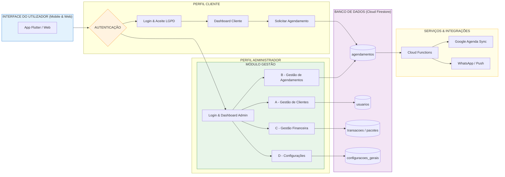

# Fluxogramas do Sistema

## 1. Visão Geral da Arquitetura e Fluxos de Usuário
Este diagrama ilustra a arquitetura macro do sistema SAGMA, detalhando as interações entre os perfis de Cliente e Administrador, os módulos de gestão, o banco de dados (Cloud Firestore) e serviços externos.

As setas indicam o fluxo de dados e interações entre os componentes do sistema. O diagrama destaca os principais pontos de interação, como a autenticação, as ações dos usuários (clientes e administradores), as operações no banco de dados e as integrações com serviços externos.
Dessa forma, é possível entender como as diferentes partes do sistema se conectam e onde ocorrem as principais operações, como o processo de agendamento, a gestão de clientes e a sincronização com o Google Agenda.

## 2. Diagrama do Processo de Agendamento quando em desenvolvimento do aplicativo no Flutter
Este diagrama detalha o fluxo específico do processo de agendamento, desde a ação do usuário até a criação do documento no Firestore, incluindo as validações e possíveis falhas.

Link para o fluxo detalhado do procedimento de agendamento: [Fluxo detalhado do procedimento de agendamento](fluxo_agendamento_detalhado.md), que descreve o processo de forma minuciosa, com separação entre o fluxo do cliente e o fluxo da profissional.

Link para falha silenciosa no processo de agendamento: [Falha Silenciosa no Processo de Agendamento](falha_silenciosa_agendamento.md) que detalha um cenário específico de falha no fluxo de agendamento, onde as regras de segurança do Firestore bloqueiam a criação do documento sem fornecer feedback ao usuário.