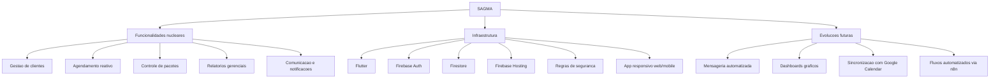

# Funcionalidades Sistêmicas e Infraestrutura

## Visão Geral

Este documento organiza as capacidades nucleares do SAGMA e os elementos de infraestrutura citados no relatório final do TCC.

## 1. Funcionalidades Nucleares

### 1.1 Gestao de clientes
A aplicação centraliza inclusão, edição, consulta e histórico de atendimentos, reduzindo retrabalho administrativo.

### 1.2 Agendamento reativo
O fluxo de agendamento utiliza estados de aprovação para evitar conflitos de horários e garantir controle manual pela profissional.

### 1.3 Controle de pacotes
As sessões dos pacotes são debitadas automaticamente após o atendimento realizado, preservando a rastreabilidade do saldo.

### 1.4 Relatorios gerenciais
O sistema oferece listagens e filtros temporais para apoio ao acompanhamento financeiro e de produtividade.

### 1.5 Comunicacao e notificacoes
As mensagens ao cliente são apoiadas por hyperlinks e templates, com potencial de evolução para notificações automatizadas.

## 2. Infraestrutura

### 2.1 Flutter
Base de desenvolvimento multiplataforma para ambiente mobile e web.

### 2.2 Firebase Auth
Gerencia autenticação e controle de acesso por perfil.

### 2.3 Firestore
Camada de persistência em tempo real para clientes, agendamentos, pacotes e estoque.

### 2.4 Firebase Hosting
Infraestrutura de publicação web utilizada para a entrega do MVP em ambiente produtivo.

### 2.5 Regras de seguranca
As regras declarativas do Firestore sustentam o isolamento de dados e a proteção de operações sensíveis.

## 3. Evolucoes Futuras

### 3.1 Mensageria automatizada
Evoluir de hyperlinks manuais para integração oficial de mensageria e lembretes automáticos.

### 3.2 Dashboards graficos
Incluir painéis visuais para leitura sintética do faturamento e da operação.

### 3.3 Sincronizacao com Google Calendar
Integrar com calendários externos para ampliar a visibilidade dos horários.

### 3.4 Fluxos automatizados via n8n
Acoplar orquestração de automações para notificações e atendimento assistido.

## Encaminhamento

Consulte também o [Dossiê de Entrevistas e Elicitação de Requisitos](dossie_entrevistas_elicitacao_requisitos.md) e o arquivo de [Requisitos Funcionais e Não Funcionais](requisitos_funcionais_e_nao_funcionais.md).
