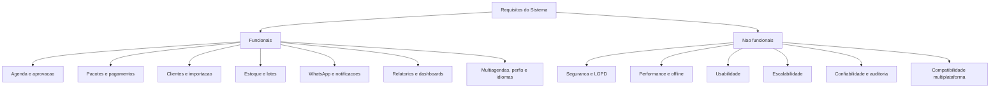

# Requisitos Funcionais e Não Funcionais

## Visão Geral

Este documento consolida os requisitos derivados do dossiê de entrevistas e da análise do escopo do MVP.

## Requisitos Funcionais

| ID | Requisito |
|---|---|
| RF01 | Controle de acesso por perfil: o sistema deve separar interfaces e permissões entre Profissional e Cliente. |
| RF02 | Importação e higienização de clientes: o sistema deve ler listas de clientes, extrair apenas o primeiro nome para mensagens e higienizar números de telefone. Caso a string possua 9 dígitos numéricos isolados, o sistema deve inserir o prefixo de DDD 16. |
| RF03 | Máquina de estados de agendamento: o campo status das consultas deve seguir o fluxo solicitado -> aprovado -> (realizado, cancelado_com_onus ou cancelado_sem_onus). |
| RF04 | Bloqueio de inadimplência: o sistema deve impedir solicitações de agendamento se o pacote vinculado estiver com status de pagamento pendente. |
| RF05 | Controle sanitário de estoque: o sistema deve exigir a seleção do lote do cosmético utilizado ao encerrar a sessão como realizada, decrementando a quantidade correspondente do estoque. |
| RF06 | Integração com WhatsApp: o sistema deve enviar mensagens automáticas de confirmação, lembrete e cancelamento via WhatsApp, utilizando templates pré-aprovados pela profissional e respeitando o consentimento de comunicação dos clientes. |
| RF07 | Relatórios de sessões e consumo: o sistema deve gerar relatórios que listem sessões realizadas por período, consumo de insumos por lote e receita estimada, acessíveis apenas por perfis administrativos. |
| RF08 | Configuração de bloqueio de grade: o sistema deve permitir configurar janelas fixas de indisponibilidade, como horário de descanso, que impeçam a reserva de horários no intervalo configurado. |
| RF09 | Dashboard de acompanhamento: o sistema deve apresentar um dashboard para a profissional acompanhar agendamentos pendentes, saldo de pacotes e estoque em tempo real. |
| RF10 | Notificações de status: o sistema deve notificar a profissional sobre novas solicitações de agendamento, alterações de status e vencimento de pacotes via notificações push ou alertas no dashboard. |
| RF11 | Exportação de dados: o sistema deve permitir exportar relatórios e listas de clientes em formatos CSV e Excel para análise externa. |
| RF12 | Validação de dados de entrada: o sistema deve validar os dados inseridos durante o cadastro de clientes, agendamento e controle de estoque, garantindo que campos obrigatórios sejam preenchidos e que os formatos estejam corretos. |
| RF13 | Interface intuitiva para não técnicos: o sistema deve apresentar uma interface simples e intuitiva, com fluxos guiados e mensagens de ajuda, considerando o perfil de usuários sem experiência prévia com tecnologia. |
| RF14 | Suporte a múltiplos idiomas: o sistema deve oferecer suporte a múltiplos idiomas, como português, inglês e espanhol, para atender a uma base de clientes diversificada e permitir expansão futura. |
| RF15 | Backup e recuperação de dados: o sistema deve implementar rotinas de backup automático dos dados e permitir a recuperação em caso de falhas ou perda de informações. |
| RF16 | Auditoria de ações: o sistema deve manter um log de auditoria que registre as ações realizadas por usuários administrativos, como aprovações, cancelamentos e alterações de estoque, para fins de segurança e rastreabilidade. |
| RF17 | Configuração de políticas de cancelamento: o sistema deve permitir configurar políticas de cancelamento, como prazos para cancelamento sem ônus e penalidades para cancelamentos tardios, aplicando essas regras automaticamente durante o processo de cancelamento. |
| RF18 | Integração com meios de pagamento: o sistema deve permitir a integração com meios de pagamento, como PIX e cartão de crédito, para facilitar a confirmação de pagamento de pacotes e reduzir o risco de inadimplência. |
| RF19 | Suporte a múltiplas plataformas: o sistema deve ser desenvolvido utilizando Flutter para garantir compatibilidade com dispositivos Android, iOS e Web. |
| RF20 | Modo offline: o sistema deve permitir que a profissional registre atendimentos e controle estoque mesmo sem conexão à internet, sincronizando os dados automaticamente quando a conexão for restabelecida. |
| RF21 | Personalização de mensagens: o sistema deve permitir que a profissional personalize os templates de mensagens automáticas enviadas via WhatsApp, mantendo a conformidade com as regras de comunicação consentida e as normas da LGPD. |
| RF22 | Gerenciamento de múltiplas agendas: o sistema deve permitir a gestão de múltiplas agendas para profissionais que atuam em diferentes locais ou horários, possibilitando visualização consolidada e configuração individual de cada agenda. |
| RF23 | Suporte a recursos visuais: o sistema deve permitir a personalização de recursos visuais, como logos e ícones, para reforçar a identidade visual do negócio e melhorar a experiência do usuário. |
| RF24 | Notificações de estoque baixo: o sistema deve enviar alertas para a profissional quando o estoque de um insumo atingir um nível crítico, permitindo reposição antecipada e evitando interrupções no atendimento. |
| RF25 | Configuração de horários de atendimento: o sistema deve permitir configurar os horários de atendimento disponíveis para cada dia da semana, considerando intervalos de descanso e horários de pico. |
| RF26 | Suporte a múltiplos perfis de cliente: o sistema deve permitir a criação de perfis de cliente com informações adicionais, como preferências de atendimento, histórico de sessões e restrições dermatológicas, para personalizar o serviço. |
| RF27 | Integração com calendários externos: o sistema deve permitir a integração com calendários externos, como Google Calendar, para sincronizar os agendamentos e evitar conflitos de horários. |
| RF28 | Suporte a avaliações e feedbacks: o sistema deve permitir que os clientes avaliem os atendimentos e forneçam feedbacks, possibilitando identificar pontos de melhoria. |
| RF29 | Configuração de lembretes personalizados: o sistema deve permitir que a profissional configure lembretes personalizados para os clientes, como mensagens de aniversário, promoções especiais ou dicas de cuidados pós-atendimento. |
| RF30 | Suporte a campanhas de marketing: o sistema deve permitir a criação e gestão de campanhas de marketing, como promoções sazonais ou descontos para clientes frequentes. |
| RF31 | Análise de dados e insights: o sistema deve fornecer análises de dados e insights sobre o desempenho do negócio, como tendências de agendamento, preferências dos clientes e eficiência operacional. |
| RF32 | Suporte a múltiplos usuários administrativos: o sistema deve permitir a criação de múltiplos usuários administrativos com diferentes níveis de permissão. |

## Requisitos Não Funcionais

| ID | Requisito |
|---|---|
| RNF01 | Execução segura de saldos: a baixa de saldo de pacotes e de estoque deve ocorrer de forma atômica, garantindo consistência mesmo em cenários de queda de conexão móvel. |
| RNF02 | Proteção de concorrência de grade: o sistema deve bloquear requisições assíncronas simultâneas para o mesmo horário na agenda da profissional. |
| RNF03 | Anonimização parcial e LGPD: caso um usuário solicite exclusão de conta, o sistema deve apagar dados pessoais identificáveis, mas manter de forma mascarada os registros de faturamento e os logs de utilização de lotes por motivos de segurança jurídica. |
| RNF04 | Foco regional e escalabilidade: o sistema deve ser otimizado para atender a clientes do DDD 16, mas com arquitetura escalável para expansão futura. |
| RNF05 | Usabilidade para não técnicos: as interfaces devem ser intuitivas e acessíveis para usuários sem experiência prévia com tecnologia. |
| RNF06 | Conformidade com LGPD: o sistema deve implementar medidas de segurança e privacidade para proteger os dados pessoais dos clientes, incluindo consentimento explícito para comunicação e opções de exclusão/anonimização de dados. |
| RNF07 | Performance em dispositivos móveis: o sistema deve ser responsivo e apresentar tempos de carregamento rápidos, mesmo em conexões móveis instáveis. |
| RNF08 | Suporte a múltiplas plataformas: o sistema deve ser desenvolvido utilizando Flutter para garantir compatibilidade com dispositivos Android, iOS e Web. |
| RNF09 | Segurança de dados: o sistema deve implementar medidas de segurança para proteger os dados dos clientes e do negócio, incluindo criptografia de dados sensíveis, autenticação robusta e controle de acesso baseado em perfis. |
| RNF10 | Escalabilidade: o sistema deve ser projetado para suportar um aumento no número de usuários e transações sem perda significativa de desempenho. |
| RNF11 | Manutenção e suporte: o sistema deve ser desenvolvido com uma arquitetura modular e documentada, facilitando manutenção e implementação de novas funcionalidades. |
| RNF12 | Conformidade com regulamentações: o sistema deve estar em conformidade com as regulamentações aplicáveis ao setor de estética e saúde, incluindo normas de biossegurança, proteção de dados e práticas comerciais justas. |
| RNF13 | Personalização e flexibilidade: o sistema deve permitir a personalização de recursos e fluxos de trabalho para atender às necessidades específicas do negócio. |
| RNF14 | Integração com terceiros: o sistema deve ser projetado para permitir integrações futuras com serviços de terceiros, como plataformas de pagamento, sistemas de contabilidade ou ferramentas de marketing. |

## Encaminhamento

O dossiê principal passou a referenciar este arquivo para manter a documentação do escopo mais limpa e objetiva.

Veja também o resumo de [Funcionalidades Sistêmicas e Infraestrutura](funcionalidades_sistemicas_e_infraestrutura.md) para uma visão mais executiva da arquitetura e das capacidades centrais do sistema.
